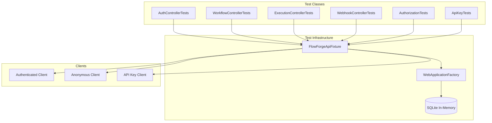

# Design Document: API Integration Tests

## Overview

This design document describes the architecture and implementation approach for integration tests covering the FlowForge API project. The tests verify end-to-end behavior of API endpoints including HTTP handling, authentication, authorization, database persistence, and error responses.

The integration test suite uses:
- **WebApplicationFactory** for in-memory API hosting
- **SQLite in-memory database** for test isolation
- **xUnit** as the test framework
- **CsCheck** for property-based testing where applicable

## Architecture



## Components and Interfaces

### FlowForgeApiFixture

The shared test fixture providing test server and client factories.

```csharp
public class FlowForgeApiFixture : IAsyncLifetime
{
    public WebApplicationFactory<Program> Factory { get; private set; }
    public HttpClient AnonymousClient { get; private set; }
    
    public Task<HttpClient> CreateAuthenticatedClientAsync(
        string email = "test@example.com",
        string password = "TestPassword123!",
        UserRole role = UserRole.Editor);
    
    public Task<HttpClient> CreateApiKeyClientAsync(
        string name = "test-key",
        string[] scopes = null);
    
    public Task<T> GetServiceAsync<T>() where T : class;
    
    public Task InitializeAsync();
    public Task DisposeAsync();
}
```

### CustomWebApplicationFactory

Configures the test server with test-specific settings.

```csharp
internal class CustomWebApplicationFactory : WebApplicationFactory<Program>
{
    protected override void ConfigureWebHost(IWebHostBuilder builder)
    {
        builder.ConfigureServices(services =>
        {
            // Replace SQLite with in-memory database
            // Configure shorter token expiry for tests
            // Disable external service calls
        });
    }
}
```

### Test Helper Classes

```csharp
public static class TestDataFactory
{
    public static CreateWorkflowRequest CreateValidWorkflow(string name = "Test Workflow");
    public static CreateWorkflowRequest CreateInvalidWorkflow();
    public static TriggerExecutionRequest CreateExecutionRequest(Guid workflowId);
}

public static class HttpClientExtensions
{
    public static Task<T> GetFromJsonAsync<T>(this HttpClient client, string uri);
    public static Task<HttpResponseMessage> PostAsJsonAsync<T>(this HttpClient client, string uri, T value);
}
```

## Data Models

### Test Request/Response Models

The tests use the existing API DTOs from `FlowForge.Api.Models`:
- `LoginRequest`, `LoginResponse`
- `RegisterRequest`
- `RefreshRequest`
- `CreateWorkflowRequest`, `UpdateWorkflowRequest`, `WorkflowResponse`
- `TriggerExecutionRequest`, `ExecutionResponse`
- `ApiError`

### Test User Seed Data

```csharp
public static class TestUsers
{
    public static readonly TestUser Admin = new("admin@test.com", "AdminPass123!", UserRole.Admin);
    public static readonly TestUser Editor = new("editor@test.com", "EditorPass123!", UserRole.Editor);
    public static readonly TestUser Viewer = new("viewer@test.com", "ViewerPass123!", UserRole.Viewer);
}

public record TestUser(string Email, string Password, UserRole Role);
```


## Correctness Properties

*A property is a characteristic or behavior that should hold true across all valid executions of a system—essentially, a formal statement about what the system should do. Properties serve as the bridge between human-readable specifications and machine-verifiable correctness guarantees.*

### Property 1: Database Isolation Between Test Classes

*For any* two test classes running in the same test session, data created by one test class SHALL NOT be visible to the other test class.

**Validates: Requirements 1.2**

### Property 2: Authenticated Client Authorization

*For any* valid user credentials (email, password, role), the Authenticated_Client created by the Test_Fixture SHALL successfully receive 2xx responses when calling endpoints permitted for that role.

**Validates: Requirements 1.3**

### Property 3: Pagination Bounds Respected

*For any* valid pagination parameters (skip >= 0, take > 0), the GET /api/workflow endpoint SHALL return at most `take` items and skip the first `skip` items.

**Validates: Requirements 3.9**

### Property 4: Search Results Match Query

*For any* search query string, all workflows returned by GET /api/workflow?search={query} SHALL contain the query string in their name or description.

**Validates: Requirements 3.10**

### Property 5: Execution Workflow Filter Consistency

*For any* workflow ID, all executions returned by GET /api/execution/workflow/{workflowId} SHALL have their WorkflowId property equal to the requested workflow ID.

**Validates: Requirements 4.7**

### Property 6: Error Response Format Consistency

*For any* API endpoint that returns a 4xx status code (400, 401, 403, 404, 409), the response body SHALL contain a JSON object with `code` (string) and `message` (string) properties.

**Validates: Requirements 8.1, 8.2, 8.3**

## Error Handling

### Test Infrastructure Errors

| Error Scenario | Handling Strategy |
|----------------|-------------------|
| Database connection failure | Fail test with descriptive message |
| Server startup failure | Fail test with startup exception details |
| Authentication service unavailable | Use mock authentication for isolated tests |

### Test Execution Errors

| Error Scenario | Handling Strategy |
|----------------|-------------------|
| Unexpected HTTP status code | Assert failure with response body details |
| JSON deserialization failure | Assert failure with raw response content |
| Timeout waiting for response | Fail with timeout duration and endpoint |

### Cleanup Errors

| Error Scenario | Handling Strategy |
|----------------|-------------------|
| Database disposal failure | Log warning, continue with other cleanup |
| Server disposal failure | Log warning, allow test to complete |

## Testing Strategy

### Test Organization

```
FlowForge.Tests/
├── Integration/
│   ├── Fixtures/
│   │   ├── FlowForgeApiFixture.cs
│   │   ├── CustomWebApplicationFactory.cs
│   │   └── TestDataFactory.cs
│   ├── Auth/
│   │   └── AuthControllerTests.cs
│   ├── Workflows/
│   │   └── WorkflowControllerTests.cs
│   ├── Executions/
│   │   └── ExecutionControllerTests.cs
│   ├── Webhooks/
│   │   └── WebhookControllerTests.cs
│   ├── Authorization/
│   │   └── AuthorizationTests.cs
│   └── ApiKeys/
│       └── ApiKeyAuthenticationTests.cs
```

### Test Framework Configuration

- **Framework**: xUnit with `IAsyncLifetime` for async setup/teardown
- **Property Testing**: CsCheck for property-based tests (minimum 100 iterations)
- **Assertions**: xUnit built-in assertions
- **HTTP Client**: `System.Net.Http.HttpClient` with `System.Net.Http.Json` extensions

### Unit Tests vs Integration Tests

| Test Type | Purpose | Location |
|-----------|---------|----------|
| Unit Tests | Test individual components in isolation | `Tests/Unit/` |
| Property Tests | Verify universal properties across inputs | `Tests/Property/` |
| Integration Tests | Test API endpoints end-to-end | `Tests/Integration/` |

### Test Naming Convention

Tests follow the pattern: `When{Condition}Then{ExpectedBehavior}`

Examples:
- `WhenValidCredentialsThenReturnsAccessToken`
- `WhenInvalidPasswordThenReturns401Unauthorized`
- `WhenWorkflowNotFoundThenReturns404NotFound`

### Test Data Management

- Each test class gets a fresh database via `IAsyncLifetime.InitializeAsync()`
- Test users are seeded at fixture initialization
- Workflows and executions are created per-test as needed
- No shared mutable state between tests

### Property-Based Test Configuration

```csharp
// Example property test configuration
Gen.Int[0, 100].Sample(skip =>
{
    Gen.Int[1, 50].Sample(take =>
    {
        // Test pagination with generated skip/take values
    }, iter: 100);
}, iter: 100);
```

Each property test runs minimum 100 iterations to ensure adequate coverage of the input space.
