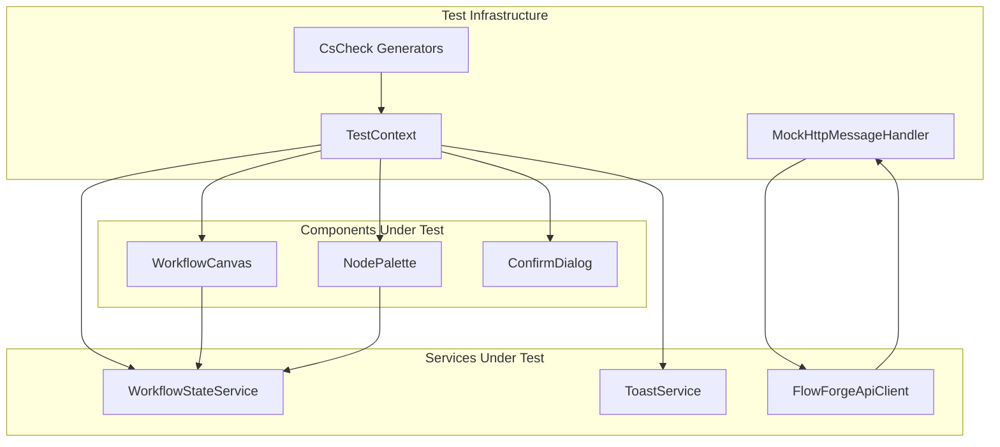

# Design Document: Blazor Integration Tests

## Overview

This design document describes the integration testing strategy for the FlowForge.Designer Blazor WebAssembly application. The tests validate that Blazor components work correctly with their dependent services, ensuring proper state management, user interactions, and API communication.

The testing approach uses:
- **bUnit** (v1.38.5) - Blazor component testing library for rendering and interacting with components
- **CsCheck** - Property-based testing library for generating test inputs and validating properties
- **NSubstitute** - Mocking library for external dependencies
- **Mock HTTP handlers** - For simulating API responses

## Architecture



## Components and Interfaces

### Test Infrastructure

#### MockHttpMessageHandler

A custom HTTP message handler for mocking API responses in tests:

```csharp
public class MockHttpMessageHandler : HttpMessageHandler
{
    private readonly Func<HttpRequestMessage, HttpResponseMessage> _handler;
    
    public MockHttpMessageHandler(Func<HttpRequestMessage, HttpResponseMessage> handler)
    {
        _handler = handler;
    }
    
    protected override Task<HttpResponseMessage> SendAsync(
        HttpRequestMessage request, 
        CancellationToken cancellationToken)
    {
        return Task.FromResult(_handler(request));
    }
}
```

#### Test Generators

CsCheck generators for creating test data:

```csharp
// Node generator
public static Gen<WorkflowNode> NodeGen => 
    from id in Gen.Guid.Select(g => g.ToString())
    from type in Gen.String[1, 20].AlphaNumeric
    from name in Gen.String[1, 50].AlphaNumeric
    from x in Gen.Double[0, 1000]
    from y in Gen.Double[0, 1000]
    select new WorkflowNode
    {
        Id = id,
        Type = type,
        Name = name,
        Position = new Position(x, y)
    };

// Workflow generator
public static Gen<Workflow> WorkflowGen =>
    from id in Gen.Guid
    from name in Gen.String[1, 100].AlphaNumeric
    from nodes in NodeGen.List[0, 10]
    select new Workflow
    {
        Id = id,
        Name = name,
        Nodes = nodes.ToList(),
        Connections = [],
        CreatedAt = DateTime.UtcNow,
        UpdatedAt = DateTime.UtcNow
    };
```

### Test Organization

Tests are organized in `FlowForge.Tests/Integration/Designer/`:

```
FlowForge.Tests/
└── Integration/
    └── Designer/
        ├── WorkflowStateServiceTests.cs
        ├── NodePaletteIntegrationTests.cs
        ├── WorkflowCanvasIntegrationTests.cs
        ├── FlowForgeApiClientTests.cs
        ├── ToastServiceTests.cs
        └── Generators/
            └── DesignerGenerators.cs
```

## Data Models

### Test Data Models

The tests use the existing domain models from `FlowForge.Core.Models` and `FlowForge.Designer.Models`:

| Model | Purpose |
|-------|---------|
| `Workflow` | Workflow definition with nodes and connections |
| `WorkflowNode` | Individual node in a workflow |
| `Connection` | Connection between node ports |
| `NodeDefinition` | Node type definition with ports |
| `CanvasState` | Canvas pan/zoom state |
| `ToastModel` | Toast notification data |

### Test Fixtures

```csharp
public static class TestFixtures
{
    public static WorkflowNode CreateTriggerNode(string id = null) => new()
    {
        Id = id ?? Guid.NewGuid().ToString(),
        Type = "ManualTrigger",
        Name = "Manual Trigger",
        Position = new Position(100, 100)
    };
    
    public static NodeDefinition CreateTriggerDefinition() => new()
    {
        Type = "ManualTrigger",
        Name = "Manual Trigger",
        Category = NodeCategory.Trigger,
        Outputs = [new PortDefinition { Name = "output", Type = PortType.Any }]
    };
}
```


## Correctness Properties

*A property is a characteristic or behavior that should hold true across all valid executions of a system—essentially, a formal statement about what the system should do. Properties serve as the bridge between human-readable specifications and machine-verifiable correctness guarantees.*

### Property 1: Node Addition Invariant

*For any* valid workflow node, when added to the WorkflowStateService, the node SHALL appear in the workflow's node collection and be selected.

**Validates: Requirements 1.1**

### Property 2: Node Removal Cascades Connections

*For any* workflow with nodes and connections, when a node is removed, the node and all connections referencing that node SHALL be removed from the workflow.

**Validates: Requirements 1.2**

### Property 3: Node Position Update

*For any* node in a workflow and any valid position coordinates, updating the node's position SHALL result in the node having the new coordinates.

**Validates: Requirements 1.3**

### Property 4: Connection Addition

*For any* valid connection between two different nodes, adding the connection SHALL result in the connection appearing in the workflow's connection collection.

**Validates: Requirements 2.1**

### Property 5: Duplicate Connection Prevention

*For any* connection, adding the same connection twice SHALL result in only one instance of the connection in the workflow.

**Validates: Requirements 2.2**

### Property 6: Self-Connection Rejection

*For any* node, attempting to create a connection from the node to itself SHALL be rejected as invalid.

**Validates: Requirements 2.4**

### Property 7: Port Type Compatibility

*For any* two port types, the compatibility check SHALL return true if and only if the types are compatible according to the type rules (Any matches all, same types match, Object accepts most types).

**Validates: Requirements 2.5**

### Property 8: Undo Restores Previous State

*For any* workflow modification action, performing the action then undoing SHALL restore the workflow to its state before the action.

**Validates: Requirements 3.1, 3.2**

### Property 9: Redo Restores Undone State

*For any* workflow modification action, performing the action, undoing, then redoing SHALL restore the workflow to its state after the action.

**Validates: Requirements 3.3**

### Property 10: Workflow Serialization Round-Trip

*For any* valid workflow, serializing to JSON then deserializing SHALL produce an equivalent workflow with the same nodes, connections, and metadata.

**Validates: Requirements 4.1**

### Property 11: Valid Workflow Passes Validation

*For any* workflow with at least one trigger node, unique node IDs, and valid connections, validation SHALL report no errors.

**Validates: Requirements 5.4**

### Property 12: NodePalette Category Grouping

*For any* set of node definitions, the NodePalette SHALL render nodes grouped by their category.

**Validates: Requirements 6.1**

### Property 13: NodePalette Search Filtering

*For any* search term, the NodePalette SHALL display only nodes whose name or description contains the search term (case-insensitive).

**Validates: Requirements 6.2**

### Property 14: Canvas Node Rendering

*For any* workflow with nodes, the WorkflowCanvas SHALL render a visual element for each node in the workflow.

**Validates: Requirements 7.1**

### Property 15: Canvas Zoom Bounds

*For any* zoom operation, the canvas zoom level SHALL remain within the bounds [0.25, 2.0].

**Validates: Requirements 7.4**

### Property 16: API Workflow Deserialization

*For any* valid JSON workflow response from the API, the FlowForgeApiClient SHALL deserialize it into a Workflow object with matching properties.

**Validates: Requirements 8.1, 8.4**

### Property 17: Toast Service Type Handling

*For any* toast type (Success, Error, Warning, Info), showing a toast SHALL add it to the collection with the correct type and appropriate default timeout.

**Validates: Requirements 9.1, 9.4**

### Property 18: Toast Removal

*For any* toast in the collection, removing it by ID SHALL result in the toast no longer being in the collection.

**Validates: Requirements 9.2, 9.3**

## Error Handling

### Service Errors

| Error Scenario | Handling Strategy |
|----------------|-------------------|
| Invalid JSON deserialization | Return null, do not throw |
| API request failure | Propagate HttpRequestException to caller |
| Invalid node type | Skip node, log warning |
| Connection to non-existent node | Report validation error |

### Component Errors

| Error Scenario | Handling Strategy |
|----------------|-------------------|
| Missing node definition | Render placeholder node |
| Invalid port reference | Skip connection rendering |
| State service unavailable | Show error toast |

### Test Error Handling

```csharp
// Tests should verify error handling behavior
[Fact]
public void DeserializeFromJson_WithInvalidJson_ReturnsNull()
{
    // Arrange
    var invalidJson = "{ invalid json }";
    
    // Act
    var result = WorkflowStateService.DeserializeFromJson(invalidJson);
    
    // Assert
    Assert.Null(result);
}
```

## Testing Strategy

### Testing Framework Configuration

The tests use the following frameworks (already configured in the project):

| Framework | Version | Purpose |
|-----------|---------|---------|
| xUnit | 2.9.3 | Test framework |
| bUnit | 1.38.5 | Blazor component testing |
| CsCheck | 4.5.0 | Property-based testing |
| NSubstitute | 5.3.0 | Mocking |

### Dual Testing Approach

**Unit Tests**: Verify specific examples and edge cases
- Invalid JSON deserialization
- Validation error scenarios (no trigger, duplicate IDs)
- API error handling

**Property Tests**: Verify universal properties across all inputs
- Serialization round-trip
- Node/connection operations
- Undo/redo consistency
- Port type compatibility

### Property-Based Testing Configuration

- Minimum 100 iterations per property test
- Each property test references its design document property
- Tag format: **Feature: blazor-integration-tests, Property {number}: {property_text}**

### Test File Organization

```
FlowForge.Tests/
├── Integration/
│   └── Designer/
│       ├── WorkflowStateServiceTests.cs      # Properties 1-11
│       ├── NodePaletteIntegrationTests.cs    # Properties 12-13
│       ├── WorkflowCanvasIntegrationTests.cs # Properties 14-15
│       ├── FlowForgeApiClientTests.cs        # Property 16
│       ├── ToastServiceTests.cs              # Properties 17-18
│       └── Generators/
│           └── DesignerGenerators.cs         # CsCheck generators
```

### bUnit Test Pattern

```csharp
public class NodePaletteIntegrationTests : TestContext
{
    [Fact]
    public void WhenNodeDefinitionsSet_ThenNodesGroupedByCategory()
    {
        // Arrange
        var stateService = new WorkflowStateService();
        var definitions = new List<NodeDefinition>
        {
            new() { Type = "ManualTrigger", Name = "Manual", Category = NodeCategory.Trigger },
            new() { Type = "HttpRequest", Name = "HTTP", Category = NodeCategory.Action }
        };
        stateService.SetNodeDefinitions(definitions);
        
        Services.AddSingleton(stateService);
        
        // Act
        var cut = RenderComponent<NodePalette>();
        
        // Assert
        Assert.Contains("Trigger", cut.Markup);
        Assert.Contains("Action", cut.Markup);
    }
}
```

### Property Test Pattern

```csharp
public class WorkflowStateServicePropertyTests
{
    // Feature: blazor-integration-tests, Property 10: Workflow Serialization Round-Trip
    // Validates: Requirements 4.1
    [Fact]
    public void SerializationRoundTrip_PreservesWorkflow()
    {
        DesignerGenerators.WorkflowGen.Sample(workflow =>
        {
            var service = new WorkflowStateService();
            service.LoadWorkflow(workflow);
            
            // Act
            var json = service.SerializeToJson();
            var deserialized = WorkflowStateService.DeserializeFromJson(json);
            
            // Assert
            Assert.NotNull(deserialized);
            Assert.Equal(workflow.Id, deserialized.Id);
            Assert.Equal(workflow.Name, deserialized.Name);
            Assert.Equal(workflow.Nodes.Count, deserialized.Nodes.Count);
        }, iter: 100);
    }
}
```

### Mock HTTP Handler Pattern

```csharp
public class FlowForgeApiClientTests
{
    [Fact]
    public async Task GetWorkflowsAsync_DeserializesResponse()
    {
        // Arrange
        var workflows = new List<Workflow> { TestFixtures.CreateWorkflow() };
        var handler = new MockHttpMessageHandler(request =>
        {
            var json = JsonSerializer.Serialize(workflows);
            return new HttpResponseMessage(HttpStatusCode.OK)
            {
                Content = new StringContent(json, Encoding.UTF8, "application/json")
            };
        });
        
        var client = new FlowForgeApiClient(new HttpClient(handler) 
        { 
            BaseAddress = new Uri("http://test/") 
        });
        
        // Act
        var result = await client.GetWorkflowsAsync();
        
        // Assert
        Assert.Single(result);
    }
}
```
