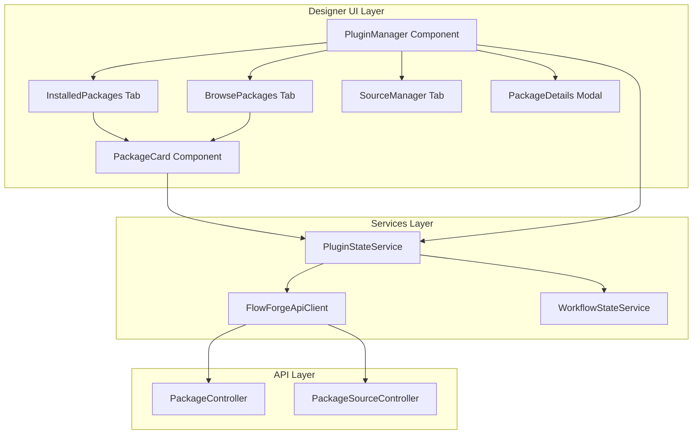

# Design Document: Designer Plugin Management

## Overview

This design adds a Plugin Manager UI to the FlowForge Designer application, enabling users to browse, install, update, and uninstall NuGet-based node packages directly from the visual designer interface. The implementation uses Blazor WebAssembly components that communicate with the existing Package API endpoints.

The design follows the existing Designer architecture patterns, using the `FlowForgeApiClient` for API communication and integrating with the `WorkflowStateService` for node palette updates.

## Architecture



## Components and Interfaces

### PluginStateService

Service for managing plugin-related state and API communication.

```csharp
/// <summary>
/// Service for managing plugin state and operations in the Designer.
/// </summary>
public class PluginStateService : IDisposable
{
    /// <summary>Event raised when plugin state changes.</summary>
    public event Action? OnStateChanged;
    
    /// <summary>Currently installed packages.</summary>
    public IReadOnlyList<InstalledPackageModel> InstalledPackages { get; }
    
    /// <summary>Available updates for installed packages.</summary>
    public IReadOnlyList<PackageUpdateModel> AvailableUpdates { get; }
    
    /// <summary>Configured package sources.</summary>
    public IReadOnlyList<PackageSourceModel> Sources { get; }
    
    /// <summary>Current search results.</summary>
    public PackageSearchResultModel? SearchResults { get; }
    
    /// <summary>Whether an operation is in progress.</summary>
    public bool IsLoading { get; }
    
    /// <summary>Current operation status message.</summary>
    public string? StatusMessage { get; }
    
    /// <summary>Current error message, if any.</summary>
    public string? ErrorMessage { get; }
    
    /// <summary>Loads installed packages from the API.</summary>
    Task LoadInstalledPackagesAsync(CancellationToken cancellationToken = default);
    
    /// <summary>Searches for packages matching the query.</summary>
    Task SearchPackagesAsync(string query, CancellationToken cancellationToken = default);
    
    /// <summary>Gets detailed information about a package.</summary>
    Task<PackageDetailsModel?> GetPackageDetailsAsync(string packageId, CancellationToken cancellationToken = default);
    
    /// <summary>Installs a package.</summary>
    Task<bool> InstallPackageAsync(string packageId, string? version = null, CancellationToken cancellationToken = default);
    
    /// <summary>Updates a package to the latest or specified version.</summary>
    Task<bool> UpdatePackageAsync(string packageId, string? targetVersion = null, CancellationToken cancellationToken = default);
    
    /// <summary>Uninstalls a package.</summary>
    Task<PackageUninstallResultModel> UninstallPackageAsync(string packageId, bool force = false, CancellationToken cancellationToken = default);
    
    /// <summary>Checks for available updates.</summary>
    Task CheckForUpdatesAsync(CancellationToken cancellationToken = default);
    
    /// <summary>Loads package sources from the API.</summary>
    Task LoadSourcesAsync(CancellationToken cancellationToken = default);
    
    /// <summary>Adds a new package source.</summary>
    Task<bool> AddSourceAsync(PackageSourceModel source, CancellationToken cancellationToken = default);
    
    /// <summary>Updates an existing package source.</summary>
    Task<bool> UpdateSourceAsync(string name, PackageSourceModel source, CancellationToken cancellationToken = default);
    
    /// <summary>Removes a package source.</summary>
    Task<bool> RemoveSourceAsync(string name, CancellationToken cancellationToken = default);
    
    /// <summary>Tests connectivity to a package source.</summary>
    Task<SourceTestResultModel> TestSourceAsync(string name, CancellationToken cancellationToken = default);
}
```

### FlowForgeApiClient Extensions

Extensions to the existing API client for package operations.

```csharp
// Add to FlowForgeApiClient
public partial class FlowForgeApiClient
{
    /// <summary>Gets all installed packages.</summary>
    Task<List<InstalledPackageModel>> GetInstalledPackagesAsync(CancellationToken cancellationToken = default);
    
    /// <summary>Searches for packages.</summary>
    Task<PackageSearchResultModel> SearchPackagesAsync(string query, int skip = 0, int take = 20, CancellationToken cancellationToken = default);
    
    /// <summary>Gets package details.</summary>
    Task<PackageDetailsModel?> GetPackageDetailsAsync(string packageId, string? version = null, CancellationToken cancellationToken = default);
    
    /// <summary>Installs a package.</summary>
    Task<PackageInstallResultModel> InstallPackageAsync(string packageId, string? version = null, bool prerelease = false, CancellationToken cancellationToken = default);
    
    /// <summary>Updates a package.</summary>
    Task<PackageUpdateResultModel> UpdatePackageAsync(string packageId, string? targetVersion = null, CancellationToken cancellationToken = default);
    
    /// <summary>Uninstalls a package.</summary>
    Task<PackageUninstallResultModel> UninstallPackageAsync(string packageId, bool force = false, CancellationToken cancellationToken = default);
    
    /// <summary>Checks for package updates.</summary>
    Task<List<PackageUpdateInfoModel>> CheckForUpdatesAsync(CancellationToken cancellationToken = default);
    
    /// <summary>Gets package sources.</summary>
    Task<List<PackageSourceModel>> GetPackageSourcesAsync(CancellationToken cancellationToken = default);
    
    /// <summary>Adds a package source.</summary>
    Task<PackageSourceModel> AddPackageSourceAsync(PackageSourceModel source, CancellationToken cancellationToken = default);
    
    /// <summary>Updates a package source.</summary>
    Task UpdatePackageSourceAsync(string name, PackageSourceModel source, CancellationToken cancellationToken = default);
    
    /// <summary>Removes a package source.</summary>
    Task RemovePackageSourceAsync(string name, CancellationToken cancellationToken = default);
    
    /// <summary>Tests a package source.</summary>
    Task<SourceTestResultModel> TestPackageSourceAsync(string name, CancellationToken cancellationToken = default);
}
```

## Data Models

```csharp
/// <summary>
/// Model for an installed package in the Designer.
/// </summary>
public record InstalledPackageModel
{
    public required string PackageId { get; init; }
    public required string Version { get; init; }
    public required string SourceName { get; init; }
    public required DateTime InstalledAt { get; init; }
    public IReadOnlyList<string> NodeTypes { get; init; } = [];
    public bool IsLoaded { get; init; }
    public bool HasUpdate { get; init; }
    public string? LatestVersion { get; init; }
}

/// <summary>
/// Model for a package in search results.
/// </summary>
public record PackageSearchItemModel
{
    public required string PackageId { get; init; }
    public required string Title { get; init; }
    public required string LatestVersion { get; init; }
    public string? Description { get; init; }
    public string? Authors { get; init; }
    public long DownloadCount { get; init; }
    public string? IconUrl { get; init; }
    public IReadOnlyList<string> Tags { get; init; } = [];
    public bool IsInstalled { get; init; }
    public string? InstalledVersion { get; init; }
}

/// <summary>
/// Model for package search results.
/// </summary>
public record PackageSearchResultModel
{
    public IReadOnlyList<PackageSearchItemModel> Packages { get; init; } = [];
    public int TotalCount { get; init; }
    public IReadOnlyList<string> Errors { get; init; } = [];
}

/// <summary>
/// Model for detailed package information.
/// </summary>
public record PackageDetailsModel
{
    public required string PackageId { get; init; }
    public required string Version { get; init; }
    public string? Title { get; init; }
    public string? Description { get; init; }
    public string? Authors { get; init; }
    public string? License { get; init; }
    public string? ProjectUrl { get; init; }
    public string? IconUrl { get; init; }
    public IReadOnlyList<string> Tags { get; init; } = [];
    public IReadOnlyList<string> Dependencies { get; init; } = [];
    public IReadOnlyList<string> AllVersions { get; init; } = [];
    public IReadOnlyList<string> NodeTypes { get; init; } = [];
    public bool IsInstalled { get; init; }
    public string? InstalledVersion { get; init; }
}

/// <summary>
/// Model for package installation result.
/// </summary>
public record PackageInstallResultModel
{
    public bool Success { get; init; }
    public InstalledPackageModel? Package { get; init; }
    public IReadOnlyList<string> Errors { get; init; } = [];
    public IReadOnlyList<string> Warnings { get; init; } = [];
}

/// <summary>
/// Model for package update result.
/// </summary>
public record PackageUpdateResultModel
{
    public bool Success { get; init; }
    public InstalledPackageModel? Package { get; init; }
    public string? PreviousVersion { get; init; }
    public IReadOnlyList<string> Errors { get; init; } = [];
}

/// <summary>
/// Model for package uninstall result.
/// </summary>
public record PackageUninstallResultModel
{
    public bool Success { get; init; }
    public IReadOnlyList<string> AffectedWorkflows { get; init; } = [];
    public IReadOnlyList<string> Errors { get; init; } = [];
}

/// <summary>
/// Model for package update information.
/// </summary>
public record PackageUpdateInfoModel
{
    public required string PackageId { get; init; }
    public required string CurrentVersion { get; init; }
    public required string LatestVersion { get; init; }
    public string? ReleaseNotes { get; init; }
}

/// <summary>
/// Model for a package source.
/// </summary>
public record PackageSourceModel
{
    public required string Name { get; init; }
    public required string Url { get; init; }
    public bool IsEnabled { get; init; } = true;
    public bool IsTrusted { get; init; }
    public bool HasCredentials { get; init; }
    public int Priority { get; init; }
    public string? Username { get; init; }
    public string? Password { get; init; }
    public string? ApiKey { get; init; }
}

/// <summary>
/// Model for source test result.
/// </summary>
public record SourceTestResultModel
{
    public bool Success { get; init; }
    public required string SourceName { get; init; }
    public long ResponseTimeMs { get; init; }
    public string? ErrorMessage { get; init; }
}
```

## Component Structure

### PluginManager.razor

Main container component with tab navigation.

```razor
@* Main plugin manager modal/panel *@
<div class="plugin-manager @(IsOpen ? "open" : "")">
    <div class="plugin-manager-header">
        <h2>Plugin Manager</h2>
        <button class="close-btn" @onclick="Close">×</button>
    </div>
    
    <div class="plugin-manager-tabs">
        <button class="tab @(ActiveTab == "installed" ? "active" : "")" 
                @onclick="() => SetTab("installed")">
            Installed (@InstalledCount)
        </button>
        <button class="tab @(ActiveTab == "browse" ? "active" : "")" 
                @onclick="() => SetTab("browse")">
            Browse
        </button>
        <button class="tab @(ActiveTab == "sources" ? "active" : "")" 
                @onclick="() => SetTab("sources")">
            Sources
        </button>
    </div>
    
    <div class="plugin-manager-content">
        @switch (ActiveTab)
        {
            case "installed":
                <InstalledPackages />
                break;
            case "browse":
                <BrowsePackages />
                break;
            case "sources":
                <SourceManager />
                break;
        }
    </div>
</div>
```

### PackageCard.razor

Reusable component for displaying package information.

```razor
@* Package card component *@
<div class="package-card @(IsInstalled ? "installed" : "")">
    <div class="package-icon">
        @if (!string.IsNullOrEmpty(IconUrl))
        {
            
        }
        else
        {
            <span class="default-icon">📦</span>
        }
    </div>
    
    <div class="package-info">
        <div class="package-header">
            <h4 class="package-title" @onclick="OnClick">@Title</h4>
            <span class="package-version">v@Version</span>
            @if (HasUpdate)
            {
                <span class="update-badge" title="Update available">⬆</span>
            }
        </div>
        
        @if (!string.IsNullOrEmpty(Description))
        {
            <p class="package-description">@Description</p>
        }
        
        <div class="package-meta">
            @if (!string.IsNullOrEmpty(Authors))
            {
                <span class="meta-item">👤 @Authors</span>
            }
            @if (DownloadCount > 0)
            {
                <span class="meta-item">⬇ @FormatDownloads(DownloadCount)</span>
            }
            @if (NodeCount > 0)
            {
                <span class="meta-item">🔲 @NodeCount nodes</span>
            }
        </div>
    </div>
    
    <div class="package-actions">
        @if (IsInstalled)
        {
            @if (HasUpdate)
            {
                <button class="btn btn-primary" @onclick="OnUpdate" disabled="@IsLoading">
                    Update
                </button>
            }
            <button class="btn btn-danger" @onclick="OnUninstall" disabled="@IsLoading">
                Uninstall
            </button>
        }
        else
        {
            <button class="btn btn-primary" @onclick="OnInstall" disabled="@IsLoading">
                Install
            </button>
        }
    </div>
</div>
```

### InstalledPackages.razor

Tab content for viewing installed packages.

```razor
@* Installed packages tab *@
<div class="installed-packages">
    <div class="tab-toolbar">
        <button class="btn" @onclick="CheckForUpdates" disabled="@IsLoading">
            🔄 Check for Updates
        </button>
    </div>
    
    @if (IsLoading)
    {
        <div class="loading">Loading packages...</div>
    }
    else if (!Packages.Any())
    {
        <div class="empty-state">
            <p>No packages installed yet.</p>
            <button class="btn btn-primary" @onclick="GoToBrowse">
                Browse Packages
            </button>
        </div>
    }
    else
    {
        <div class="package-list">
            @foreach (var package in Packages)
            {
                <PackageCard 
                    PackageId="@package.PackageId"
                    Title="@package.PackageId"
                    Version="@package.Version"
                    IsInstalled="true"
                    HasUpdate="@package.HasUpdate"
                    NodeCount="@package.NodeTypes.Count"
                    OnClick="() => ShowDetails(package.PackageId)"
                    OnUpdate="() => UpdatePackage(package.PackageId)"
                    OnUninstall="() => UninstallPackage(package.PackageId)" />
            }
        </div>
    }
</div>
```

### BrowsePackages.razor

Tab content for searching and browsing packages.

```razor
@* Browse packages tab *@
<div class="browse-packages">
    <div class="search-bar">
        <input type="text" 
               placeholder="Search packages..." 
               @bind="SearchQuery" 
               @bind:event="oninput"
               @onkeyup="OnSearchKeyUp" />
        <button class="btn" @onclick="Search" disabled="@IsLoading">
            🔍 Search
        </button>
    </div>
    
    @if (IsLoading)
    {
        <div class="loading">Searching...</div>
    }
    else if (SearchResults is null)
    {
        <div class="search-prompt">
            <p>Enter a search term to find packages.</p>
        </div>
    }
    else if (!SearchResults.Packages.Any())
    {
        <div class="no-results">
            <p>No packages found for "@SearchQuery".</p>
        </div>
    }
    else
    {
        <div class="search-results">
            <p class="result-count">@SearchResults.TotalCount packages found</p>
            <div class="package-list">
                @foreach (var package in SearchResults.Packages)
                {
                    <PackageCard 
                        PackageId="@package.PackageId"
                        Title="@package.Title"
                        Version="@package.LatestVersion"
                        Description="@package.Description"
                        Authors="@package.Authors"
                        IconUrl="@package.IconUrl"
                        DownloadCount="@package.DownloadCount"
                        IsInstalled="@package.IsInstalled"
                        InstalledVersion="@package.InstalledVersion"
                        OnClick="() => ShowDetails(package.PackageId)"
                        OnInstall="() => InstallPackage(package.PackageId)" />
                }
            </div>
        </div>
    }
    
    @if (SearchResults?.Errors.Any() == true)
    {
        <div class="search-errors">
            @foreach (var error in SearchResults.Errors)
            {
                <p class="error">@error</p>
            }
        </div>
    }
</div>
```

### SourceManager.razor

Tab content for managing package sources.

```razor
@* Source manager tab *@
<div class="source-manager">
    <div class="tab-toolbar">
        <button class="btn btn-primary" @onclick="ShowAddSource">
            ➕ Add Source
        </button>
    </div>
    
    @if (IsLoading)
    {
        <div class="loading">Loading sources...</div>
    }
    else if (!Sources.Any())
    {
        <div class="empty-state">
            <p>No package sources configured.</p>
        </div>
    }
    else
    {
        <div class="source-list">
            @foreach (var source in Sources)
            {
                <div class="source-item @(!source.IsEnabled ? "disabled" : "")">
                    <div class="source-info">
                        <div class="source-header">
                            <span class="source-name">@source.Name</span>
                            @if (source.IsTrusted)
                            {
                                <span class="trusted-badge" title="Trusted">✓</span>
                            }
                        </div>
                        <span class="source-url">@source.Url</span>
                    </div>
                    <div class="source-actions">
                        <button class="btn btn-sm" @onclick="() => TestSource(source.Name)" 
                                disabled="@IsLoading">
                            Test
                        </button>
                        <button class="btn btn-sm" @onclick="() => EditSource(source)">
                            Edit
                        </button>
                        <button class="btn btn-sm btn-danger" @onclick="() => RemoveSource(source.Name)">
                            Remove
                        </button>
                    </div>
                </div>
            }
        </div>
    }
</div>
```

### PackageDetailsModal.razor

Modal for displaying detailed package information.

```razor
@* Package details modal *@
<div class="modal @(IsOpen ? "open" : "")">
    <div class="modal-content package-details">
        <div class="modal-header">
            <h3>@Package?.Title ?? Package?.PackageId</h3>
            <button class="close-btn" @onclick="Close">×</button>
        </div>
        
        @if (IsLoading)
        {
            <div class="loading">Loading details...</div>
        }
        else if (Package is not null)
        {
            <div class="modal-body">
                <div class="details-header">
                    @if (!string.IsNullOrEmpty(Package.IconUrl))
                    {
                        
                    }
                    <div class="details-meta">
                        <p><strong>Version:</strong> @Package.Version</p>
                        <p><strong>Author:</strong> @Package.Authors</p>
                        @if (!string.IsNullOrEmpty(Package.License))
                        {
                            <p><strong>License:</strong> @Package.License</p>
                        }
                        @if (!string.IsNullOrEmpty(Package.ProjectUrl))
                        {
                            <p><a href="@Package.ProjectUrl" target="_blank">Project Page</a></p>
                        }
                    </div>
                </div>
                
                @if (!string.IsNullOrEmpty(Package.Description))
                {
                    <div class="details-section">
                        <h4>Description</h4>
                        <p>@Package.Description</p>
                    </div>
                }
                
                @if (Package.Tags.Any())
                {
                    <div class="details-section">
                        <h4>Tags</h4>
                        <div class="tag-list">
                            @foreach (var tag in Package.Tags)
                            {
                                <span class="tag">@tag</span>
                            }
                        </div>
                    </div>
                }
                
                @if (Package.NodeTypes.Any())
                {
                    <div class="details-section">
                        <h4>Included Nodes</h4>
                        <ul class="node-list">
                            @foreach (var node in Package.NodeTypes)
                            {
                                <li>@node</li>
                            }
                        </ul>
                    </div>
                }
                
                @if (Package.Dependencies.Any())
                {
                    <div class="details-section">
                        <h4>Dependencies</h4>
                        <ul class="dependency-list">
                            @foreach (var dep in Package.Dependencies)
                            {
                                <li>@dep</li>
                            }
                        </ul>
                    </div>
                }
                
                @if (Package.AllVersions.Any())
                {
                    <div class="details-section">
                        <h4>Version</h4>
                        <select @bind="SelectedVersion">
                            @foreach (var version in Package.AllVersions)
                            {
                                <option value="@version">@version</option>
                            }
                        </select>
                    </div>
                }
            </div>
            
            <div class="modal-footer">
                @if (Package.IsInstalled)
                {
                    @if (Package.InstalledVersion != Package.Version)
                    {
                        <button class="btn btn-primary" @onclick="Update" disabled="@IsLoading">
                            Update to @SelectedVersion
                        </button>
                    }
                    <button class="btn btn-danger" @onclick="Uninstall" disabled="@IsLoading">
                        Uninstall
                    </button>
                }
                else
                {
                    <button class="btn btn-primary" @onclick="Install" disabled="@IsLoading">
                        Install @SelectedVersion
                    </button>
                }
                <button class="btn" @onclick="Close">Close</button>
            </div>
        }
    </div>
</div>
```

## Node Palette Integration

After package installation/uninstallation, the node palette must be refreshed:

```csharp
// In PluginStateService
private async Task RefreshNodeDefinitionsAsync()
{
    var definitions = await _apiClient.GetNodeDefinitionsAsync();
    _workflowStateService.SetNodeDefinitions(definitions);
}
```

The `WorkflowStateService.SetNodeDefinitions` method already triggers `OnStateChanged`, which causes the `NodePalette` component to re-render with the updated node list.


## Correctness Properties

*A property is a characteristic or behavior that should hold true across all valid executions of a system—essentially, a formal statement about what the system should do. Properties serve as the bridge between human-readable specifications and machine-verifiable correctness guarantees.*

### Property 1: Installed Package Card Information Completeness

*For any* installed package displayed in the Plugin Manager, the Package_Card SHALL display the package name, version, installation date, node count, and appropriate action buttons (Update if available, Uninstall always).

**Validates: Requirements 2.2, 2.3, 2.4**

### Property 2: Search Result Card Information Completeness

*For any* package in search results, the Package_Card SHALL display the package name, latest version, description, author, download count, and either an "Install" button (if not installed) or the installed version indicator (if installed).

**Validates: Requirements 3.3, 3.4, 3.5**

### Property 3: Node Refresh After Package Operations

*For any* successful package installation, update, or uninstallation, the Designer SHALL trigger a node definitions refresh, and the Node Palette SHALL reflect the changes without requiring a page refresh.

**Validates: Requirements 4.4, 5.4, 6.6, 9.1, 9.2, 9.3**

### Property 4: Source List Information Completeness

*For any* configured package source, the source list item SHALL display the source name, URL, enabled status, trusted status, and provide Edit, Remove, and Test Connection actions.

**Validates: Requirements 7.1, 7.2, 7.5**

### Property 5: Package Details Information Completeness

*For any* package in the details view, the modal SHALL display description, author, license, project URL, tags, available versions with selection, dependencies, node types (if installed), and appropriate Install/Update/Uninstall actions based on package state.

**Validates: Requirements 8.2, 8.3, 8.4, 8.5, 8.6**

### Property 6: UI State Management During Operations

*For any* asynchronous operation (install, update, uninstall, search, load), the Plugin_Manager_UI SHALL display a loading indicator and disable action buttons to prevent duplicate requests.

**Validates: Requirements 10.4, 10.5**

### Property 7: Workflow Reference Warning on Uninstall

*For any* package uninstallation request where workflows reference nodes from the package, the Plugin_Manager_UI SHALL display a warning dialog listing the affected workflows before proceeding.

**Validates: Requirements 6.2**

### Property 8: Untrusted Source Confirmation

*For any* package installation from an untrusted source, the Plugin_Manager_UI SHALL display a confirmation dialog before proceeding with the installation.

**Validates: Requirements 4.6**

### Property 9: Search Results Display All Matching Packages

*For any* search query, all packages returned by the API SHALL be displayed in the Package_List, and the total count SHALL match the API response.

**Validates: Requirements 3.2**

### Property 10: Node Palette Grouping

*For any* set of installed packages with nodes, the Node Palette SHALL group nodes by their category, and plugin nodes SHALL be distinguishable from built-in nodes.

**Validates: Requirements 9.4**

## Error Handling

### API Communication Errors

- Network failures: Display connection error with retry button
- 401/403 errors: Display authentication error, suggest re-login
- 404 errors: Display "not found" message for specific resources
- 500 errors: Display generic server error with retry option

### Package Operation Errors

- Installation failures: Display error message from API, show retry button
- Update failures: Display error message, keep current version installed
- Uninstall failures: Display error message, package remains installed
- Dependency conflicts: Display conflict details from API response

### Validation Errors

- Invalid source URL: Display validation error in form
- Duplicate source name: Display "already exists" error
- Empty search query: Prevent search, show hint message

## Testing Strategy

### Property-Based Testing

Use bUnit for Blazor component testing with generated test data.

**Test Configuration:**
```csharp
// Test data generators for plugin manager tests
public class PluginManagerTestGenerators
{
    public static Gen<InstalledPackageModel> InstalledPackageGen => 
        Gen.Select(
            Gen.String[1, 50],
            Gen.String[1, 20].Select(v => $"{Gen.Int[1, 10]}.{Gen.Int[0, 99]}.{Gen.Int[0, 99]}"),
            Gen.String[1, 30],
            Gen.DateTime,
            Gen.List(Gen.String[1, 30], 0, 5),
            Gen.Bool,
            Gen.Bool,
            (id, version, source, date, nodes, loaded, hasUpdate) => new InstalledPackageModel
            {
                PackageId = id,
                Version = version,
                SourceName = source,
                InstalledAt = date,
                NodeTypes = nodes,
                IsLoaded = loaded,
                HasUpdate = hasUpdate
            });
}
```

### Unit Tests

- Test individual components in isolation using bUnit
- Mock FlowForgeApiClient for deterministic behavior
- Test error handling paths
- Test edge cases (empty lists, null values, long strings)

### Integration Tests

- Test full user flows (search → install → verify in palette)
- Test API client integration with mock HTTP responses
- Test state synchronization between components

## File Structure

```
FlowForge.Designer/
├── Components/
│   └── PluginManager/
│       ├── PluginManager.razor
│       ├── PluginManager.razor.css
│       ├── InstalledPackages.razor
│       ├── BrowsePackages.razor
│       ├── SourceManager.razor
│       ├── PackageCard.razor
│       ├── PackageCard.razor.css
│       ├── PackageDetailsModal.razor
│       ├── PackageDetailsModal.razor.css
│       ├── SourceEditModal.razor
│       ├── ConfirmDialog.razor
│       └── Toast.razor
├── Models/
│   └── PluginModels.cs
├── Services/
│   ├── FlowForgeApiClient.cs (extended)
│   └── PluginStateService.cs
```

## Dependencies

The Designer already includes necessary Blazor WebAssembly packages. No additional dependencies required.

## Configuration

No additional configuration needed. The Designer uses the existing API base URL configuration.

