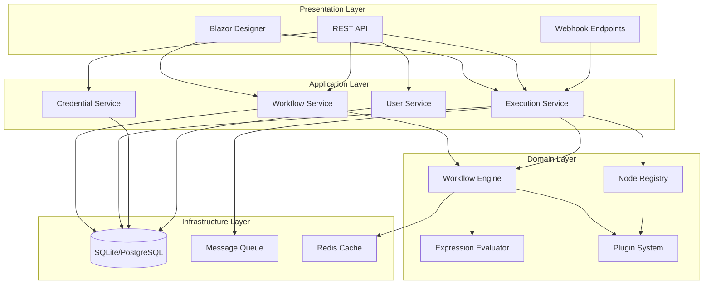

# Design Document: FlowForge

## Overview

FlowForge is a .NET 10 workflow automation platform that enables users to create, manage, and execute automated workflows through a visual node-based interface. The system follows a modular architecture with clear separation between the workflow engine, visual designer, persistence layer, and plugin system.

The platform is designed to be:
- **Extensible**: Plugin-based node system for custom integrations
- **Scalable**: Support for both single-instance and distributed deployments
- **Secure**: Encrypted credentials, RBAC, and audit logging
- **Developer-friendly**: REST API, webhooks, and comprehensive SDK

## Architecture



### Layer Responsibilities

**Presentation Layer**
- Blazor WebAssembly designer for visual workflow editing
- REST API for programmatic access
- Webhook endpoints for external triggers

**Application Layer**
- Workflow Service: CRUD operations for workflow definitions
- Execution Service: Workflow triggering and execution management
- Credential Service: Secure credential storage and retrieval
- User Service: Authentication, authorization, and user management

**Domain Layer**
- Workflow Engine: Core execution logic
- Node Registry: Node type catalog and validation
- Expression Evaluator: Runtime expression parsing and evaluation
- Plugin System: Custom node loading and isolation

**Infrastructure Layer**
- Database: SQLite (preferred for development/single-instance) or PostgreSQL (for production/distributed)
- Message Queue: For distributed execution (optional)
- Cache: Redis for execution state and performance

## Components and Interfaces

### Workflow Engine

```csharp
public interface IWorkflowEngine
{
    Task<ExecutionResult> ExecuteAsync(
        Workflow workflow, 
        ExecutionContext context, 
        CancellationToken cancellationToken = default);
    
    Task<ExecutionResult> ExecuteNodeAsync(
        Node node, 
        ExecutionContext context, 
        CancellationToken cancellationToken = default);
    
    Task CancelExecutionAsync(Guid executionId);
}

public interface IExecutionContext
{
    Guid ExecutionId { get; }
    Guid WorkflowId { get; }
    Dictionary<string, object> Variables { get; }
    INodeOutputStore NodeOutputs { get; }
    ICredentialProvider Credentials { get; }
    CancellationToken CancellationToken { get; }
}
```

### Node System

```csharp
public interface INode
{
    string Id { get; }
    string Type { get; }
    NodeCategory Category { get; }
    Task<NodeOutput> ExecuteAsync(NodeInput input, IExecutionContext context);
}

public interface ITriggerNode : INode
{
    Task<bool> ShouldTriggerAsync(TriggerContext context);
}

public interface INodeRegistry
{
    void Register<TNode>() where TNode : INode;
    void RegisterFromAssembly(Assembly assembly);
    INode CreateNode(string nodeType, JsonElement configuration);
    NodeDefinition GetDefinition(string nodeType);
    IEnumerable<NodeDefinition> GetAllDefinitions();
}

public enum NodeCategory
{
    Trigger,
    Action,
    Logic,
    Transform
}
```

### Expression Evaluator

```csharp
public interface IExpressionEvaluator
{
    object Evaluate(string expression, IExecutionContext context);
    bool TryEvaluate(string expression, IExecutionContext context, out object result, out string error);
    ValidationResult Validate(string expression);
}
```

### Credential Service

```csharp
public interface ICredentialService
{
    Task<Credential> CreateAsync(CreateCredentialRequest request);
    Task<Credential> GetAsync(Guid id);
    Task<DecryptedCredential> GetDecryptedAsync(Guid id, IExecutionContext context);
    Task DeleteAsync(Guid id);
    Task<IEnumerable<Credential>> ListAsync(Guid userId);
}

public interface ICredentialEncryption
{
    byte[] Encrypt(string plainText);
    string Decrypt(byte[] cipherText);
}
```

### Plugin System

```csharp
public interface IPluginLoader
{
    IEnumerable<PluginInfo> LoadPlugins(string pluginDirectory);
    void UnloadPlugin(string pluginId);
}

public interface IPluginHost
{
    Task<NodeOutput> ExecuteNodeInIsolationAsync(
        INode node, 
        NodeInput input, 
        IExecutionContext context,
        TimeSpan timeout);
}
```

## Data Models

### Workflow Definition

```csharp
public record Workflow
{
    public Guid Id { get; init; }
    public string Name { get; init; } = string.Empty;
    public string? Description { get; init; }
    public int Version { get; init; }
    public bool IsActive { get; init; }
    public List<WorkflowNode> Nodes { get; init; } = [];
    public List<Connection> Connections { get; init; } = [];
    public WorkflowSettings Settings { get; init; } = new();
    public DateTime CreatedAt { get; init; }
    public DateTime UpdatedAt { get; init; }
    public Guid CreatedBy { get; init; }
}

public record WorkflowNode
{
    public string Id { get; init; } = string.Empty;
    public string Type { get; init; } = string.Empty;
    public string Name { get; init; } = string.Empty;
    public JsonElement Configuration { get; init; }
    public Position Position { get; init; } = new();
    public Guid? CredentialId { get; init; }
}

public record Connection
{
    public string SourceNodeId { get; init; } = string.Empty;
    public string SourcePort { get; init; } = "output";
    public string TargetNodeId { get; init; } = string.Empty;
    public string TargetPort { get; init; } = "input";
}

public record Position(double X, double Y);

public record WorkflowSettings
{
    public TimeSpan? Timeout { get; init; }
    public int MaxRetries { get; init; }
    public ErrorHandlingMode ErrorHandling { get; init; }
}
```

### Execution Models

```csharp
public record Execution
{
    public Guid Id { get; init; }
    public Guid WorkflowId { get; init; }
    public int WorkflowVersion { get; init; }
    public ExecutionStatus Status { get; init; }
    public ExecutionMode Mode { get; init; }
    public DateTime StartedAt { get; init; }
    public DateTime? CompletedAt { get; init; }
    public JsonElement? TriggerData { get; init; }
    public JsonElement? OutputData { get; init; }
    public string? ErrorMessage { get; init; }
    public List<NodeExecution> NodeExecutions { get; init; } = [];
}

public record NodeExecution
{
    public string NodeId { get; init; } = string.Empty;
    public ExecutionStatus Status { get; init; }
    public DateTime StartedAt { get; init; }
    public DateTime? CompletedAt { get; init; }
    public JsonElement? InputData { get; init; }
    public JsonElement? OutputData { get; init; }
    public string? ErrorMessage { get; init; }
}

public enum ExecutionStatus
{
    Pending,
    Running,
    Completed,
    Failed,
    Cancelled
}

public enum ExecutionMode
{
    Manual,
    Trigger,
    Api,
    Scheduled
}
```

### Credential Models

```csharp
public record Credential
{
    public Guid Id { get; init; }
    public string Name { get; init; } = string.Empty;
    public CredentialType Type { get; init; }
    public byte[] EncryptedData { get; init; } = [];
    public Guid OwnerId { get; init; }
    public DateTime CreatedAt { get; init; }
    public DateTime UpdatedAt { get; init; }
}

public enum CredentialType
{
    ApiKey,
    OAuth2,
    BasicAuth,
    CustomHeaders
}

public record DecryptedCredential
{
    public Guid Id { get; init; }
    public CredentialType Type { get; init; }
    public Dictionary<string, string> Values { get; init; } = [];
}
```

### User and Permission Models

```csharp
public record User
{
    public Guid Id { get; init; }
    public string Email { get; init; } = string.Empty;
    public string? DisplayName { get; init; }
    public UserRole Role { get; init; }
    public bool IsActive { get; init; }
    public DateTime CreatedAt { get; init; }
    public DateTime? LastLoginAt { get; init; }
}

public enum UserRole
{
    Viewer,
    Editor,
    Admin
}

public record ApiKey
{
    public Guid Id { get; init; }
    public string Name { get; init; } = string.Empty;
    public string KeyHash { get; init; } = string.Empty;
    public Guid UserId { get; init; }
    public List<string> Scopes { get; init; } = [];
    public DateTime CreatedAt { get; init; }
    public DateTime? ExpiresAt { get; init; }
}
```

### Node Definition Models

```csharp
public record NodeDefinition
{
    public string Type { get; init; } = string.Empty;
    public string Name { get; init; } = string.Empty;
    public string Description { get; init; } = string.Empty;
    public NodeCategory Category { get; init; }
    public string Icon { get; init; } = string.Empty;
    public List<PortDefinition> Inputs { get; init; } = [];
    public List<PortDefinition> Outputs { get; init; } = [];
    public JsonElement ConfigurationSchema { get; init; }
    public CredentialType? RequiredCredentialType { get; init; }
}

public record PortDefinition
{
    public string Name { get; init; } = string.Empty;
    public string DisplayName { get; init; } = string.Empty;
    public PortType Type { get; init; }
    public bool IsRequired { get; init; }
}

public enum PortType
{
    Any,
    Object,
    Array,
    String,
    Number,
    Boolean
}
```


## Correctness Properties

*A property is a characteristic or behavior that should hold true across all valid executions of a system—essentially, a formal statement about what the system should do. Properties serve as the bridge between human-readable specifications and machine-verifiable correctness guarantees.*

### Property 1: Workflow Serialization Round-Trip

*For any* valid Workflow object, serializing it to JSON and then deserializing back to a Workflow object SHALL produce an equivalent object with identical nodes, connections, and metadata.

**Validates: Requirements 1.1, 1.6, 1.7**

### Property 2: Workflow Schema Validation

*For any* JSON document, the Workflow_Engine validation SHALL return success if and only if the document conforms to the workflow schema, and SHALL return descriptive errors for all schema violations.

**Validates: Requirements 1.4, 1.5**

### Property 3: Workflow Identity Assignment

*For any* collection of created workflows, each workflow SHALL have a unique identifier, and no two workflows SHALL share the same ID regardless of creation order or timing.

**Validates: Requirements 1.2**

### Property 4: Node Registration and Metadata Completeness

*For any* node registered in the Node_Registry (whether built-in or custom), the registry SHALL provide complete metadata including name, description, inputs, outputs, and configuration schema.

**Validates: Requirements 2.6, 2.7**

### Property 5: Node Configuration Validation

*For any* node added to a workflow, if the node's configuration is missing required properties as defined in its schema, the validation SHALL fail with specific error messages identifying the missing properties.

**Validates: Requirements 2.2**

### Property 6: Topological Execution Order

*For any* workflow with connected nodes, the Workflow_Engine SHALL execute nodes such that no node executes before all of its upstream dependencies have completed successfully.

**Validates: Requirements 3.2**

### Property 7: Data Flow Between Nodes

*For any* completed node execution, all downstream nodes connected to that node SHALL receive the output data as their input, and the data SHALL be unmodified during transmission.

**Validates: Requirements 3.3, 5.1**

### Property 8: Parallel Branch Execution

*For any* workflow containing independent branches (nodes with no shared dependencies), the Workflow_Engine SHALL execute those branches concurrently, and the execution time SHALL be less than the sum of individual branch execution times.

**Validates: Requirements 3.5**

### Property 9: Execution State Persistence

*For any* workflow execution (successful or failed), the System SHALL persist a complete execution record containing start time, end time, status, trigger information, and for each node: input data, output data, and any error details.

**Validates: Requirements 3.6, 7.1, 7.4**

### Property 10: Connection Port Compatibility

*For any* connection between two nodes, the Designer SHALL only allow the connection if the source port type is compatible with the target port type according to the type compatibility rules.

**Validates: Requirements 4.3**

### Property 11: Undo/Redo Reversibility

*For any* sequence of canvas modifications in the Designer, applying undo followed by redo SHALL restore the canvas to its state before the undo operation.

**Validates: Requirements 4.6**

### Property 12: Expression Evaluation Correctness

*For any* valid expression referencing node outputs, nested properties, or array elements, the Expression_Evaluator SHALL return the correct value from the Execution_Context, and invalid expressions SHALL produce descriptive error messages with location information.

**Validates: Requirements 5.2, 5.3, 5.4, 5.5**

### Property 13: Credential Encryption and Non-Exposure

*For any* stored credential, the credential data SHALL be encrypted using AES-256, and the decrypted values SHALL never appear in logs, execution history, API responses, or any other system output.

**Validates: Requirements 6.1, 6.5**

### Property 14: Credential Injection at Runtime

*For any* node execution requiring credentials, the Workflow_Engine SHALL decrypt and provide the credential values to the node, and the credentials SHALL be available only during that node's execution scope.

**Validates: Requirements 6.4**

### Property 15: API Authentication Enforcement

*For any* API request without valid authentication (API key or JWT token), the System SHALL reject the request with an authentication error before processing any business logic.

**Validates: Requirements 8.5**

### Property 16: Webhook Trigger Execution

*For any* HTTP request received by a Webhook Trigger endpoint, the Workflow_Engine SHALL start a workflow execution with the complete request data (headers, body, query parameters) available as input to the trigger node.

**Validates: Requirements 8.4**

### Property 17: Authorization Enforcement

*For any* user action requiring permissions, the System SHALL verify the user's role grants the required permission before executing the action, and unauthorized attempts SHALL return an error without revealing details about the protected resource.

**Validates: Requirements 9.3, 9.4**

### Property 18: Plugin Isolation and Exception Handling

*For any* plugin node execution that throws an exception, the Workflow_Engine SHALL catch the exception, fail only that node gracefully, and continue system operation without affecting other workflows or the core system.

**Validates: Requirements 10.4, 10.5**

### Property 19: Execution History Filtering

*For any* combination of filter criteria (workflow ID, status, date range, tags), the execution history query SHALL return exactly the executions matching all specified criteria and no others.

**Validates: Requirements 7.6**

## Error Handling

### Workflow Validation Errors

```csharp
public record ValidationError
{
    public string Path { get; init; } = string.Empty;
    public string Message { get; init; } = string.Empty;
    public string ErrorCode { get; init; } = string.Empty;
}

public record ValidationResult
{
    public bool IsValid { get; init; }
    public List<ValidationError> Errors { get; init; } = [];
}
```

### Execution Errors

The system handles execution errors at multiple levels:

1. **Node-level errors**: Captured per-node with full context
2. **Workflow-level errors**: Aggregated from node errors or system failures
3. **System-level errors**: Infrastructure failures (database, network)

```csharp
public record ExecutionError
{
    public string NodeId { get; init; } = string.Empty;
    public string ErrorCode { get; init; } = string.Empty;
    public string Message { get; init; } = string.Empty;
    public string? StackTrace { get; init; }
    public JsonElement? InputData { get; init; }
    public DateTime OccurredAt { get; init; }
}
```

### Error Handling Modes

```csharp
public enum ErrorHandlingMode
{
    StopOnFirstError,    // Stop workflow on first node failure
    ContinueOnError,     // Continue with other branches, mark failed
    RetryWithBackoff     // Retry failed nodes with exponential backoff
}
```

### API Error Responses

```csharp
public record ApiError
{
    public string Code { get; init; } = string.Empty;
    public string Message { get; init; } = string.Empty;
    public Dictionary<string, string[]>? Details { get; init; }
    public string? TraceId { get; init; }
}
```

Standard HTTP status codes:
- 400: Validation errors
- 401: Authentication required
- 403: Authorization denied
- 404: Resource not found
- 409: Conflict (e.g., version mismatch)
- 500: Internal server error

## Testing Strategy

### Unit Tests

Unit tests verify individual components in isolation:

- **Workflow Serialization**: Test JSON parsing and generation
- **Expression Evaluator**: Test expression parsing and evaluation
- **Node Validation**: Test configuration schema validation
- **Credential Encryption**: Test encrypt/decrypt operations
- **Authorization Logic**: Test permission checking

### Property-Based Tests

Property-based tests verify universal properties using CsCheck:

- **Round-trip serialization**: Generate random workflows, serialize/deserialize
- **Topological ordering**: Generate random DAGs, verify execution order
- **Expression evaluation**: Generate random expressions and contexts
- **Filter correctness**: Generate random executions and filter criteria

Configuration:
- Minimum 100 iterations per property test
- Use shrinking to find minimal failing cases
- Tag tests with property references: `[Property("Feature: flowforge, Property 1: Workflow Serialization Round-Trip")]`

### Integration Tests

Integration tests verify component interactions:

- **Workflow execution end-to-end**: Create workflow, execute, verify results
- **API operations**: Test REST endpoints with real HTTP calls
- **Credential flow**: Test credential creation, storage, and injection
- **Plugin loading**: Test plugin discovery and registration

### Testing Framework

- **xUnit**: Primary test framework
- **CsCheck**: Property-based testing (fast, modern C# PBT library)
- **NSubstitute**: Mocking external dependencies
- **TestContainers**: Database integration tests
- **WireMock**: HTTP service mocking
