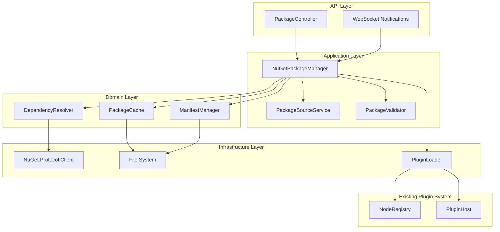

# Design Document: NuGet Plugin System

## Overview

This design extends FlowForge's existing plugin system to support NuGet packages as a distribution mechanism for custom nodes. The system enables runtime downloading, installation, and loading of plugin packages from NuGet feeds without requiring application restarts.

The design builds on the existing `IPluginLoader` and `PluginLoadContext` infrastructure, adding a new `INuGetPackageManager` layer that handles package discovery, download, dependency resolution, and lifecycle management.

## Architecture



## Components and Interfaces

### INuGetPackageManager

The primary interface for package operations.

```csharp
public interface INuGetPackageManager
{
    /// <summary>
    /// Searches for packages matching the query across configured sources.
    /// </summary>
    Task<PackageSearchResult> SearchPackagesAsync(
        string query,
        PackageSearchOptions? options = null,
        CancellationToken cancellationToken = default);
    
    /// <summary>
    /// Gets detailed information about a specific package.
    /// </summary>
    Task<PackageDetails?> GetPackageDetailsAsync(
        string packageId,
        NuGetVersion? version = null,
        CancellationToken cancellationToken = default);
    
    /// <summary>
    /// Installs a package and its dependencies.
    /// </summary>
    Task<PackageInstallResult> InstallPackageAsync(
        string packageId,
        NuGetVersion? version = null,
        bool prerelease = false,
        CancellationToken cancellationToken = default);
    
    /// <summary>
    /// Updates an installed package to a newer version.
    /// </summary>
    Task<PackageUpdateResult> UpdatePackageAsync(
        string packageId,
        NuGetVersion? targetVersion = null,
        CancellationToken cancellationToken = default);
    
    /// <summary>
    /// Uninstalls a package and removes orphaned dependencies.
    /// </summary>
    Task<PackageUninstallResult> UninstallPackageAsync(
        string packageId,
        bool force = false,
        CancellationToken cancellationToken = default);
    
    /// <summary>
    /// Gets all installed packages.
    /// </summary>
    IReadOnlyList<InstalledPackage> GetInstalledPackages();
    
    /// <summary>
    /// Checks for available updates to installed packages.
    /// </summary>
    Task<IReadOnlyList<PackageUpdateInfo>> CheckForUpdatesAsync(
        CancellationToken cancellationToken = default);
    
    /// <summary>
    /// Loads all installed packages from the manifest on startup.
    /// </summary>
    Task InitializeAsync(CancellationToken cancellationToken = default);
}
```

### IPackageSourceService

Manages NuGet feed configuration.

```csharp
public interface IPackageSourceService
{
    /// <summary>
    /// Gets all configured package sources.
    /// </summary>
    IReadOnlyList<PackageSource> GetSources();
    
    /// <summary>
    /// Adds a new package source.
    /// </summary>
    Task<PackageSource> AddSourceAsync(PackageSourceConfig config);
    
    /// <summary>
    /// Removes a package source.
    /// </summary>
    Task RemoveSourceAsync(string sourceName);
    
    /// <summary>
    /// Updates a package source configuration.
    /// </summary>
    Task UpdateSourceAsync(string sourceName, PackageSourceConfig config);
    
    /// <summary>
    /// Tests connectivity to a package source.
    /// </summary>
    Task<SourceTestResult> TestSourceAsync(string sourceName);
    
    /// <summary>
    /// Gets the NuGet source repository for a package source.
    /// </summary>
    SourceRepository GetRepository(PackageSource source);
}
```

### IDependencyResolver

Resolves package dependencies.

```csharp
public interface IDependencyResolver
{
    /// <summary>
    /// Resolves all dependencies for a package.
    /// </summary>
    Task<DependencyResolutionResult> ResolveAsync(
        string packageId,
        NuGetVersion version,
        IEnumerable<InstalledPackage> installedPackages,
        CancellationToken cancellationToken = default);
    
    /// <summary>
    /// Checks if a package update would cause conflicts.
    /// </summary>
    Task<CompatibilityResult> CheckUpdateCompatibilityAsync(
        string packageId,
        NuGetVersion newVersion,
        IEnumerable<InstalledPackage> installedPackages,
        CancellationToken cancellationToken = default);
}
```

### IPackageCache

Manages local package storage.

```csharp
public interface IPackageCache
{
    /// <summary>
    /// Gets the path to a cached package, downloading if necessary.
    /// </summary>
    Task<string> GetPackagePathAsync(
        string packageId,
        NuGetVersion version,
        SourceRepository source,
        CancellationToken cancellationToken = default);
    
    /// <summary>
    /// Extracts package contents to the plugins directory.
    /// </summary>
    Task<string> ExtractPackageAsync(
        string packagePath,
        string packageId,
        NuGetVersion version,
        CancellationToken cancellationToken = default);
    
    /// <summary>
    /// Removes a package from the cache.
    /// </summary>
    Task RemovePackageAsync(string packageId, NuGetVersion version);
    
    /// <summary>
    /// Gets the extraction path for a package.
    /// </summary>
    string GetExtractionPath(string packageId, NuGetVersion version);
    
    /// <summary>
    /// Cleans up orphaned cache entries.
    /// </summary>
    Task CleanupAsync(IEnumerable<InstalledPackage> installedPackages);
}
```

### IManifestManager

Persists installed package information.

```csharp
public interface IManifestManager
{
    /// <summary>
    /// Loads the package manifest from disk.
    /// </summary>
    Task<PackageManifest> LoadAsync();
    
    /// <summary>
    /// Saves the package manifest to disk.
    /// </summary>
    Task SaveAsync(PackageManifest manifest);
    
    /// <summary>
    /// Adds a package to the manifest.
    /// </summary>
    Task AddPackageAsync(InstalledPackage package);
    
    /// <summary>
    /// Removes a package from the manifest.
    /// </summary>
    Task RemovePackageAsync(string packageId);
    
    /// <summary>
    /// Updates a package in the manifest.
    /// </summary>
    Task UpdatePackageAsync(InstalledPackage package);
}
```

## Data Models

```csharp
/// <summary>
/// Represents a configured NuGet package source.
/// </summary>
public record PackageSource
{
    public required string Name { get; init; }
    public required string Url { get; init; }
    public bool IsEnabled { get; init; } = true;
    public bool IsTrusted { get; init; }
    public PackageSourceCredentials? Credentials { get; init; }
    public int Priority { get; init; }
}

/// <summary>
/// Credentials for authenticated package sources.
/// </summary>
public record PackageSourceCredentials
{
    public string? Username { get; init; }
    public string? Password { get; init; }
    public string? ApiKey { get; init; }
}

/// <summary>
/// Information about an installed package.
/// </summary>
public record InstalledPackage
{
    public required string PackageId { get; init; }
    public required NuGetVersion Version { get; init; }
    public required string SourceName { get; init; }
    public required string InstallPath { get; init; }
    public required DateTime InstalledAt { get; init; }
    public IReadOnlyList<string> NodeTypes { get; init; } = [];
    public IReadOnlyList<string> Dependencies { get; init; } = [];
    public bool IsLoaded { get; init; }
}

/// <summary>
/// The persisted manifest of installed packages.
/// </summary>
public record PackageManifest
{
    public int Version { get; init; } = 1;
    public DateTime LastModified { get; init; }
    public IReadOnlyList<InstalledPackage> Packages { get; init; } = [];
    public IReadOnlyList<PackageSource> Sources { get; init; } = [];
}

/// <summary>
/// Result of a package search operation.
/// </summary>
public record PackageSearchResult
{
    public IReadOnlyList<PackageSearchItem> Packages { get; init; } = [];
    public int TotalCount { get; init; }
    public IReadOnlyList<string> Errors { get; init; } = [];
}

/// <summary>
/// A package in search results.
/// </summary>
public record PackageSearchItem
{
    public required string PackageId { get; init; }
    public required string Title { get; init; }
    public required NuGetVersion LatestVersion { get; init; }
    public string? Description { get; init; }
    public string? Authors { get; init; }
    public long DownloadCount { get; init; }
    public string? IconUrl { get; init; }
    public string? ProjectUrl { get; init; }
    public IReadOnlyList<string> Tags { get; init; } = [];
    public bool IsInstalled { get; init; }
    public NuGetVersion? InstalledVersion { get; init; }
}

/// <summary>
/// Result of a package installation.
/// </summary>
public record PackageInstallResult
{
    public bool Success { get; init; }
    public InstalledPackage? Package { get; init; }
    public IReadOnlyList<InstalledPackage> InstalledDependencies { get; init; } = [];
    public IReadOnlyList<string> Errors { get; init; } = [];
    public IReadOnlyList<string> Warnings { get; init; } = [];
}

/// <summary>
/// Result of dependency resolution.
/// </summary>
public record DependencyResolutionResult
{
    public bool Success { get; init; }
    public IReadOnlyList<PackageDependency> Dependencies { get; init; } = [];
    public IReadOnlyList<DependencyConflict> Conflicts { get; init; } = [];
}

/// <summary>
/// A resolved package dependency.
/// </summary>
public record PackageDependency
{
    public required string PackageId { get; init; }
    public required NuGetVersion Version { get; init; }
    public bool IsAlreadyInstalled { get; init; }
}

/// <summary>
/// A dependency version conflict.
/// </summary>
public record DependencyConflict
{
    public required string PackageId { get; init; }
    public required NuGetVersion RequestedVersion { get; init; }
    public required NuGetVersion InstalledVersion { get; init; }
    public required string RequestedBy { get; init; }
}
```


## Correctness Properties

*A property is a characteristic or behavior that should hold true across all valid executions of a system—essentially, a formal statement about what the system should do. Properties serve as the bridge between human-readable specifications and machine-verifiable correctness guarantees.*

### Property 1: Package Manifest Round-Trip

*For any* valid PackageManifest object, serializing to JSON then deserializing SHALL produce an equivalent object.

**Validates: Requirements 9.4**

### Property 2: Search Results Completeness

*For any* package search query against configured sources, all returned PackageSearchItem objects SHALL contain non-null PackageId, Title, and LatestVersion, and SHALL correctly indicate IsInstalled status matching the current manifest.

**Validates: Requirements 1.1, 1.2, 1.3**

### Property 3: Installation Completeness

*For any* successful package installation, the Package_Manager SHALL:
- Download the package to the Package_Cache
- Extract contents to the correct InstallPath
- Resolve and install all transitive dependencies
- Update the Package_Manifest with the installed package
- Register all node types with the Node_Registry

**Validates: Requirements 2.1, 2.2, 2.4, 2.6, 2.7**

### Property 4: Uninstallation Completeness

*For any* successful package uninstallation, the Package_Manager SHALL:
- Unload plugin assemblies from memory
- Remove package files from the Package_Cache
- Remove the package from the Package_Manifest
- Unregister all node types from the Node_Registry

**Validates: Requirements 4.3, 4.4, 4.5, 4.6**

### Property 5: Dependency Conflict Detection

*For any* package installation where a dependency version conflict exists with already-installed packages, the Dependency_Resolver SHALL detect the conflict and return a DependencyResolutionResult with Success=false and non-empty Conflicts list.

**Validates: Requirements 2.5, 7.3**

### Property 6: Dependency Resolution Completeness

*For any* package with transitive dependencies, the Dependency_Resolver SHALL return all required packages in the Dependencies list, and installing the package SHALL result in all dependencies being present in the Package_Cache.

**Validates: Requirements 7.1, 7.2**

### Property 7: Orphaned Dependency Cleanup

*For any* package uninstallation, dependencies that are not required by any other installed package SHALL be removed from the Package_Cache.

**Validates: Requirements 7.5**

### Property 8: Source Unavailability Resilience

*For any* set of configured Package_Sources where some are unavailable, the Package_Manager SHALL continue operating with cached packages and return partial results from available sources.

**Validates: Requirements 1.5, 8.4**

### Property 9: Offline Loading

*For any* valid Package_Manifest with packages in the Package_Cache, the Package_Manager SHALL successfully load all packages on startup without network access.

**Validates: Requirements 8.1, 8.2**

### Property 10: Package Source Persistence

*For any* Package_Source configuration (add, update, remove), the changes SHALL persist across application restarts.

**Validates: Requirements 5.1, 5.2, 5.6**

### Property 11: Untrusted Source Confirmation

*For any* package installation from a non-trusted Package_Source, the Package_Manager SHALL require explicit confirmation before proceeding.

**Validates: Requirements 5.5**

### Property 12: Plugin Interface Validation

*For any* package installation, the Package_Manager SHALL validate that all node types in the package implement the INode interface, and SHALL reject packages with invalid node types.

**Validates: Requirements 6.3**

### Property 13: Allow/Block List Enforcement

*For any* package installation attempt, if the package ID is in the block list, installation SHALL be rejected; if an allow list is configured and the package ID is not in it, installation SHALL be rejected.

**Validates: Requirements 6.6**

### Property 14: Update Version Ordering

*For any* installed package with available updates, CheckForUpdatesAsync SHALL return updates where the new version is greater than the installed version.

**Validates: Requirements 3.1, 3.2**

### Property 15: Workflow Reference Detection

*For any* package uninstallation request where workflows reference nodes from the package, the Package_Manager SHALL return a result indicating the affected workflows.

**Validates: Requirements 4.1, 4.2**

## Error Handling

### Package Download Errors

- Network failures: Retry with exponential backoff (3 attempts, 1s/2s/4s delays)
- Package not found: Return clear error with package ID and searched sources
- Signature verification failure: Reject package with security error

### Dependency Resolution Errors

- Version conflicts: Return detailed conflict information including which packages require which versions
- Missing dependencies: List all missing packages with their required versions
- Circular dependencies: Detect and report the cycle

### Plugin Loading Errors

- Assembly load failure: Log error, mark package as failed in manifest, continue with other packages
- Interface validation failure: Reject package, provide details about missing/incompatible interfaces
- Node registration failure: Log error, continue with other nodes from the package

### Manifest Corruption Recovery

1. Attempt to parse manifest JSON
2. If parsing fails, scan Package_Cache for installed packages
3. Rebuild manifest from discovered packages
4. Log recovery action and any packages that couldn't be recovered

## Testing Strategy

### Property-Based Testing

Use CsCheck for property-based testing with minimum 100 iterations per property.

**Test Configuration:**
```csharp
// CsCheck configuration for package manager tests
public class PackageManagerPropertyTests
{
    private static readonly Gen<PackageManifest> ManifestGen = 
        Gen.Select(
            Gen.Int[1, 3],
            Gen.DateTime,
            Gen.List(InstalledPackageGen, 0, 10),
            Gen.List(PackageSourceGen, 1, 5),
            (version, modified, packages, sources) => new PackageManifest
            {
                Version = version,
                LastModified = modified,
                Packages = packages,
                Sources = sources
            });
}
```

### Unit Tests

- Test individual components in isolation
- Mock NuGet.Protocol for deterministic behavior
- Test error handling paths
- Test edge cases (empty manifest, single package, max dependencies)

### Integration Tests

- Use TestContainers for isolated NuGet feed
- Test full installation/uninstallation cycles
- Test offline scenarios with pre-populated cache
- Test concurrent package operations

## File Structure

```
FlowForge/
├── FlowForge.Core/
│   └── Interfaces/
│       ├── INuGetPackageManager.cs
│       ├── IPackageSourceService.cs
│       ├── IDependencyResolver.cs
│       ├── IPackageCache.cs
│       └── IManifestManager.cs
│
├── FlowForge.Engine/
│   └── Packages/
│       ├── NuGetPackageManager.cs
│       ├── PackageSourceService.cs
│       ├── DependencyResolver.cs
│       ├── PackageCache.cs
│       ├── ManifestManager.cs
│       └── Models/
│           ├── PackageSource.cs
│           ├── InstalledPackage.cs
│           ├── PackageManifest.cs
│           ├── PackageSearchResult.cs
│           └── DependencyResolutionResult.cs
│
├── FlowForge.Api/
│   └── Controllers/
│       └── PackageController.cs
│
└── FlowForge.Tests/
    └── Property/
        └── PackageManagerTests.cs
```

## Dependencies

Add to FlowForge.Engine.csproj:
```xml
<PackageReference Include="NuGet.Protocol" Version="6.12.1" />
<PackageReference Include="NuGet.Packaging" Version="6.12.1" />
<PackageReference Include="NuGet.Versioning" Version="6.12.1" />
```

## Configuration

```json
{
  "FlowForge": {
    "Packages": {
      "CacheDirectory": "./packages",
      "ManifestPath": "./packages/manifest.json",
      "RequireSignedPackages": false,
      "AllowedPackages": [],
      "BlockedPackages": [],
      "Sources": [
        {
          "Name": "nuget.org",
          "Url": "https://api.nuget.org/v3/index.json",
          "IsTrusted": true,
          "IsEnabled": true
        }
      ]
    }
  }
}
```
