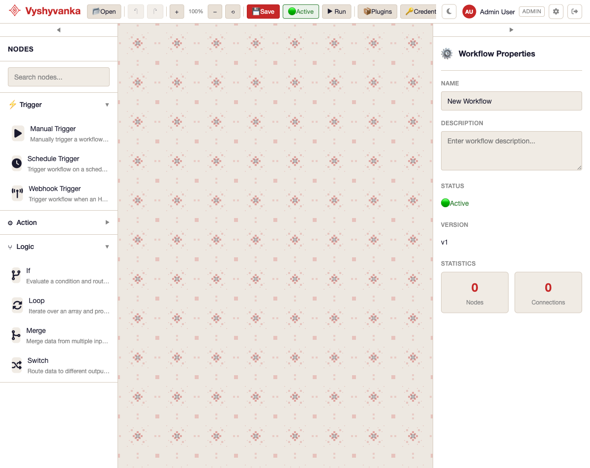
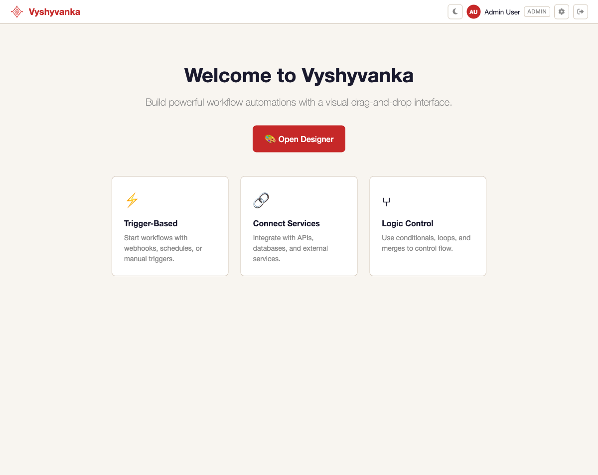
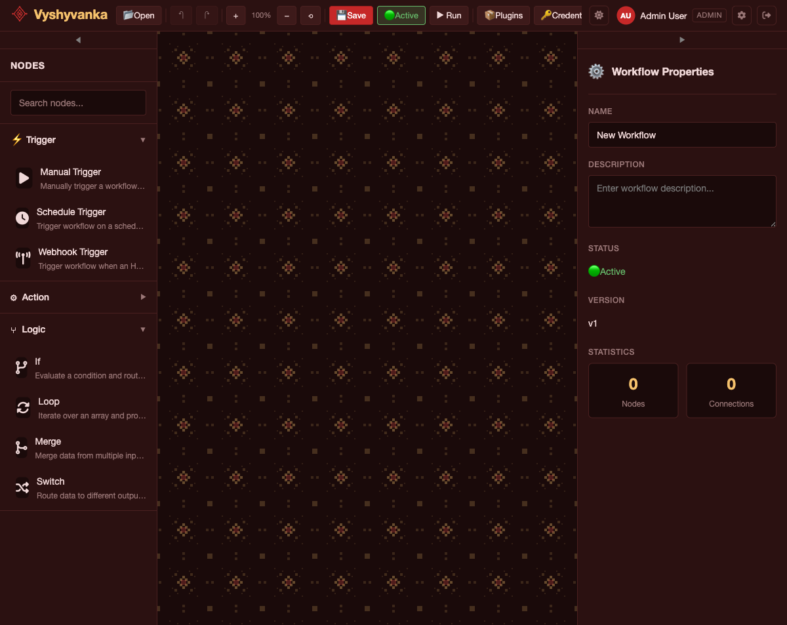
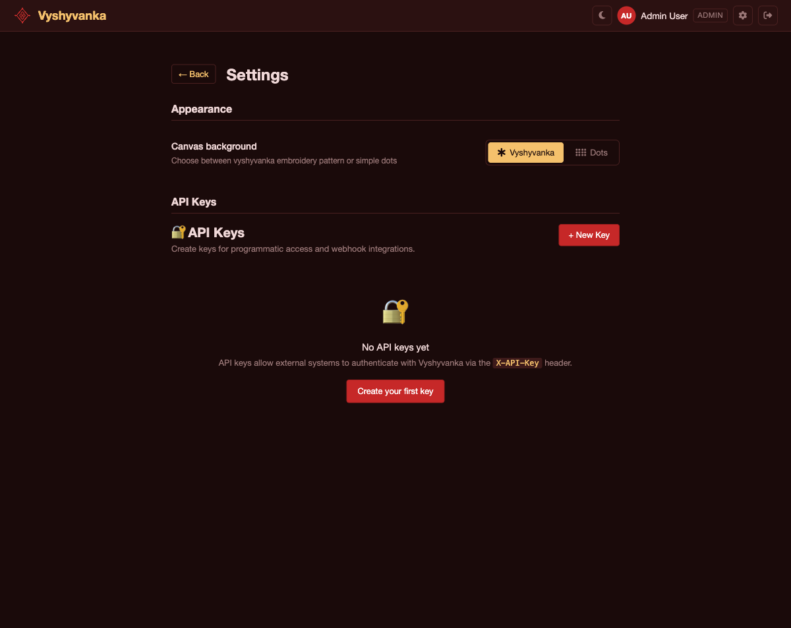
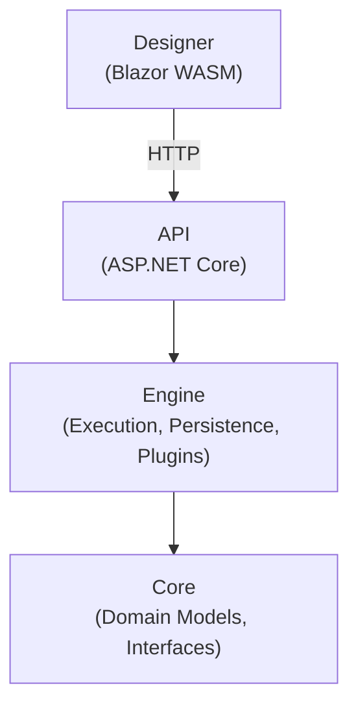

<p align="center">
  
</p>

<p align="center">
  A workflow automation platform built on .NET 10. Users create automated workflows through a visual node-based designer, connect nodes to define data flow, and execute workflows triggered by webhooks, schedules, or manual actions.
</p>

> [!WARNING]
> This project is under heavy development and is not suitable for production use. APIs, data formats, and features may change without notice.

## Why "Vyshyvanka"?

**Vyshyvanka** (Вишиванка) is a traditional Ukrainian embroidered shirt. Each pattern is crafted by weaving threads through fabric — every stitch deliberate, every connection meaningful. The same idea drives this project: workflows are patterns woven from nodes and connections, each one carrying data from one point to the next. The name reflects both the craft of building something intricate from simple elements and the Ukrainian roots of the team behind it.

## Screenshots

### Light Theme
| Designer | Home |
|----------|------|
|  |  |

### Dark Theme (Vyshyvanka Red)
| Designer | Settings |
|----------|----------|
|  |  |

## Architecture



Dependencies flow downward only. The Designer communicates with the API exclusively over HTTP.

## Tech Stack

| Component | Technology |
|-----------|------------|
| Runtime | .NET 10 / C# 14 |
| API | ASP.NET Core |
| UI | Blazor WebAssembly |
| Database | SQLite (dev) / PostgreSQL (prod) |
| ORM | Entity Framework Core (code-first) |
| Orchestration | .NET Aspire |
| Auth | Built-in JWT, Keycloak, Authentik, or LDAP |
| Credential Storage | Built-in AES-256, HashiCorp Vault, or OpenBao |
| Serialization | System.Text.Json |
| Testing | xUnit, CsCheck, NSubstitute, bUnit |

## Prerequisites

- [.NET 10 SDK](https://dotnet.microsoft.com/download/dotnet/10.0)
- [.NET Aspire workload](https://learn.microsoft.com/en-us/dotnet/aspire/fundamentals/setup-tooling) (`dotnet workload install aspire`)
- Docker (optional, for PostgreSQL via Aspire)

## Getting Started

Clone the repo and restore dependencies:

```bash
git clone <repository-url>
cd Vyshyvanka
dotnet restore Vyshyvanka.slnx
```

### Run with Aspire (recommended)

Starts both the API and Designer with service discovery:

```bash
dotnet run --project src/Vyshyvanka.AppHost
```

This uses SQLite by default. To use PostgreSQL instead (requires Docker):

```bash
USE_POSTGRES=true dotnet run --project src/Vyshyvanka.AppHost
```

### Run individual projects

```bash
# API only
dotnet run --project src/Vyshyvanka.Api

# Designer only
dotnet run --project src/Vyshyvanka.Designer
```

### Build & Test

```bash
dotnet build
dotnet test
```

## Project Structure

| Project | Location | Description |
|---------|----------|-------------|
| `Vyshyvanka.Core` | `src/` | Domain models, interfaces, enums, exceptions. No external dependencies. |
| `Vyshyvanka.Engine` | `src/` | Workflow execution engine, EF Core persistence, plugin system, node registry. |
| `Vyshyvanka.Api` | `src/` | REST API controllers, middleware, authentication, DTOs. |
| `Vyshyvanka.Designer` | `src/` | Blazor WebAssembly visual workflow editor. |
| `Vyshyvanka.AppHost` | `src/` | .NET Aspire host for orchestrating services. |
| `Vyshyvanka.ServiceDefaults` | `src/` | Shared Aspire service configuration (OpenTelemetry, resilience). |
| `Vyshyvanka.Plugin.AdvancedHttp` | `plugins/` | HTTP retry, polling, batch, and GraphQL nodes. |
| `Vyshyvanka.Plugin.GitLab` | `plugins/` | GitLab issues, merge requests, pipelines, files, tags, releases. |
| `Vyshyvanka.Plugin.Jira` | `plugins/` | Jira issues, comments, users, and JQL search. |
| `Vyshyvanka.Plugin.Tmplt` | `plugins/` | Starter template for building new plugins. |
| `Vyshyvanka.Tests` | `tests/` | Unit, integration, property-based, and E2E tests. |

## Key Concepts

### Workflows

A workflow is a directed graph of nodes connected through typed ports. Every workflow must have exactly one trigger node as its entry point.

### Nodes

Nodes are the building blocks of workflows. Three categories:

| Category | Base Class | Description |
|----------|------------|-------------|
| Trigger | `BaseTriggerNode` | Entry point — webhooks, schedules, manual triggers |
| Action | `BaseActionNode` | Operations — HTTP requests, database queries, email, custom code |
| Logic | `BaseLogicNode` | Flow control — conditionals, switches, loops, merges |

### Executions

When a trigger fires, an execution is created and moves through: `Pending` → `Running` → `Completed` / `Failed` / `Cancelled`. Node outputs are stored during execution for use in expressions.

### Expressions

Reference data from previous nodes using double-brace syntax:

```
{{$node.NodeName.data.propertyName}}
{{$execution.id}}
{{$workflow.id}}
```

### Plugins

Extend Vyshyvanka by creating plugin projects that reference `Vyshyvanka.Core` and implement custom nodes.

| Plugin | Description |
|--------|-------------|
| [AdvancedHttp](plugins/Vyshyvanka.Plugin.AdvancedHttp/) | HTTP retry, polling, batch requests, and GraphQL |
| [GitLab](plugins/Vyshyvanka.Plugin.GitLab/) | GitLab issues, merge requests, pipelines, files, tags, releases, and webhook triggers |
| [Jira](plugins/Vyshyvanka.Plugin.Jira/) | Jira issues, comments, users, and JQL search |
| [Template](plugins/Vyshyvanka.Plugin.Tmplt/) | Starter template for building your own plugins |

## Authentication

Vyshyvanka supports four authentication providers, configured via `Authentication:Provider` in `appsettings.json`:

| Provider | Value | Description |
|----------|-------|-------------|
| Built-in | `BuiltIn` | Local email/password with self-issued JWT tokens (default) |
| Keycloak | `Keycloak` | OpenID Connect via Keycloak |
| Authentik | `Authentik` | OpenID Connect via Authentik |
| LDAP | `Ldap` | LDAP directory with locally-issued JWT tokens |

API key authentication (`X-API-Key` header) is always available for webhooks and external integrations, regardless of the active provider.

### Built-in (default)

Works out of the box. Users register and log in with email/password. Development seeds three users automatically (`admin@vyshyvanka.local`, `editor@vyshyvanka.local`, `viewer@vyshyvanka.local`).

### Keycloak / Authentik

Configure the OIDC authority and role mappings. The API validates tokens issued by the external provider and auto-provisions local users on first login.

```json
{
  "Authentication": {
    "Provider": "Keycloak",
    "Authority": "https://keycloak.example.com/realms/vyshyvanka",
    "ClientId": "vyshyvanka-api",
    "Audience": "vyshyvanka-api",
    "RoleClaimType": "realm_access",
    "RoleMappings": {
      "vyshyvanka-admin": "Admin",
      "vyshyvanka-editor": "Editor"
    }
  }
}
```

See [`appsettings.Keycloak.json`](src/Vyshyvanka.Api/appsettings.Keycloak.json) and [`appsettings.Authentik.json`](src/Vyshyvanka.Api/appsettings.Authentik.json) for full examples.

### LDAP

Credentials are verified against the LDAP directory. Sessions use locally-issued JWT tokens. Users are provisioned on first login with roles mapped from LDAP group memberships.

```json
{
  "Authentication": {
    "Provider": "Ldap",
    "Ldap": {
      "Host": "ldap.example.com",
      "Port": 389,
      "UseStartTls": true,
      "BindDn": "cn=readonly,dc=example,dc=com",
      "BindPassword": "...",
      "SearchBase": "ou=users,dc=example,dc=com",
      "UserSearchFilter": "(mail={0})",
      "RoleMappings": {
        "Vyshyvanka-Admins": "Admin",
        "Vyshyvanka-Editors": "Editor"
      }
    }
  }
}
```

See [`appsettings.Ldap.json`](src/Vyshyvanka.Api/appsettings.Ldap.json) for the full example.

### Auth Discovery

The `GET /api/auth/config` endpoint (anonymous) returns the active provider and OIDC settings so the Designer can configure its auth flow at runtime.

## Credential Storage

Vyshyvanka supports three credential storage backends, configured via `CredentialStorage:Provider` in `appsettings.json`:

| Provider | Value | Description |
|----------|-------|-------------|
| Built-in | `BuiltIn` | AES-256 encrypted in the local database (default) |
| HashiCorp Vault | `HashiCorpVault` | KV v2 secrets engine |
| OpenBao | `OpenBao` | KV v2 secrets engine (Vault-compatible) |

### Built-in (default)

Credential values are encrypted with AES-256 and stored alongside metadata in the database. Configure the encryption key via `Vyshyvanka:EncryptionKey`.

### HashiCorp Vault / OpenBao

Metadata (name, type, owner) stays in the local database. Secret values are stored in Vault/OpenBao via the KV v2 API.

```json
{
  "CredentialStorage": {
    "Provider": "HashiCorpVault",
    "Url": "https://vault.example.com:8200",
    "MountPath": "secret",
    "PathPrefix": "vyshyvanka/credentials"
  }
}
```

The Vault token can be set via `CredentialStorage:Token` or the `VAULT_TOKEN` environment variable.

See [`appsettings.Vault.json`](src/Vyshyvanka.Api/appsettings.Vault.json) and [`appsettings.OpenBao.json`](src/Vyshyvanka.Api/appsettings.OpenBao.json) for full examples.

## Documentation

Detailed design docs and architectural decisions live in the [`docs/`](docs/) folder.

## License

MIT
