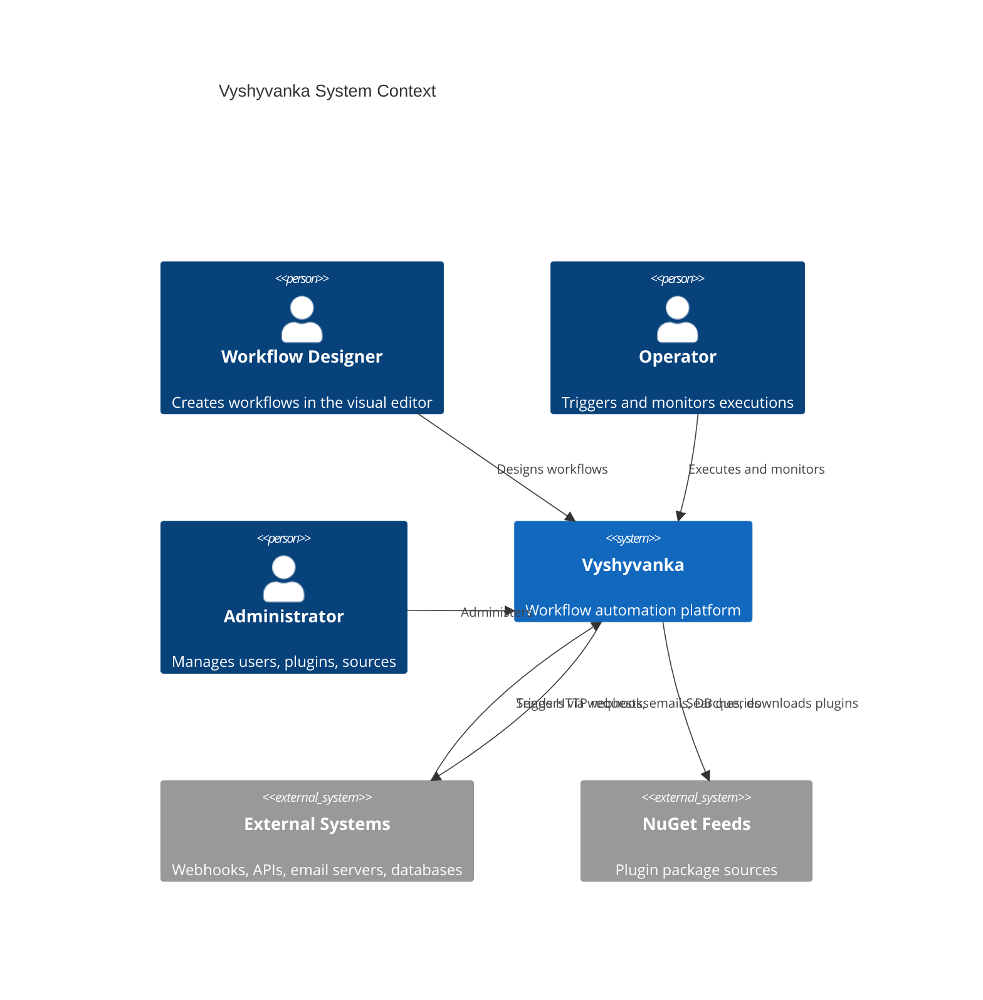

# Vyshyvanka — Product Overview

## Vision

Vyshyvanka is a workflow automation platform built on .NET 10. It enables users to design, execute, and monitor automated workflows through a visual node-based editor. Workflows are composed of interconnected nodes that define data flow and processing logic, triggered by webhooks, schedules, or manual actions.

## Core Capabilities

- Visual workflow design via a Blazor WebAssembly canvas editor
- Node-based execution engine with topological ordering and parallel branch support
- Expression language for referencing data between nodes at runtime
- Plugin system backed by NuGet for extending the node library
- Role-based access control with configurable authentication (built-in JWT, Keycloak, Authentik OIDC, or LDAP) and API key support
- Credential vault with AES-256 encryption at rest or external secrets management (HashiCorp Vault, OpenBao)
- Audit logging for all security-sensitive operations
- Execution persistence with full node-level tracing
- Optimistic concurrency control on workflow updates

## Glossary

The following terms are used consistently across the codebase, API, UI, and documentation.

| Term | Definition |
|------|-----------|
| Workflow | A directed acyclic graph of nodes and connections that defines an automated process. Owned by a user. |
| Node | A single unit of work within a workflow. Categorized as Trigger, Action, Logic, or Transform. |
| Connection | A directed link from an output port of one node to an input port of another. |
| Execution | A runtime instance of a workflow. Immutable once it reaches a terminal status. |
| Credential | Encrypted authentication data (API keys, OAuth tokens, basic auth) stored at rest with AES-256. |
| Trigger | A node that initiates workflow execution. Every workflow must have exactly one. |
| Port | A typed input or output endpoint on a node through which data flows. |
| Expression | A double-brace template that resolves data from previous node outputs or context variables at runtime. |
| Plugin | A NuGet package containing custom node implementations that extend the platform. |

## Stakeholders

| Role | Interaction |
|------|------------|
| Workflow Designer | Creates and edits workflows in the visual editor |
| Operator | Triggers executions, monitors results, manages credentials |
| Administrator | Manages users, installs plugins, configures package sources |
| External System | Triggers workflows via webhooks or API keys |

## System Context

