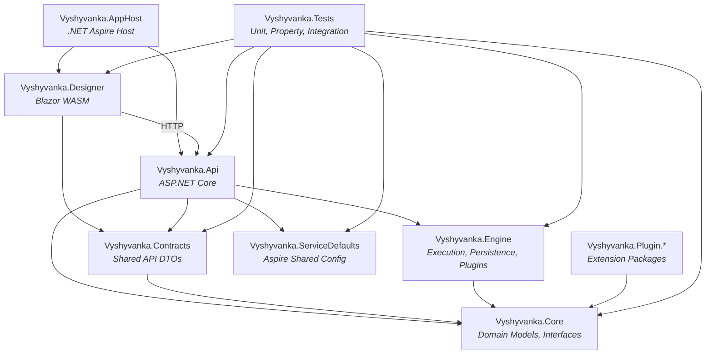
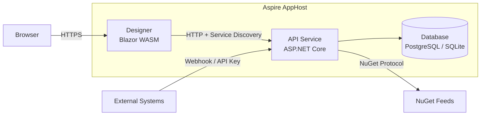
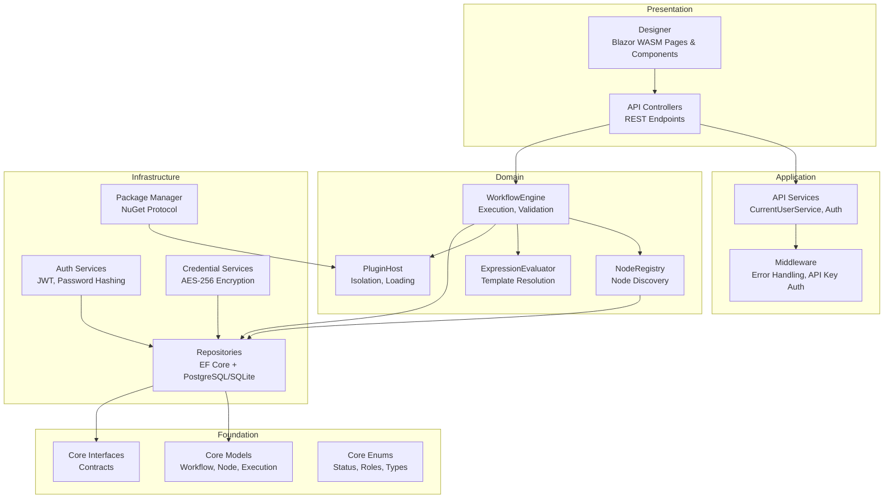

# Architecture

## Technology Stack

| Layer | Technology |
|-------|-----------|
| Runtime | .NET 10, C# 14 |
| API | ASP.NET Core (REST) |
| UI | Blazor WebAssembly |
| ORM | Entity Framework Core (code-first) |
| Database | PostgreSQL (default), SQLite (opt-in for CI) |
| Orchestration | .NET Aspire 9.1 |
| Observability | OpenTelemetry (traces, metrics, logs) |
| Serialization | System.Text.Json |
| Authentication | JWT Bearer + API Key (dual scheme); configurable OIDC (Keycloak, Authentik) or LDAP |
| Encryption | AES-256 for credentials at rest; optional HashiCorp Vault / OpenBao integration |
| Package Management | NuGet Protocol |

## Project Structure

## Dependency Rules

Dependencies flow strictly downward. Violations cause circular reference build errors.

| Project | Can Reference | Must Not Reference |
|---------|--------------|-------------------|
| Core | Nothing | Any other project |
| Contracts | Core | Engine, Api, Designer |
| Engine | Core | Api, Designer, Contracts |
| Api | Core, Engine, Contracts, ServiceDefaults | Designer |
| Designer | Contracts | Core (directly), Engine, Api |
| Plugin.* | Core | Engine, Api, Designer, Contracts |
| Tests | All projects | — |

The Designer communicates with the API exclusively over HTTP. It shares request/response types via the Contracts library but never references Engine or Api assemblies directly.

## Deployment Topology

The Aspire AppHost orchestrates both services with three database modes:

1. **Existing PostgreSQL** (if `ConnectionStrings:vyshyvankadb` is set in AppHost config) — connects to your local/external PostgreSQL instance, no container needed.
2. **Aspire-managed container** (default when no connection string is provided) — spins up a PostgreSQL Docker container with a persistent data volume.
3. **SQLite** (`Database:Provider=Sqlite`) — file-based, no container or external database required.

For standalone deployments (without Aspire), configure `Database:Provider` and `ConnectionStrings:vyshyvankadb` in `appsettings.json` or environment variables.

## Layered Architecture

## Key Architectural Decisions

| Decision | Rationale |
|----------|-----------|
| Records for domain models | Immutability by default; value equality semantics; concise syntax with `with` expressions |
| Repository pattern via interfaces in Core | Decouples domain from persistence; enables in-memory testing |
| Decorator pattern for PersistentWorkflowEngine | Separates execution logic from persistence concerns; inner engine is testable in isolation |
| Plugin isolation via AssemblyLoadContext | Prevents plugin failures from crashing the host; enables hot-unloading |
| Central package version management | `Directory.Packages.props` ensures consistent dependency versions across all projects |
| Dual authentication scheme | JWT for interactive sessions; API keys for programmatic and webhook access |
| Pluggable authentication provider | Configurable via `appsettings.json` — built-in JWT, Keycloak, Authentik OIDC, or LDAP directory with JIT user provisioning |
| Topological sort for execution order | Guarantees correct data flow; detects cycles at execution time |
| Optimistic concurrency on workflows | Version field prevents lost updates in concurrent editing scenarios |
