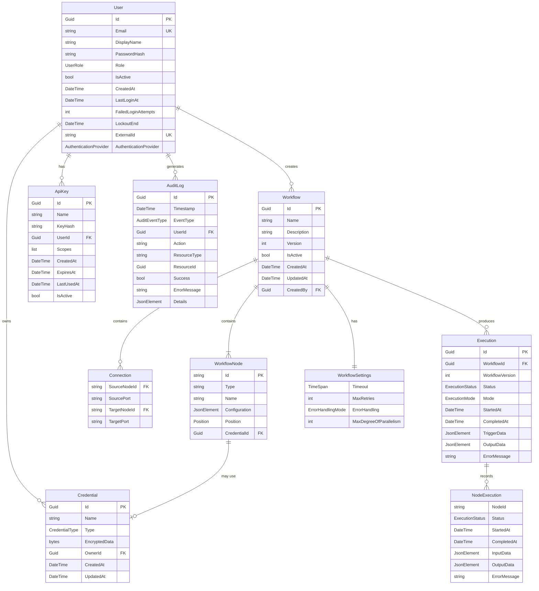
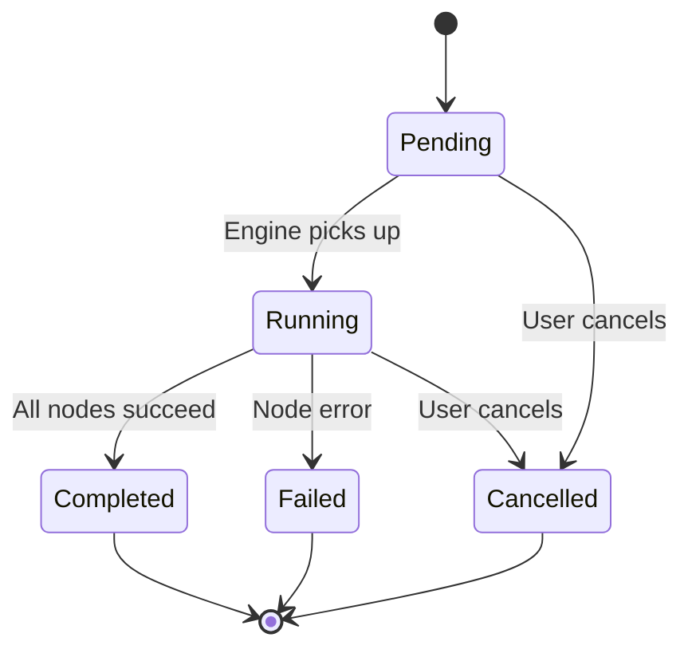

# Domain Model

## Entity Relationship Diagram

## Enumerations

### ExecutionStatus

Represents the lifecycle state of a workflow or node execution.

Terminal states (Completed, Failed, Cancelled) are immutable — no further transitions are allowed.

### ExecutionMode

Indicates how an execution was initiated.

| Value | Description |
|-------|------------|
| Manual | User clicked "Execute" in the Designer |
| Trigger | Fired by a trigger node (webhook event, schedule tick) |
| Api | Triggered via the REST API execution endpoint |
| Scheduled | Triggered by a cron-based schedule |

### ErrorHandlingMode

Controls how the engine responds to node failures during execution.

| Value | Behavior |
|-------|---------|
| StopOnFirstError | Immediately halts the entire workflow on the first node failure |
| ContinueOnError | Marks the failed node but continues executing other reachable branches |
| RetryWithBackoff | Retries the failed node with exponential backoff up to MaxRetries |

### NodeCategory

Classifies nodes by their role in a workflow.

| Value | Description |
|-------|------------|
| Trigger | Entry point nodes that initiate execution. No input ports. |
| Action | Nodes that perform operations (HTTP, database, email, file). |
| Logic | Flow control nodes (conditionals, switches, loops, merges). |
| Transform | Data transformation nodes between other nodes. |

### PortType

Defines the data type of a node port. Used for connection compatibility validation.

| Value | Compatible With |
|-------|----------------|
| Any | All types |
| Object | Object, Any |
| Array | Array, Any |
| String | String, Any |
| Number | Number, Any |
| Boolean | Boolean, Any |

A connection is valid when the source port type equals the target port type, or either port is `Any`.

### CredentialType

Types of authentication credentials the system can store.

| Value | Description |
|-------|------------|
| ApiKey | API key authentication |
| OAuth2 | OAuth 2.0 tokens |
| BasicAuth | Username and password |
| CustomHeaders | Arbitrary HTTP headers |

### UserRole

Role-based access control levels.

| Value | Permissions |
|-------|------------|
| Viewer | Read-only access to workflows and executions |
| Editor | Create, edit, and execute workflows; manage credentials |
| Admin | Full access including user management and plugin installation |

### AuthenticationProvider

Identifies which authentication provider owns a user account.

| Value | Description |
|-------|------------|
| BuiltIn | Local email/password authentication with self-issued JWT tokens |
| Keycloak | User provisioned from a Keycloak OIDC realm |
| Authentik | User provisioned from an Authentik OIDC application |
| Ldap | User provisioned from an LDAP directory |

Users with `Keycloak`, `Authentik`, or `Ldap` have an `ExternalId` and an empty `PasswordHash`.

## Validation Rules

### Workflow Validation

The `WorkflowValidator` enforces the following rules before a workflow can be saved or executed:

| Rule | Error Code |
|------|-----------|
| Name is required and non-empty | WORKFLOW_NAME_REQUIRED |
| Name cannot exceed 200 characters | WORKFLOW_NAME_TOO_LONG |
| Description cannot exceed 2000 characters | WORKFLOW_DESCRIPTION_TOO_LONG |
| Version must be non-negative | WORKFLOW_VERSION_INVALID |
| Exactly one trigger node must exist | WORKFLOW_TRIGGER_REQUIRED / WORKFLOW_MULTIPLE_TRIGGERS |
| Node IDs must be unique | NODE_ID_DUPLICATE |
| Node ID, type, and name are required | NODE_ID_REQUIRED / NODE_TYPE_REQUIRED / NODE_NAME_REQUIRED |
| Connection source and target must reference existing nodes | CONNECTION_SOURCE_NOT_FOUND / CONNECTION_TARGET_NOT_FOUND |
| Self-loop connections are forbidden | CONNECTION_SELF_LOOP |
| Source and target ports are required | CONNECTION_SOURCE_PORT_REQUIRED / CONNECTION_TARGET_PORT_REQUIRED |

### Concurrency Control

Workflows use optimistic concurrency via a `Version` field. On every update, the client must send the current version. If the stored version differs, the API returns HTTP 409 Conflict with error code `WORKFLOW_VERSION_CONFLICT`.

## Custom Exceptions

All domain exceptions extend `VyshyvankaException`, which carries a structured `ErrorCode` for programmatic handling.

| Exception | Error Code | HTTP Status |
|-----------|-----------|-------------|
| WorkflowNotFoundException | WORKFLOW_NOT_FOUND | 404 |
| ExecutionNotFoundException | EXECUTION_NOT_FOUND | 404 |
| CredentialNotFoundException | CREDENTIAL_NOT_FOUND | 404 |
| WorkflowValidationException | WORKFLOW_VALIDATION_FAILED | 400 |
| VersionConflictException | VERSION_CONFLICT | 409 |
| WorkflowExecutionException | EXECUTION_FAILED | 500 |
