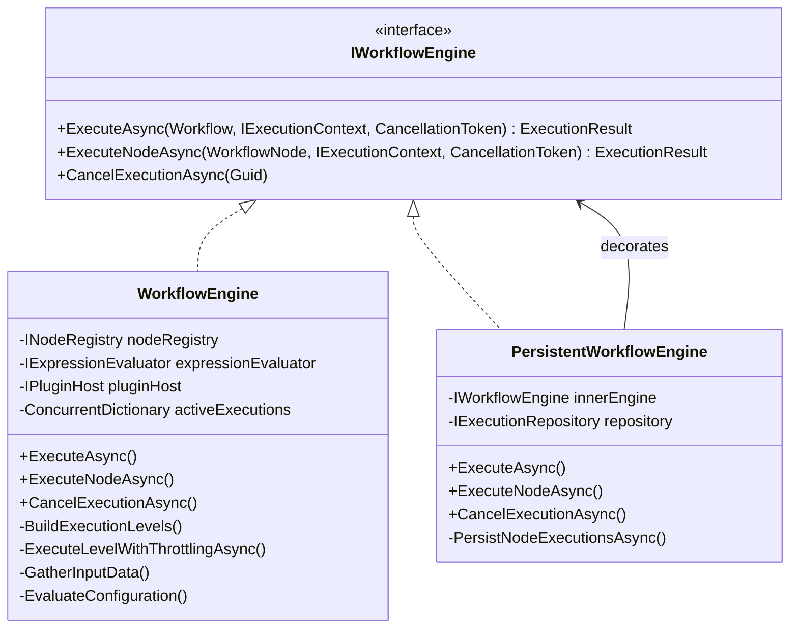
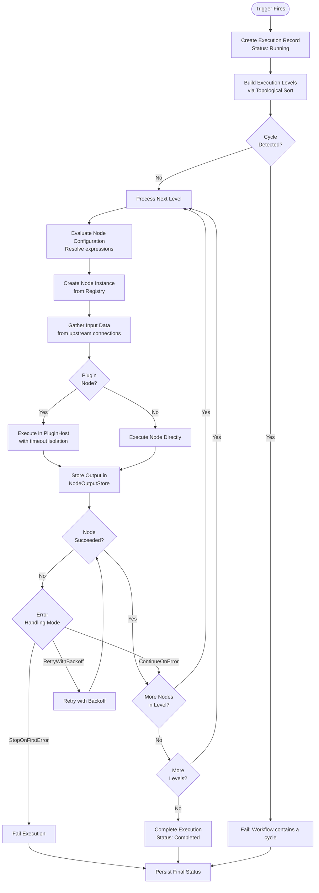
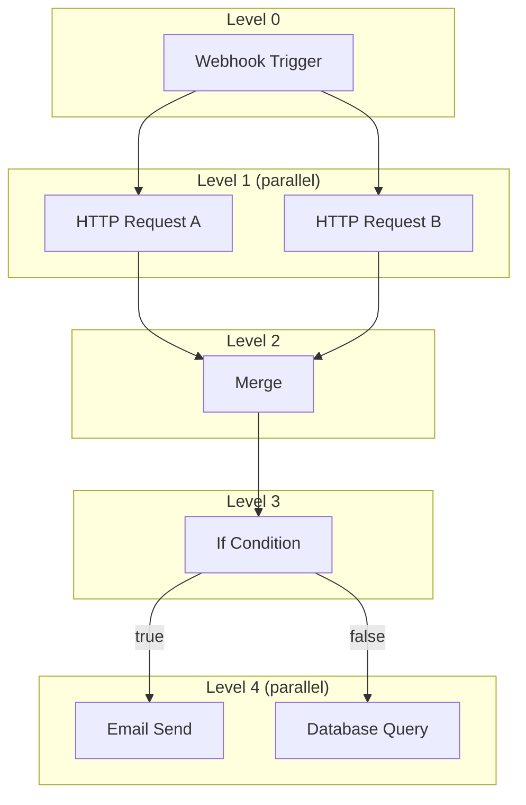

# Workflow Execution Engine

## Overview

The execution engine is responsible for running workflows by resolving node execution order, managing data flow between nodes, evaluating expressions, and handling errors. It is implemented as two cooperating classes:

- **WorkflowEngine** — Core execution logic (topological sort, parallel execution, expression evaluation)
- **PersistentWorkflowEngine** — Decorator that wraps WorkflowEngine and persists execution records to the database

## Execution Flow

## Topological Sort and Parallel Execution

The engine uses Kahn's algorithm to determine execution order:

1. Compute in-degree for every node based on connections
2. Nodes with in-degree zero form the first level (always the trigger node)
3. After executing a level, decrement in-degrees of downstream nodes
4. Nodes whose in-degree reaches zero form the next level
5. If not all nodes are processed, the workflow contains a cycle (rejected)

Nodes within the same level have no dependencies on each other and execute in parallel, throttled by a `SemaphoreSlim` with configurable `MaxDegreeOfParallelism`. The default parallelism is `Environment.ProcessorCount * 2`.

## Data Flow Between Nodes

Data flows through connections via the `NodeOutputStore`:

1. When a node completes, its output is stored keyed by `(nodeId, portName)`
2. Before executing a downstream node, the engine gathers input data from all incoming connections
3. If a node has a single incoming connection, the upstream output is passed directly
4. If a node has multiple incoming connections, outputs are merged into a JSON object keyed by `{sourceNodeId}_{sourcePort}`

The store supports port-specific outputs for nodes with multiple output ports (e.g., the If node outputs to `true` or `false` ports).

## Expression Evaluation

Node configurations can contain expressions using double-brace syntax. Before a node executes, the engine recursively walks its JSON configuration and resolves all expressions.

### Syntax

| Pattern | Description |
|---------|------------|
| `{{ nodes.NodeId.field }}` | Access output data from a named node |
| `{{ nodes.NodeId.field.nested }}` | Access nested properties |
| `{{ nodes.NodeId.field[0] }}` | Access array elements by index |
| `{{ variables.name }}` | Access execution context variables |
| `{{ toUpper(nodes.NodeId.field) }}` | Call a built-in function |

### Built-in Functions

| Category | Functions |
|----------|----------|
| String | `toUpper`, `toLower`, `trim`, `substring`, `length`, `concat`, `replace`, `contains`, `startsWith`, `endsWith`, `split` |
| Date | `now`, `utcNow`, `format`, `parseDate`, `addDays`, `addHours`, `addMinutes` |
| Math | `round`, `floor`, `ceil`, `abs`, `min`, `max` |
| Type Conversion | `toString`, `toNumber`, `toBoolean` |
| Utility | `coalesce`, `ifNull`, `iif` |

### Evaluation Behavior

- If the entire string is a single expression, the actual typed value is returned (not stringified)
- If expressions are mixed with literal text, string interpolation mode is used
- Expressions that reference nodes that haven't executed yet throw `ExpressionEvaluationException`
- Unknown function names or invalid paths produce descriptive error messages with the full path context

## Execution Context

The `ExecutionContext` provides runtime state during workflow execution:

| Property | Purpose |
|----------|---------|
| ExecutionId | Unique identifier for this execution run |
| WorkflowId | Identifier of the workflow being executed |
| Variables | Key-value store for trigger data, webhook payloads, and user-defined variables |
| NodeOutputs | Port-aware store for node output data |
| Credentials | Provider for decrypting credentials on demand |
| CancellationToken | Cooperative cancellation support |

## Cancellation

Active executions are tracked in a `ConcurrentDictionary<Guid, CancellationTokenSource>`. Calling `CancelExecutionAsync` signals the token, which is checked:

- Before each execution level
- Before each node execution
- By async operations within nodes

Cancelled executions are persisted with status `Cancelled`.

## Persistence (Decorator)

The `PersistentWorkflowEngine` wraps the core engine and:

1. Creates an `Execution` record with status `Running` before execution starts
2. Delegates to the inner engine for actual execution
3. Persists individual `NodeExecution` records after each node completes
4. Updates the `Execution` record with the final status (`Completed`, `Failed`, or `Cancelled`)
5. Catches exceptions to ensure the execution record is always updated, even on failure
