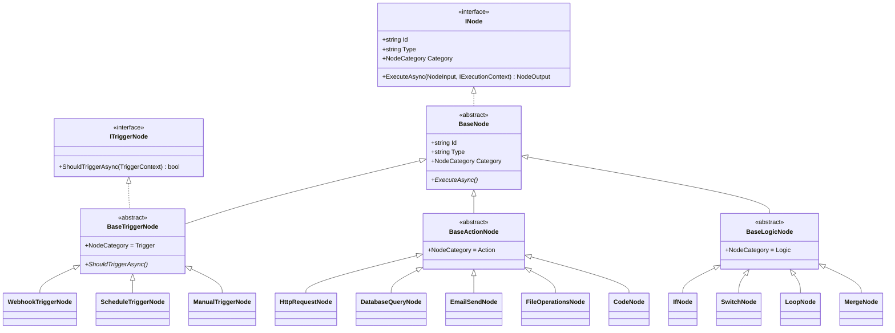
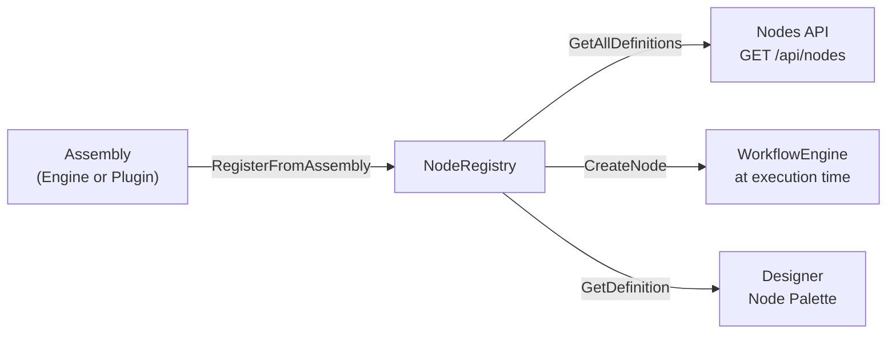
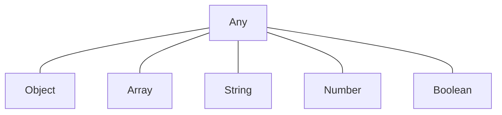
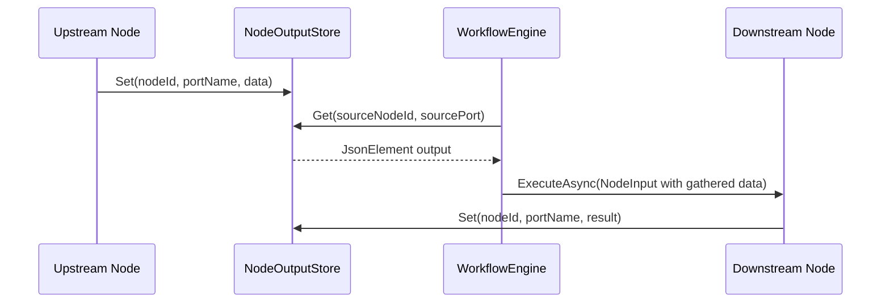

# Node System

## Overview

Nodes are the building blocks of workflows. Each node is a self-contained unit of work with typed input and output ports, a configuration schema, and an execution method. The node system is designed for extensibility — built-in nodes and plugin nodes share the same interfaces and registration mechanism.

## Node Class Hierarchy



## Built-in Nodes

### Trigger Nodes

Trigger nodes initiate workflow execution. They have no input ports and produce output data that downstream nodes consume.

| Node | Type Identifier | Description |
|------|----------------|------------|
| Webhook Trigger | `webhook-trigger` | Fires when an HTTP request hits the webhook endpoint. Passes method, headers, query params, and body as output. Optional security: `secret` (HMAC-SHA256 verification), `allowedIps` (IP allowlist). |
| Schedule Trigger | `schedule-trigger` | Fires on a cron schedule. Passes the scheduled time as output. |
| Manual Trigger | `manual-trigger` | Fires when a user manually executes the workflow. Passes any provided input data. |

### Action Nodes

Action nodes perform operations and produce output data.

| Node | Type Identifier | Description | Credential Required |
|------|----------------|------------|-------------------|
| HTTP Request | `http-request` | Makes HTTP requests to external APIs. Configurable method, URL, headers, body. | Optional (ApiKey, OAuth2, BasicAuth, CustomHeaders) |
| Database Query | `database-query` | Executes SQL queries against configured databases. | Optional (BasicAuth) |
| Email Send | `email-send` | Sends emails via SMTP. | Optional (BasicAuth) |
| File Operations | `file-operations` | Reads, writes, and manipulates files. | None |
| Code | `code` | Executes custom JavaScript or JSONata code. JavaScript uses the Jint interpreter for general-purpose scripting; JSONata provides declarative JSON transformation. Supports "run once" and "run for each item" modes. | None |

### Logic Nodes

Logic nodes control the flow of execution through the workflow.

| Node | Type Identifier | Description | Output Ports |
|------|----------------|------------|-------------|
| If | `if-condition` | Evaluates a condition and routes data to the `true` or `false` output port. | `true`, `false` |
| Switch | `switch` | Evaluates an expression and routes to one of multiple named output ports based on matching cases. | Dynamic (one per case + `default`) |
| Loop | `loop` | Iterates over an array, executing downstream nodes for each element. The `done` port fires after all iterations and carries collected outputs from terminal subgraph nodes in an `items` array. | `item`, `done` |
| Merge | `merge` | Waits for all incoming connections and merges their data into a single output. | `output` |

## Node Definition and Registration

### Metadata Attributes

Node classes are decorated with attributes that the `NodeRegistry` reads to build `NodeDefinition` records:

| Attribute | Purpose |
|-----------|---------|
| `NodeDefinitionAttribute` | Name, description, icon |
| `NodeInputAttribute` | Defines an input port (name, display name, type, required) |
| `NodeOutputAttribute` | Defines an output port (name, display name, type) |
| `ConfigurationPropertyAttribute` | Defines a configuration property (name, type, description, required, options, data source) |
| `RequiresCredentialAttribute` | Declares the credential type needed |

### Node Registry

The `NodeRegistry` is the central catalog of all available node types. It:

1. Scans assemblies for classes implementing `INode`
2. Instantiates each to read its `Type` and `Category`
3. Reads metadata attributes to build `NodeDefinition` records
4. Stores type mappings for runtime instantiation via `CreateNode(type, config)`



Registration also supports:
- `Register<TNode>()` for individual type registration
- `Unregister(nodeType)` for removing a single type
- `UnregisterFromAssembly(assembly)` for bulk removal (used during plugin unload)

### Node Definition Schema

Each `NodeDefinition` contains:

| Field | Description |
|-------|------------|
| Type | Unique string identifier (e.g., `http-request`) |
| Name | Human-readable display name |
| Description | What the node does |
| Category | Trigger, Action, Logic, or Transform |
| Icon | Icon identifier for the Designer UI |
| Inputs | List of input port definitions with name, type, and required flag |
| Outputs | List of output port definitions with name and type |
| ConfigurationSchema | JSON Schema describing the node's configurable properties |
| RequiredCredentialType | The credential type needed, if any |
| SourcePackage | Package ID for plugin nodes (null for built-in) |

## Port System

### Port Compatibility

Connections between nodes are validated based on port types:



A connection is valid when:
- Source port type equals target port type, OR
- Either port type is `Any`

### Data Flow Through Ports



When a downstream node has multiple incoming connections, the engine merges all upstream outputs into a single JSON object keyed by `{sourceNodeId}_{sourcePort}`.

## Configuration Schema

Node configuration is stored as a `JsonElement` on each `WorkflowNode`. The schema is defined via `ConfigurationPropertyAttribute` on the node class and exposed as a JSON Schema in the `NodeDefinition`.

### ConfigurationPropertyAttribute Properties

| Property | Type | Description |
|----------|------|-------------|
| `Name` | string | Property name (positional, required) |
| `PropertyType` | string | Type: string, number, boolean, object, array (positional, required) |
| `Description` | string? | Help text shown in the Designer |
| `IsRequired` | bool | Whether the property must have a value |
| `Options` | string? | Comma-separated static options for dropdown (e.g., `"create,get,update,delete"`) |
| `DataSource` | string? | Dynamic data source identifier (e.g., `"workflows"`) — Designer fetches options from the API |

### Property Editor Mapping

The Designer uses the schema to render appropriate property editors:

| Schema Type | Editor Component | Condition |
|-------------|-----------------|-----------|
| `string` | StringPropertyEditor | Default for strings |
| `string` + `Options` | SelectPropertyEditor | When static options are defined |
| `string` + `DataSource="workflows"` | WorkflowSelectPropertyEditor | Fetches workflows from API |
| `number` | NumberPropertyEditor | |
| `boolean` | BooleanPropertyEditor | |
| `object` | JsonPropertyEditor | |
| `code` | CodePropertyEditor | Multi-line code editor with syntax highlighting |

### Static Options Example

```csharp
[ConfigurationProperty("operation", "string",
    Description = "Operation to perform",
    IsRequired = true,
    Options = "create,get,getAll,update,delete")]
```

### Dynamic Data Source Example

```csharp
[ConfigurationProperty("workflowId", "string",
    Description = "ID of the workflow to execute",
    IsRequired = true,
    DataSource = "workflows")]
```

Configuration values can contain expressions (double-brace syntax) that are resolved at execution time before the node runs.
