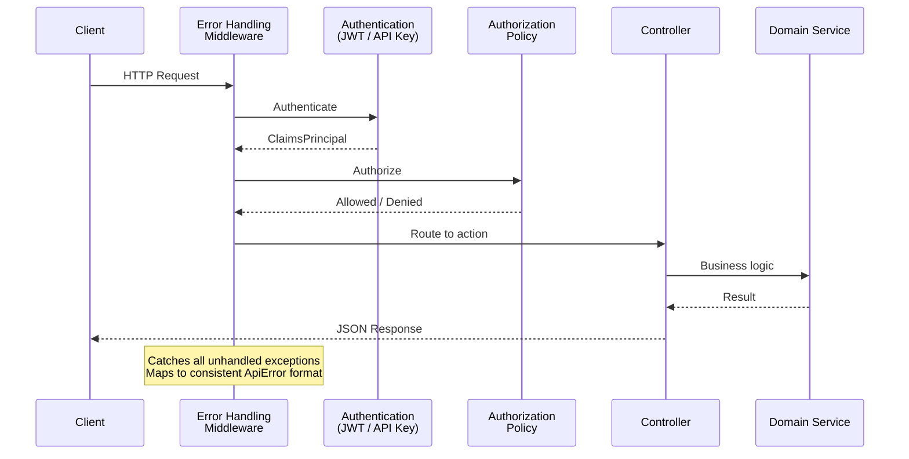

# REST API Reference

## Overview

The Vyshyvanka API is an ASP.NET Core REST API that serves as the backend for the Designer and external integrations. All endpoints return JSON responses and use consistent error formatting.

Base URL: `/api`

## Pagination

All list endpoints support `skip` and `take` query parameters. The maximum page size is **100** — values above 100 are clamped server-side. Default page size varies by endpoint (typically 50).

## Authentication

The API supports two authentication schemes, evaluated in order:

1. **JWT Bearer** — For interactive user sessions from the Designer
2. **API Key** — For programmatic access via the `X-API-Key` header

Unauthenticated requests to protected endpoints receive HTTP 401.

## Error Response Format

All errors follow a consistent structure:

| Field | Type | Description |
|-------|------|------------|
| code | string | Machine-readable error code (e.g., `WORKFLOW_NOT_FOUND`) |
| message | string | Human-readable description |
| details | object | Optional field-level errors or additional context |
| traceId | string | Request trace identifier for debugging |

The `ErrorHandlingMiddleware` maps all unhandled exceptions to appropriate HTTP status codes and error codes.

## Endpoints

### Authentication

| Method | Path | Auth | Description |
|--------|------|------|------------|
| GET | `/api/auth/config` | Anonymous | Returns the active authentication provider and OIDC settings (authority, client ID). Used by the Designer to configure its auth flow. |
| POST | `/api/auth/login` | Anonymous | Login with email/username and password. Returns JWT access token, refresh token, and user info. **Built-in and LDAP providers only.** Rate limited: 5 req/min per IP. |
| POST | `/api/auth/register` | Anonymous | Register a new user account. **Built-in provider only.** Requires `AllowRegistration: true` in settings. Enforces password complexity. Rate limited: 5 req/min per IP. |
| POST | `/api/auth/refresh` | Anonymous | Exchange a refresh token for a new access token. **Built-in and LDAP providers only.** Rate limited: 5 req/min per IP. |
| POST | `/api/auth/unlock/{userId}` | CanManageUsers | Unlock a user account locked due to failed login attempts. Resets failed attempt counter and lockout timer. |

When the active provider is Keycloak or Authentik, the login, register, and refresh endpoints return HTTP 400 with code `UNSUPPORTED`. When the provider is LDAP, only the register endpoint is disabled.

Accounts are locked after 5 consecutive failed login attempts for 15 minutes. See [Security — Account Lockout](07-security.md#account-lockout) for details.

### Workflows

| Method | Path | Auth Policy | Description |
|--------|------|------------|------------|
| GET | `/api/workflow` | CanViewWorkflows | List workflows with pagination. Supports `skip`, `take`, `search` query params. Non-Admin users see only their own workflows. |
| GET | `/api/workflow/active` | CanViewWorkflows | List only active workflows. Non-Admin users see only their own. |
| GET | `/api/workflow/{id}` | CanViewWorkflows | Get a single workflow by ID. Requires ownership or Admin role. |
| POST | `/api/workflow` | CanManageWorkflows | Create a new workflow. Validates before saving. |
| PUT | `/api/workflow/{id}` | CanManageWorkflows | Update a workflow. Requires version for optimistic concurrency. |
| DELETE | `/api/workflow/{id}` | CanManageWorkflows | Delete a workflow. |

### Executions

| Method | Path | Auth Policy | Description |
|--------|------|------------|------------|
| POST | `/api/execution` | CanExecuteWorkflows | Trigger a workflow execution. Accepts workflow ID, input data, and execution mode. Requires workflow ownership or Admin role. |
| GET | `/api/execution` | CanViewWorkflows | Query execution history with filters (workflow ID, status, mode, date range). |
| GET | `/api/execution/{id}` | CanViewWorkflows | Get execution details including node-level results. |
| GET | `/api/execution/workflow/{workflowId}` | CanViewWorkflows | Get executions for a specific workflow. |
| GET | `/api/execution/status/{status}` | CanViewWorkflows | Get executions by status. |
| POST | `/api/execution/{id}/cancel` | CanExecuteWorkflows | Cancel a running or pending execution. |

### Webhooks

| Method | Path | Auth | Description |
|--------|------|------|------------|
| GET/POST/PUT/DELETE/PATCH | `/api/webhook/{workflowId}` | Anonymous | Trigger a workflow by ID. Passes HTTP method, headers, query, and body as trigger data. |
| GET/POST/PUT/DELETE/PATCH | `/api/webhook/path/{*path}` | Anonymous | Trigger a workflow by matching webhook path configuration. |

Webhook endpoints are anonymous to allow external systems to trigger workflows. The webhook controller builds a structured payload containing the HTTP method, path, query string, headers (excluding Authorization and Cookie), and body. Rate limited: 30 req/min per IP.

**Security controls (optional, per-workflow):**
- **Request body size limit**: 1 MB maximum enforced on all webhook requests
- **HMAC-SHA256 signature verification**: Configure a `secret` in the webhook trigger node. Callers must include `X-Webhook-Signature: sha256=<hex-hmac>` header.
- **IP allowlisting**: Configure `allowedIps` array in the webhook trigger node. Only listed IPs can trigger the workflow.

See [Security — Webhook Security](07-security.md#webhook-security) for configuration details.

### Nodes

| Method | Path | Auth | Description |
|--------|------|------|------------|
| GET | `/api/nodes` | Any authenticated | List all registered node definitions (built-in and plugin). |
| GET | `/api/nodes/{nodeType}` | Any authenticated | Get a specific node definition by type identifier. |

### Packages

| Method | Path | Auth Policy | Description |
|--------|------|------------|------------|
| GET | `/api/packages/search` | CanViewPackages | Search NuGet feeds. Supports `query`, `skip`, `take`, `includePrerelease`. |
| GET | `/api/packages` | CanViewPackages | List all installed packages. |
| GET | `/api/packages/{id}` | CanViewPackages | Get package details. Optional `version` query param. |
| POST | `/api/packages/{id}/install` | CanManagePackages | Install a package. Optional version and prerelease flag. |
| POST | `/api/packages/{id}/update` | CanManagePackages | Update an installed package. Optional target version. |
| DELETE | `/api/packages/{id}` | CanManagePackages | Uninstall a package. Optional `force` flag to ignore workflow references. |
| GET | `/api/packages/updates` | CanViewPackages | Check for available updates to installed packages. |

### Package Sources

| Method | Path | Auth Policy | Description |
|--------|------|------------|------------|
| GET | `/api/packages/sources` | CanViewPackages | List all configured NuGet sources. |
| POST | `/api/packages/sources` | CanManagePackages | Add a new package source. |
| PUT | `/api/packages/sources/{name}` | CanManagePackages | Update a package source. |
| DELETE | `/api/packages/sources/{name}` | CanManagePackages | Remove a package source. |
| POST | `/api/packages/sources/{name}/test` | CanViewPackages | Test connectivity to a source. |

### API Keys

| Method | Path | Auth | Description |
|--------|------|------|------------|
| POST | `/api/apikeys` | Authenticated | Create a new API key. Returns the plain-text key (shown only once). |
| GET | `/api/apikeys` | Authenticated | List all API keys for the current user. |
| GET | `/api/apikeys/{id}` | Authenticated | Get an API key by ID (own keys only). |
| POST | `/api/apikeys/{id}/revoke` | Authenticated | Revoke an API key (deactivate without deleting). |
| DELETE | `/api/apikeys/{id}` | Authenticated | Permanently delete an API key. |

## Request/Response Flow

