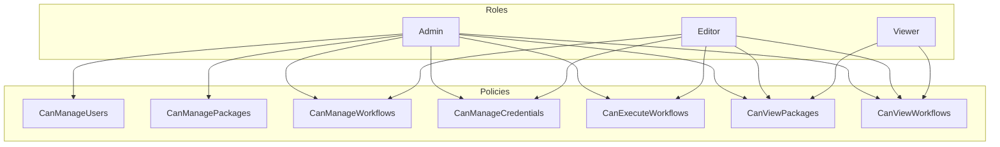
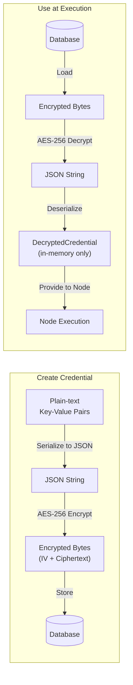
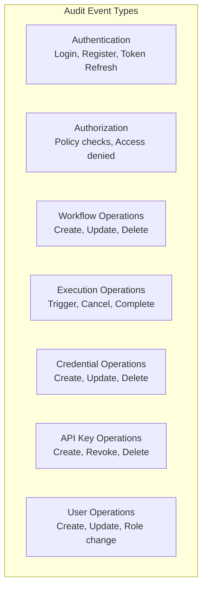

# Security Architecture

## Overview

FlowForge implements a layered security model covering authentication, authorization, credential management, and audit logging. Security is enforced at the API layer through middleware and authorization policies.

## Authentication

### Configurable Authentication Provider

FlowForge supports four authentication providers, selected via the `Authentication:Provider` setting in `appsettings.json`:

| Provider | Value | Description |
|----------|-------|-------------|
| Built-in | `BuiltIn` | Local email/password authentication with self-issued JWT tokens (default) |
| Keycloak | `Keycloak` | OpenID Connect via a Keycloak realm |
| Authentik | `Authentik` | OpenID Connect via an Authentik application |
| LDAP | `Ldap` | LDAP directory authentication with locally-issued JWT tokens |

The `GET /api/auth/config` endpoint (anonymous) returns the active provider and OIDC settings so the Designer can configure its auth flow at runtime.

### Authentication Flow


### Built-in Authentication (default)

Used for interactive sessions from the Designer when no external identity provider is configured.

| Aspect | Detail |
|--------|--------|
| Token Type | JWT (JSON Web Token) |
| Signing | Symmetric key (configurable via `Jwt:SecretKey`) |
| Claims | UserId, Email, Role |
| Refresh | Separate refresh token endpoint (`POST /api/auth/refresh`) |
| Password Hashing | PBKDF2 with SHA-256, 100 000 iterations, 16-byte salt |
| Storage | Browser local storage (client-side) |

The `IJwtTokenService` handles token generation and validation. The `IAuthService` orchestrates login, registration, and refresh flows.

### OIDC Authentication (Keycloak / Authentik)

When an external provider is configured, the API validates access tokens issued by that provider using its OIDC discovery document. The login, register, and refresh endpoints are disabled — the Designer handles the OIDC flow directly with the identity provider.

| Aspect | Detail |
|--------|--------|
| Token Validation | JWT Bearer with external `Authority` URL |
| Discovery | Automatic via `/.well-known/openid-configuration` |
| User Provisioning | Just-in-time (JIT) — local user created on first login |
| Role Mapping | Configurable via `Authentication:RoleMappings` |
| Default Role | Configurable via `Authentication:DefaultRole` (defaults to `Viewer`) |

#### Configuration

```json
{
  "Authentication": {
    "Provider": "Keycloak",
    "Authority": "https://keycloak.example.com/realms/flowforge",
    "ClientId": "flowforge-api",
    "Audience": "flowforge-api",
    "RequireHttpsMetadata": true,
    "RoleClaimType": "realm_access",
    "RoleMappings": {
      "flowforge-admin": "Admin",
      "flowforge-editor": "Editor",
      "flowforge-viewer": "Viewer"
    },
    "DefaultRole": "Viewer",
    "AutoProvisionUsers": true
  }
}
```

For Authentik, use `"Provider": "Authentik"` and set `RoleClaimType` to `"groups"`.

#### Role Claim Extraction

| Provider | Claim Structure | RoleClaimType |
|----------|----------------|---------------|
| Keycloak | Nested JSON: `realm_access: { roles: [...] }` | `realm_access` |
| Authentik | Flat claim array: `groups: [...]` | `groups` |

The `OidcClaimsTransformation` middleware extracts external roles, maps them to local `UserRole` values via `RoleMappings`, and enriches the `ClaimsPrincipal` with local user claims so authorization policies work unchanged.

#### User Provisioning

The `OidcUserProvisioningService` handles JIT provisioning:

1. Extracts the `sub` claim from the OIDC token
2. Looks up the user by `ExternalId` in the local database
3. If not found and `AutoProvisionUsers` is `true`, creates a new local user with the mapped role
4. If not found and `AutoProvisionUsers` is `false`, rejects the request

OIDC-provisioned users have an empty `PasswordHash` and cannot use the built-in login endpoint.

### LDAP Authentication

When the LDAP provider is configured, the API accepts username/password via the login endpoint (like built-in), but verifies credentials against an LDAP directory instead of the local database. Sessions use locally-issued JWT tokens.

| Aspect | Detail |
|--------|--------|
| Credential Verification | LDAP bind with user DN and password |
| Token Issuance | Local JWT (same as built-in) |
| User Provisioning | JIT — local user created/updated on every login |
| Role Mapping | LDAP group memberships mapped via `Ldap:RoleMappings` |
| Registration | Disabled — users must exist in the LDAP directory |
| Token Refresh | Supported via `POST /api/auth/refresh` |

#### Authentication Flow

1. User sends username/password to `POST /api/auth/login`
2. `LdapAuthenticationService` binds with the service account and searches for the user entry
3. Attempts an LDAP bind as the found user DN with the provided password
4. On success, extracts email, display name, and `memberOf` group memberships
5. Maps LDAP groups to local `UserRole` via `Ldap:RoleMappings`
6. Provisions or updates the local user record (using the DN as `ExternalId`)
7. Issues a local JWT access token and refresh token

#### Configuration

```json
{
  "Authentication": {
    "Provider": "Ldap",
    "Ldap": {
      "Host": "ldap.example.com",
      "Port": 389,
      "UseSsl": false,
      "UseStartTls": true,
      "BindDn": "cn=readonly,dc=example,dc=com",
      "BindPassword": "service-account-password",
      "SearchBase": "ou=users,dc=example,dc=com",
      "UserSearchFilter": "(mail={0})",
      "EmailAttribute": "mail",
      "DisplayNameAttribute": "cn",
      "MemberOfAttribute": "memberOf",
      "RoleMappings": {
        "FlowForge-Admins": "Admin",
        "FlowForge-Editors": "Editor",
        "FlowForge-Viewers": "Viewer"
      },
      "DefaultRole": "Viewer"
    }
  }
}
```

#### Active Directory Example

For Active Directory, use `sAMAccountName` or `userPrincipalName` in the search filter:

```json
{
  "UserSearchFilter": "(sAMAccountName={0})",
  "Port": 636,
  "UseSsl": true
}
```

#### Security Considerations

- The `BindPassword` for the service account should be stored securely (e.g. via environment variables or a secrets manager), not in plain text in `appsettings.json`
- Always use SSL (`UseSsl`) or StartTLS (`UseStartTls`) in production to protect credentials in transit
- The search filter input is escaped to prevent LDAP injection

### API Key Authentication

Used for webhooks and external integrations. Works identically regardless of the active authentication provider.

| Aspect | Detail |
|--------|--------|
| Header | `X-API-Key` |
| Storage | SHA-256 hash stored in database |
| Scopes | Optional scope restrictions per key |
| Expiry | Optional expiration date |
| Revocation | Keys can be revoked without deletion |

The `ApiKeyAuthenticationHandler` processes the `X-API-Key` header, validates the key hash against the database, loads the associated user, and builds a `ClaimsPrincipal` with the user's role and key scopes.

The plain-text key is returned only once at creation time and is never stored.

## Authorization

### Role-Based Access Control



### Policy Matrix

| Policy | Admin | Editor | Viewer |
|--------|:-----:|:------:|:------:|
| CanManageUsers | ✅ | ❌ | ❌ |
| CanManagePackages | ✅ | ❌ | ❌ |
| CanManageWorkflows | ✅ | ✅ | ❌ |
| CanManageCredentials | ✅ | ✅ | ❌ |
| CanExecuteWorkflows | ✅ | ✅ | ❌ |
| CanViewPackages | ✅ | ✅ | ✅ |
| CanViewWorkflows | ✅ | ✅ | ✅ |

Policies are registered in `AuthorizationExtensions.AddFlowForgePolicies()` and applied to controllers via `[Authorize(Policy = ...)]` attributes.

## Credential Management

### Encryption Architecture



| Aspect | Detail |
|--------|--------|
| Algorithm | AES-256 (symmetric) |
| IV | Unique per encryption, prepended to ciphertext |
| Storage | `EncryptedData` field on `Credential` entity |
| API Exposure | `EncryptedData` is marked `[JsonIgnore]` — never serialized to API responses |
| Runtime | `DecryptedCredential` exists only in memory during node execution |

### Credential Types

| Type | Expected Fields |
|------|----------------|
| ApiKey | `key` |
| OAuth2 | `clientId`, `clientSecret`, `accessToken`, `refreshToken` |
| BasicAuth | `username`, `password` |
| CustomHeaders | Arbitrary key-value pairs added as HTTP headers |

The `ICredentialService.ValidateCredentialData()` method validates that the provided data matches the expected schema for the credential type.

### Security Rules

- Credential values are never returned in API responses
- Credential values are never written to logs
- The `EncryptedData` property is excluded from JSON serialization
- Decrypted credentials exist only in memory during node execution
- Users can only access their own credentials (enforced by `OwnerId`)

## Audit Logging

### Audited Events



### Audit Log Record

Each audit entry captures:

| Field | Description |
|-------|------------|
| Timestamp | When the event occurred |
| EventType | Category (Authentication, Authorization, WorkflowOperation, etc.) |
| UserId / UserEmail | Who performed the action |
| IpAddress / UserAgent | Request context |
| ResourceType / ResourceId | What was affected |
| Action | What was done |
| Success | Whether the operation succeeded |
| ErrorMessage | Failure reason if applicable |
| Details | Additional structured data as JSON |

### Query Capabilities

Audit logs can be queried by:
- User ID
- Event type
- Resource type and ID
- Date range
- Success/failure status
- Pagination (skip/take)

## Error Handling

The `ErrorHandlingMiddleware` catches all unhandled exceptions and maps them to consistent API error responses. This prevents internal implementation details from leaking to clients.

| Exception Type | HTTP Status | Error Code |
|---------------|-------------|-----------|
| WorkflowNotFoundException | 404 | WORKFLOW_NOT_FOUND |
| ExecutionNotFoundException | 404 | EXECUTION_NOT_FOUND |
| CredentialNotFoundException | 404 | CREDENTIAL_NOT_FOUND |
| WorkflowValidationException | 400 | WORKFLOW_VALIDATION_FAILED |
| VersionConflictException | 409 | VERSION_CONFLICT |
| WorkflowExecutionException | 500 | EXECUTION_FAILED |
| ArgumentException | 400 | INVALID_ARGUMENT |
| UnauthorizedAccessException | 401 | UNAUTHORIZED |
| TimeoutException | 504 | TIMEOUT |
| JsonException | 400 | INVALID_JSON |
| All other exceptions | 500 | INTERNAL_ERROR |

Every error response includes a `traceId` for correlation with server-side logs.
