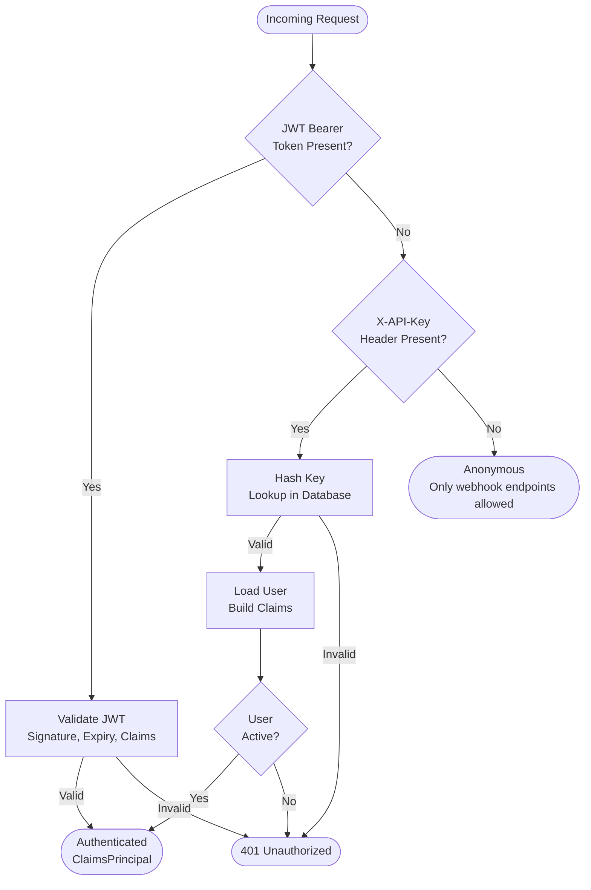
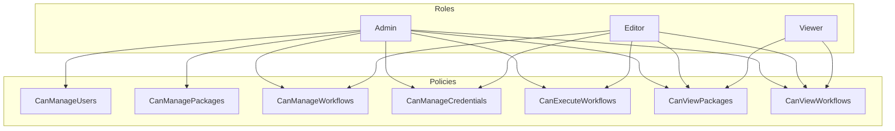
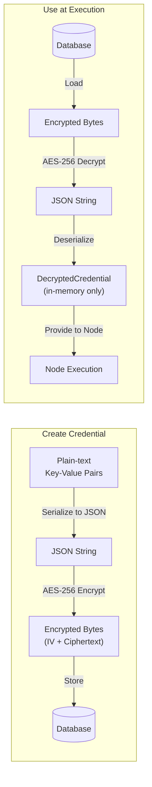
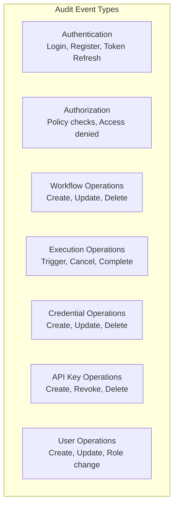

# Security Architecture

## Overview

FlowForge implements a layered security model covering authentication, authorization, credential management, and audit logging. Security is enforced at the API layer through middleware and authorization policies.

## Authentication

### Dual Authentication Scheme

### JWT Bearer Authentication

Used for interactive sessions from the Designer.

| Aspect | Detail |
|--------|--------|
| Token Type | JWT (JSON Web Token) |
| Signing | Symmetric key (configurable) |
| Claims | UserId, Email, Role |
| Refresh | Separate refresh token endpoint |
| Storage | Browser local storage (client-side) |

The `IJwtTokenService` handles token generation and validation. The `IAuthService` orchestrates login, registration, and refresh flows, including password hashing and verification.

### API Key Authentication

Used for webhooks and external integrations.

| Aspect | Detail |
|--------|--------|
| Header | `X-API-Key` |
| Storage | SHA-256 hash stored in database |
| Scopes | Optional scope restrictions per key |
| Expiry | Optional expiration date |
| Revocation | Keys can be revoked without deletion |

The `ApiKeyAuthenticationHandler` processes the `X-API-Key` header, validates the key hash against the database, loads the associated user, and builds a `ClaimsPrincipal` with the user's role and key scopes.

The plain-text key is returned only once at creation time and is never stored.

## Authorization

### Role-Based Access Control

### Policy Matrix

| Policy | Admin | Editor | Viewer |
|--------|:-----:|:------:|:------:|
| CanManageUsers | ✅ | ❌ | ❌ |
| CanManagePackages | ✅ | ❌ | ❌ |
| CanManageWorkflows | ✅ | ✅ | ❌ |
| CanManageCredentials | ✅ | ✅ | ❌ |
| CanExecuteWorkflows | ✅ | ✅ | ❌ |
| CanViewPackages | ✅ | ✅ | ✅ |
| CanViewWorkflows | ✅ | ✅ | ✅ |

Policies are registered in `AuthorizationExtensions.AddFlowForgePolicies()` and applied to controllers via `[Authorize(Policy = ...)]` attributes.

## Credential Management

### Encryption Architecture

| Aspect | Detail |
|--------|--------|
| Algorithm | AES-256 (symmetric) |
| IV | Unique per encryption, prepended to ciphertext |
| Storage | `EncryptedData` field on `Credential` entity |
| API Exposure | `EncryptedData` is marked `[JsonIgnore]` — never serialized to API responses |
| Runtime | `DecryptedCredential` exists only in memory during node execution |

### Credential Types

| Type | Expected Fields |
|------|----------------|
| ApiKey | `key` |
| OAuth2 | `clientId`, `clientSecret`, `accessToken`, `refreshToken` |
| BasicAuth | `username`, `password` |
| CustomHeaders | Arbitrary key-value pairs added as HTTP headers |

The `ICredentialService.ValidateCredentialData()` method validates that the provided data matches the expected schema for the credential type.

### Security Rules

- Credential values are never returned in API responses
- Credential values are never written to logs
- The `EncryptedData` property is excluded from JSON serialization
- Decrypted credentials exist only in memory during node execution
- Users can only access their own credentials (enforced by `OwnerId`)

## Audit Logging

### Audited Events

### Audit Log Record

Each audit entry captures:

| Field | Description |
|-------|------------|
| Timestamp | When the event occurred |
| EventType | Category (Authentication, Authorization, WorkflowOperation, etc.) |
| UserId / UserEmail | Who performed the action |
| IpAddress / UserAgent | Request context |
| ResourceType / ResourceId | What was affected |
| Action | What was done |
| Success | Whether the operation succeeded |
| ErrorMessage | Failure reason if applicable |
| Details | Additional structured data as JSON |

### Query Capabilities

Audit logs can be queried by:
- User ID
- Event type
- Resource type and ID
- Date range
- Success/failure status
- Pagination (skip/take)

## Error Handling

The `ErrorHandlingMiddleware` catches all unhandled exceptions and maps them to consistent API error responses. This prevents internal implementation details from leaking to clients.

| Exception Type | HTTP Status | Error Code |
|---------------|-------------|-----------|
| WorkflowNotFoundException | 404 | WORKFLOW_NOT_FOUND |
| ExecutionNotFoundException | 404 | EXECUTION_NOT_FOUND |
| CredentialNotFoundException | 404 | CREDENTIAL_NOT_FOUND |
| WorkflowValidationException | 400 | WORKFLOW_VALIDATION_FAILED |
| VersionConflictException | 409 | VERSION_CONFLICT |
| WorkflowExecutionException | 500 | EXECUTION_FAILED |
| ArgumentException | 400 | INVALID_ARGUMENT |
| UnauthorizedAccessException | 401 | UNAUTHORIZED |
| TimeoutException | 504 | TIMEOUT |
| JsonException | 400 | INVALID_JSON |
| All other exceptions | 500 | INTERNAL_ERROR |

Every error response includes a `traceId` for correlation with server-side logs.
