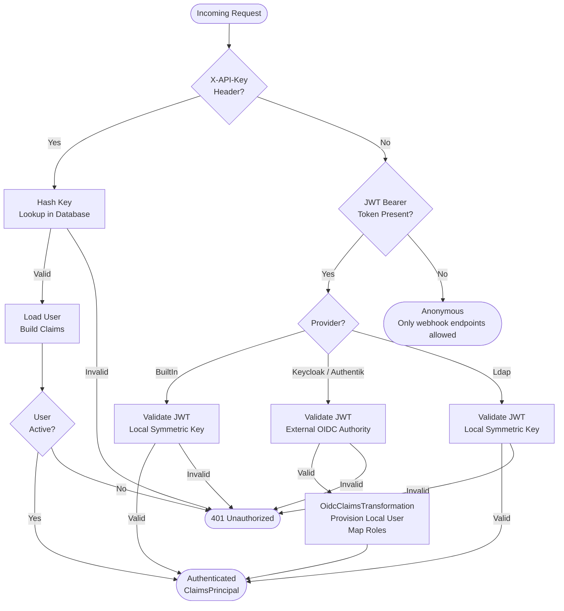
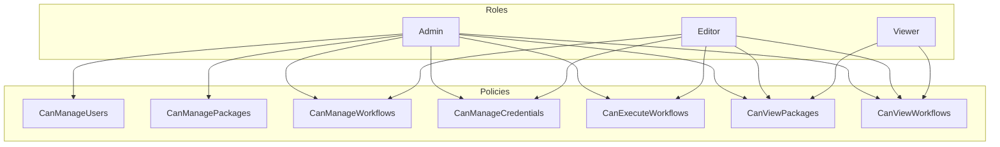
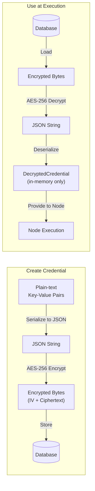
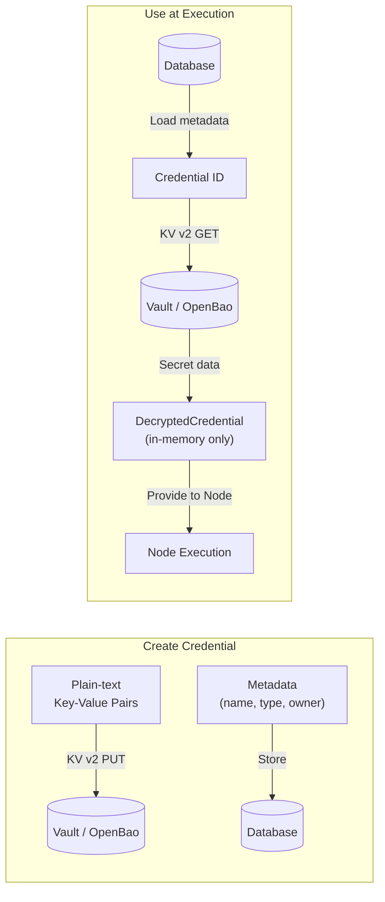
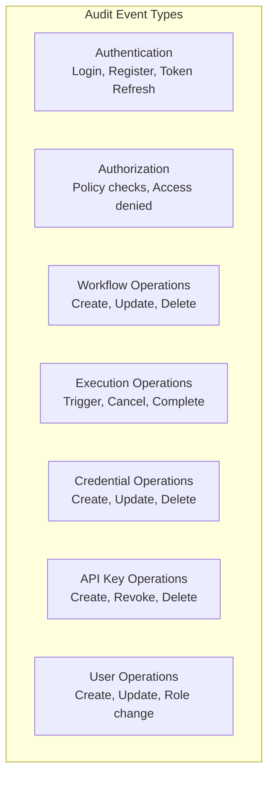

# Security Architecture

## Overview

Vyshyvanka implements a layered security model covering authentication, authorization, credential management, and audit logging. Security is enforced at the API layer through middleware and authorization policies.

## Authentication

### Configurable Authentication Provider

Vyshyvanka supports four authentication providers, selected via the `Authentication:Provider` setting in `appsettings.json`:

| Provider | Value | Description |
|----------|-------|-------------|
| Built-in | `BuiltIn` | Local email/password authentication with self-issued JWT tokens (default) |
| Keycloak | `Keycloak` | OpenID Connect via a Keycloak realm |
| Authentik | `Authentik` | OpenID Connect via an Authentik application |
| LDAP | `Ldap` | LDAP directory authentication with locally-issued JWT tokens |

The `GET /api/auth/config` endpoint (anonymous) returns the active provider and OIDC settings so the Designer can configure its auth flow at runtime.

### Authentication Flow



### Built-in Authentication (default)

Used for interactive sessions from the Designer when no external identity provider is configured.

| Aspect | Detail |
|--------|--------|
| Token Type | JWT (JSON Web Token) |
| Signing | Symmetric key (configurable via `Jwt:SecretKey`) |
| Claims | UserId, Email, Role |
| Refresh | Separate refresh token endpoint (`POST /api/auth/refresh`) |
| Password Hashing | PBKDF2 with SHA-256, 100 000 iterations, 16-byte salt |
| Storage | Browser local storage (client-side) |

The `IJwtTokenService` handles token generation and validation. The `IAuthService` orchestrates login, registration, and refresh flows.

#### Registration Controls

Open registration is disabled by default. Configure via `appsettings.json`:

```json
{
  "Authentication": {
    "AllowRegistration": true,
    "RequireAdminApproval": false,
    "MinPasswordLength": 8
  }
}
```

| Setting | Default | Description |
|---------|---------|-------------|
| `AllowRegistration` | `false` | Whether the register endpoint accepts new accounts |
| `RequireAdminApproval` | `false` | When true, new accounts are created inactive until an admin activates them |
| `MinPasswordLength` | `8` | Minimum password length |

#### Password Complexity

All passwords (registration) must satisfy:
- Minimum length (configurable, default 8)
- At least one uppercase letter
- At least one lowercase letter
- At least one digit
- At least one special character (non-alphanumeric)

The `GET /api/auth/config` endpoint returns `allowRegistration` so the Designer can conditionally show or hide the registration form.

### OIDC Authentication (Keycloak / Authentik)

When an external provider is configured, the API validates access tokens issued by that provider using its OIDC discovery document. The login, register, and refresh endpoints are disabled — the Designer handles the OIDC flow directly with the identity provider.

| Aspect | Detail |
|--------|--------|
| Token Validation | JWT Bearer with external `Authority` URL |
| Discovery | Automatic via `/.well-known/openid-configuration` |
| User Provisioning | Just-in-time (JIT) — local user created on first login |
| Role Mapping | Configurable via `Authentication:RoleMappings` |
| Default Role | Configurable via `Authentication:DefaultRole` (defaults to `Viewer`) |

#### Configuration

```json
{
  "Authentication": {
    "Provider": "Keycloak",
    "Authority": "https://keycloak.example.com/realms/vyshyvanka",
    "ClientId": "vyshyvanka-api",
    "Audience": "vyshyvanka-api",
    "RequireHttpsMetadata": true,
    "RoleClaimType": "realm_access",
    "RoleMappings": {
      "vyshyvanka-admin": "Admin",
      "vyshyvanka-editor": "Editor",
      "vyshyvanka-viewer": "Viewer"
    },
    "DefaultRole": "Viewer",
    "AutoProvisionUsers": true
  }
}
```

For Authentik, use `"Provider": "Authentik"` and set `RoleClaimType` to `"groups"`.

#### Role Claim Extraction

| Provider | Claim Structure | RoleClaimType |
|----------|----------------|---------------|
| Keycloak | Nested JSON: `realm_access: { roles: [...] }` | `realm_access` |
| Authentik | Flat claim array: `groups: [...]` | `groups` |

The `OidcClaimsTransformation` middleware extracts external roles, maps them to local `UserRole` values via `RoleMappings`, and enriches the `ClaimsPrincipal` with local user claims so authorization policies work unchanged.

#### User Provisioning

The `OidcUserProvisioningService` handles JIT provisioning:

1. Extracts the `sub` claim from the OIDC token
2. Looks up the user by `ExternalId` in the local database
3. If not found and `AutoProvisionUsers` is `true`, creates a new local user with the mapped role
4. If not found and `AutoProvisionUsers` is `false`, rejects the request

OIDC-provisioned users have an empty `PasswordHash` and cannot use the built-in login endpoint.

### LDAP Authentication

When the LDAP provider is configured, the API accepts username/password via the login endpoint (like built-in), but verifies credentials against an LDAP directory instead of the local database. Sessions use locally-issued JWT tokens.

| Aspect | Detail |
|--------|--------|
| Credential Verification | LDAP bind with user DN and password |
| Token Issuance | Local JWT (same as built-in) |
| User Provisioning | JIT — local user created/updated on every login |
| Role Mapping | LDAP group memberships mapped via `Ldap:RoleMappings` |
| Registration | Disabled — users must exist in the LDAP directory |
| Token Refresh | Supported via `POST /api/auth/refresh` |

#### Authentication Flow

1. User sends username/password to `POST /api/auth/login`
2. `LdapAuthenticationService` binds with the service account and searches for the user entry
3. Attempts an LDAP bind as the found user DN with the provided password
4. On success, extracts email, display name, and `memberOf` group memberships
5. Maps LDAP groups to local `UserRole` via `Ldap:RoleMappings`
6. Provisions or updates the local user record (using the DN as `ExternalId`)
7. Issues a local JWT access token and refresh token

#### Configuration

```json
{
  "Authentication": {
    "Provider": "Ldap",
    "Ldap": {
      "Host": "ldap.example.com",
      "Port": 389,
      "UseSsl": false,
      "UseStartTls": true,
      "BindDn": "cn=readonly,dc=example,dc=com",
      "BindPassword": "service-account-password",
      "SearchBase": "ou=users,dc=example,dc=com",
      "UserSearchFilter": "(mail={0})",
      "EmailAttribute": "mail",
      "DisplayNameAttribute": "cn",
      "MemberOfAttribute": "memberOf",
      "RoleMappings": {
        "Vyshyvanka-Admins": "Admin",
        "Vyshyvanka-Editors": "Editor",
        "Vyshyvanka-Viewers": "Viewer"
      },
      "DefaultRole": "Viewer"
    }
  }
}
```

#### Active Directory Example

For Active Directory, use `sAMAccountName` or `userPrincipalName` in the search filter:

```json
{
  "UserSearchFilter": "(sAMAccountName={0})",
  "Port": 636,
  "UseSsl": true
}
```

#### Security Considerations

- The `BindPassword` for the service account should be stored securely (e.g. via environment variables or a secrets manager), not in plain text in `appsettings.json`
- Always use SSL (`UseSsl`) or StartTLS (`UseStartTls`) in production to protect credentials in transit
- The search filter input is escaped to prevent LDAP injection

### API Key Authentication

Used for webhooks and external integrations. Works identically regardless of the active authentication provider.

| Aspect | Detail |
|--------|--------|
| Header | `X-API-Key` |
| Storage | SHA-256 hash stored in database |
| Scopes | Optional scope restrictions per key |
| Expiry | Optional expiration date |
| Revocation | Keys can be revoked without deletion |

The `ApiKeyAuthenticationHandler` processes the `X-API-Key` header, validates the key hash against the database, loads the associated user, and builds a `ClaimsPrincipal` with the user's role and key scopes.

The plain-text key is returned only once at creation time and is never stored.

## Authorization

### Role-Based Access Control



### Policy Matrix

| Policy | Admin | Editor | Viewer |
|--------|:-----:|:------:|:------:|
| CanManageUsers | ✅ | ❌ | ❌ |
| CanManagePackages | ✅ | ❌ | ❌ |
| CanManageWorkflows | ✅ | ✅ | ❌ |
| CanManageCredentials | ✅ | ✅ | ❌ |
| CanExecuteWorkflows | ✅ | ✅ | ❌ |
| CanViewPackages | ✅ | ✅ | ✅ |
| CanViewWorkflows | ✅ | ✅ | ✅ |

Policies are registered in `AuthorizationExtensions.AddVyshyvankaPolicies()` and applied to controllers via `[Authorize(Policy = ...)]` attributes.

### Resource Ownership

In addition to role-based policies, mutating operations enforce resource ownership. Only the resource owner or an Admin can perform the action:

| Operation | Ownership Check |
|-----------|----------------|
| List/search workflows | Non-Admin users see only own workflows |
| View workflow by ID | `workflow.CreatedBy == currentUser` or Admin |
| Update/Delete workflow | `workflow.CreatedBy == currentUser` or Admin |
| Execute workflow | `workflow.CreatedBy == currentUser` or Admin |
| Manage credentials | `credential.OwnerId == currentUser` or Admin |

This prevents Editors from executing or modifying workflows belonging to other users (which could access those users' credentials).

## Credential Management

### Configurable Storage Backend

Vyshyvanka supports three credential storage backends, selected via the `CredentialStorage:Provider` setting in `appsettings.json`:

| Provider | Value | Description |
|----------|-------|-------------|
| Built-in | `BuiltIn` | AES-256 encrypted storage in the local database (default) |
| HashiCorp Vault | `HashiCorpVault` | KV v2 secrets engine on a HashiCorp Vault server |
| OpenBao | `OpenBao` | KV v2 secrets engine on an OpenBao server (Vault-compatible API) |

### Built-in Storage (default)



| Aspect | Detail |
|--------|--------|
| Algorithm | AES-256 (symmetric, CBC mode, PKCS7 padding) |
| IV | Unique per encryption, prepended to ciphertext |
| Storage | `EncryptedData` field on `Credential` entity |
| Key | Configurable via `Vyshyvanka:EncryptionKey` (Base64-encoded 256-bit key) |

### Vault / OpenBao Storage

When an external secrets manager is configured, credential metadata (ID, name, type, owner, timestamps) stays in the local database, while the actual secret values are stored in Vault or OpenBao.



#### Configuration

```json
{
  "CredentialStorage": {
    "Provider": "HashiCorpVault",
    "Url": "https://vault.example.com:8200",
    "Token": "",
    "MountPath": "secret",
    "PathPrefix": "vyshyvanka/credentials",
    "SkipTlsVerify": false
  }
}
```

For OpenBao, use `"Provider": "OpenBao"` — the API is identical.

| Setting | Description | Default |
|---------|-------------|---------|
| `Url` | Base URL of the Vault/OpenBao server | (required) |
| `Token` | Authentication token. Falls back to `VAULT_TOKEN` env var | — |
| `MountPath` | KV v2 mount path | `secret` |
| `PathPrefix` | Path prefix under the mount | `vyshyvanka/credentials` |
| `SkipTlsVerify` | Disable TLS verification (dev only) | `false` |

Secrets are stored at `{MountPath}/data/{PathPrefix}/{credentialId}`.

### Credential Types

| Type | Expected Fields |
|------|----------------|
| ApiKey | `apiKey` |
| OAuth2 | `clientId`, `clientSecret`, `accessToken`, `refreshToken` |
| BasicAuth | `username`, `password` |
| CustomHeaders | Arbitrary key-value pairs added as HTTP headers |

The `CredentialValidator` validates that the provided data matches the expected schema for the credential type, regardless of the storage backend.

### Security Rules

- Credential values are never returned in API responses
- Credential values are never written to logs
- The `EncryptedData` property is excluded from JSON serialization
- Decrypted credentials exist only in memory during node execution
- Users can only access their own credentials (enforced by `OwnerId`)
- When using Vault/OpenBao, the `Token` should be injected via the `VAULT_TOKEN` environment variable rather than stored in `appsettings.json`

## Audit Logging

### Audited Events



### Audit Log Record

Each audit entry captures:

| Field | Description |
|-------|------------|
| Timestamp | When the event occurred |
| EventType | Category (Authentication, Authorization, WorkflowOperation, etc.) |
| UserId / UserEmail | Who performed the action |
| IpAddress / UserAgent | Request context |
| ResourceType / ResourceId | What was affected |
| Action | What was done |
| Success | Whether the operation succeeded |
| ErrorMessage | Failure reason if applicable |
| Details | Additional structured data as JSON |

### Query Capabilities

Audit logs can be queried by:
- User ID
- Event type
- Resource type and ID
- Date range
- Success/failure status
- Pagination (skip/take)

## Code Execution Sandbox

The Code node allows users to execute custom code within workflows using two languages: JavaScript and JSONata. Both runtimes are inherently safe with no access to the host system.

### JavaScript Sandbox (Jint)

JavaScript execution uses the Jint interpreter — a pure .NET JavaScript engine that provides security by design:

- **No .NET interop**: Scripts cannot access .NET types, reflection, or the host runtime
- **No ambient capabilities**: No filesystem, network, process spawning, or OS access
- **No Node.js APIs**: No `require()`, `fs`, `child_process`, or similar

| Constraint | Limit |
|-----------|-------|
| Max statements | 100,000 |
| Memory | 64 MB |
| Recursion depth | 256 |
| Timeout | Configurable (default: 30s) |

### JSONata (Expression Language)

JSONata is a declarative query and transformation language purpose-built for JSON data. It is secure by design — it has no concept of I/O, system access, or side effects. Expressions can only read and transform the input data.

- **Pure expressions**: No statements, no assignments, no loops (only declarative mappings)
- **No side effects**: Cannot modify external state, make network calls, or access the filesystem
- **No code execution**: Not a general-purpose language — only JSON transformation
- **Deterministic**: Same input always produces the same output

Implementation: [Jsonata.Net.Native](https://github.com/mikhail-barg/jsonata.net.native) v3.0.0

### Available Globals (JavaScript)

| Global | Description |
|--------|-------------|
| `input` | Parsed input data from upstream nodes |
| `executionId` | Current execution ID (string) |
| `workflowId` | Current workflow ID (string) |
| `log(message)` | Log a message (captured in execution output) |
| `getItems()` | Returns input as an array (wraps non-array input) |
| `toJson(value)` | Serializes a value to a JSON string |
| `currentItem` | Current item in "Run for Each Item" mode |
| `itemIndex` | Current item index in "Run for Each Item" mode |

### JSONata Input

JSONata expressions receive the full input data as the root context (`$`). No additional globals are needed — the expression language operates directly on the JSON structure.

### Security Properties

- Both runtimes are pure interpreters — no JIT compilation, no native code execution
- Script output is serialized to JSON before being stored — no object references leak between executions
- Compilation/runtime errors are reported to the user without exposing internal engine details
- The configurable timeout prevents infinite loops and resource exhaustion (JavaScript)
- JSONata expressions are inherently terminating (no unbounded loops)

## Rate Limiting

The API uses ASP.NET Core's built-in rate limiting middleware (`Microsoft.AspNetCore.RateLimiting`) to protect against brute-force attacks, webhook abuse, and general resource exhaustion. All limits are partitioned by client IP address.

### Policies

| Policy | Applied To | Limit | Window | Purpose |
|--------|-----------|-------|--------|---------|
| `auth` | Login, register, refresh endpoints | 5 requests | 1 minute | Prevent brute-force credential attacks |
| `webhook` | All webhook trigger endpoints | 30 requests | 1 minute | Prevent DoS via webhook abuse |
| Global | All other endpoints (fallback) | 100 requests | 1 minute | General resource protection |

### Response on Limit Exceeded

When a client exceeds the rate limit, the API returns:

- **HTTP 429 Too Many Requests**
- `Retry-After` header with seconds until the window resets
- JSON body: `{ "code": "RATE_LIMITED", "message": "Too many requests. Please try again later.", "retryAfterSeconds": <int> }`

### Configuration

Rate limiting is configured in `Vyshyvanka.Api/Extensions/RateLimitingExtensions.cs`. The middleware is placed in the pipeline after CORS and before authentication, so rate-limited requests are rejected early without consuming auth processing resources.

Policies are applied via `[EnableRateLimiting]` attributes on controllers and actions:
- `AuthController`: `login`, `register`, `refresh` actions use the `auth` policy
- `WebhookController`: entire controller uses the `webhook` policy
- All other endpoints: covered by the global partitioned limiter

## Account Lockout

To prevent brute-force password attacks, accounts are locked after repeated failed login attempts.

### Behavior

| Parameter | Value |
|-----------|-------|
| Max failed attempts | 5 consecutive failures |
| Lockout duration | 15 minutes |
| Reset trigger | Successful login or admin unlock |
| Applies to | Built-in and LDAP authentication providers |

### Flow

1. User submits invalid credentials
2. `FailedLoginAttempts` counter increments on the user record
3. After 5 consecutive failures, `LockoutEnd` is set to 15 minutes in the future
4. While locked, login attempts are rejected immediately with a message indicating remaining lockout time
5. On successful login, `FailedLoginAttempts` resets to 0 and `LockoutEnd` is cleared

### Admin Unlock

Administrators can unlock any account via:

```
POST /api/auth/unlock/{userId}
Authorization: Bearer <admin-token>
```

Requires the `CanManageUsers` policy (Admin role only). Resets both `FailedLoginAttempts` and `LockoutEnd`.

### Security Properties

- Lockout state is stored on the `User` entity (`FailedLoginAttempts`, `LockoutEnd`)
- The lockout check occurs before password verification (no wasted computation)
- For LDAP, lockout is checked before the LDAP bind attempt (protects the directory from excessive binds)
- Failed attempts are logged via the audit system
- The error message does not reveal whether the email exists (same "Invalid email or password" message)

## Webhook Security

Webhook endpoints are anonymous by design (external systems need to trigger workflows without Vyshyvanka credentials). Security is enforced per-workflow through optional controls configured in the webhook trigger node's `Configuration` JSON.

### Request Body Size Limit

All webhook requests are limited to **1 MB** via `[RequestSizeLimit(1_048_576)]`. Requests exceeding this limit receive HTTP 413.

### HMAC-SHA256 Signature Verification

When a webhook trigger node has a `secret` property configured, callers must include a signature header:

```
X-Webhook-Signature: sha256=<hex-encoded-hmac-sha256>
```

The signature is computed as `HMAC-SHA256(secret, raw-request-body)`. The server uses constant-time comparison to prevent timing attacks.

**Webhook trigger node configuration example:**
```json
{
  "path": "deploy",
  "secret": "whsec_a1b2c3d4e5f6..."
}
```

**Error responses:**
- Missing header → HTTP 401, code `WEBHOOK_SIGNATURE_MISSING`
- Invalid signature → HTTP 401, code `WEBHOOK_SIGNATURE_INVALID`

### IP Allowlisting

When a webhook trigger node has an `allowedIps` array configured, only requests from listed IP addresses are accepted.

**Configuration example:**
```json
{
  "path": "deploy",
  "secret": "whsec_a1b2c3d4e5f6...",
  "allowedIps": ["203.0.113.10", "198.51.100.0"]
}
```

**Error response:** HTTP 403, code `WEBHOOK_IP_DENIED`

### Security Properties

- All controls are optional — workflows without `secret` or `allowedIps` remain open (backward-compatible)
- Signature verification uses `CryptographicOperations.FixedTimeEquals` to prevent timing side-channels
- Body is buffered once and reused for both signature verification and payload construction
- IP check uses the connection's `RemoteIpAddress` (respects reverse proxy headers if configured)
- Rejected requests are logged at Warning level with the client IP and workflow ID

## Error Handling

The `ErrorHandlingMiddleware` catches all unhandled exceptions and maps them to consistent API error responses. This prevents internal implementation details from leaking to clients.

| Exception Type | HTTP Status | Error Code |
|---------------|-------------|-----------|
| WorkflowNotFoundException | 404 | WORKFLOW_NOT_FOUND |
| ExecutionNotFoundException | 404 | EXECUTION_NOT_FOUND |
| CredentialNotFoundException | 404 | CREDENTIAL_NOT_FOUND |
| WorkflowValidationException | 400 | WORKFLOW_VALIDATION_FAILED |
| VersionConflictException | 409 | VERSION_CONFLICT |
| WorkflowExecutionException | 500 | EXECUTION_FAILED |
| ArgumentException | 400 | INVALID_ARGUMENT |
| UnauthorizedAccessException | 401 | UNAUTHORIZED |
| TimeoutException | 504 | TIMEOUT |
| JsonException | 400 | INVALID_JSON |
| All other exceptions | 500 | INTERNAL_ERROR |

Every error response includes a `traceId` for correlation with server-side logs.
