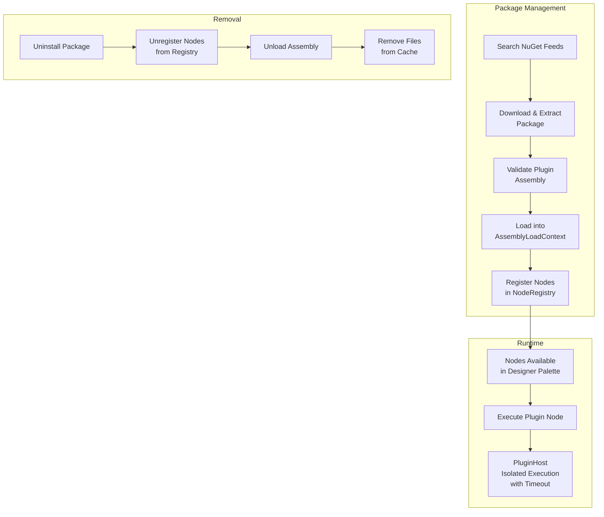
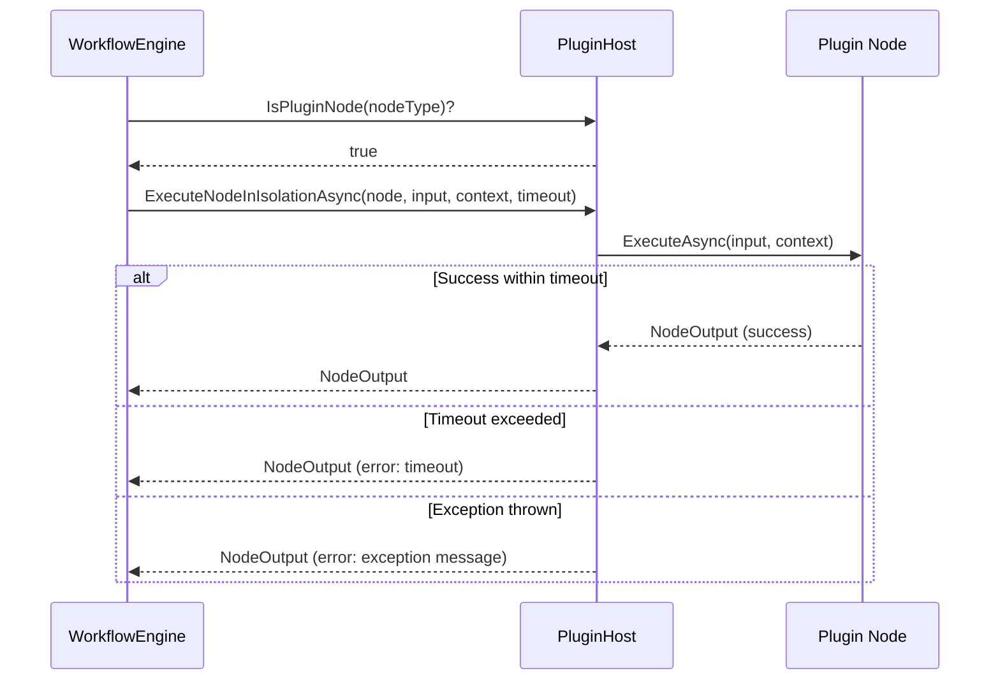
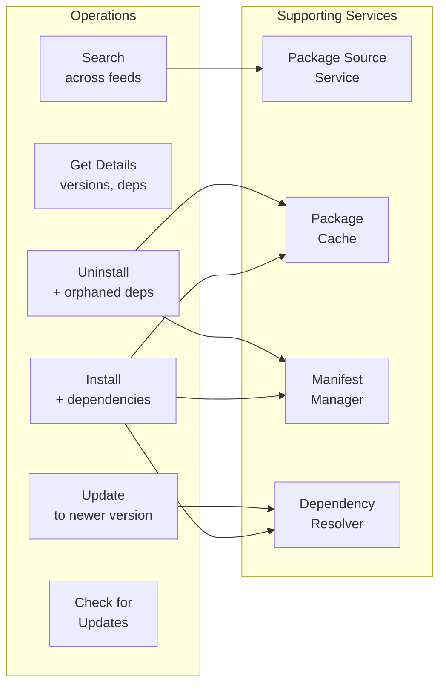
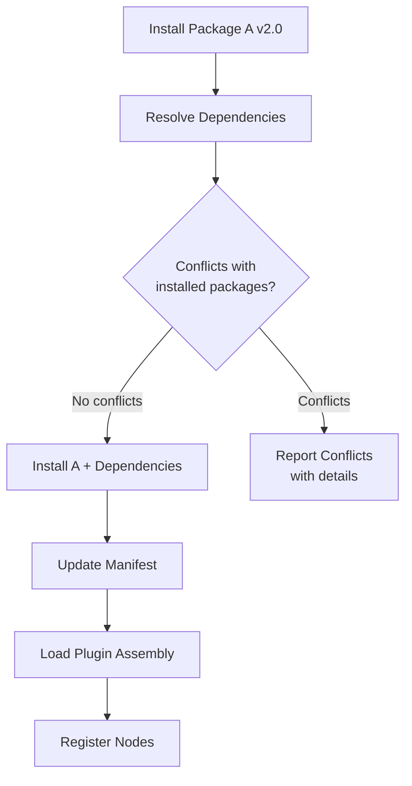

# Plugin System and Package Management

## Overview

Vyshyvanka supports extending its node library through plugins distributed as NuGet packages. The plugin system handles the full lifecycle: discovery, installation, validation, loading, isolation, and uninstallation.

## Plugin Architecture

## Component Responsibilities

### Plugin Loader

The `IPluginLoader` discovers and manages plugin assemblies:

- Scans a plugin directory for assemblies containing `INode` implementations
- Loads each plugin into an isolated `AssemblyLoadContext`
- Reads the `[Plugin]` assembly attribute for metadata (ID, name, version, author, description)
- Tracks loaded plugins and their node types
- Supports unloading individual plugins

### Plugin Validator

The `IPluginValidator` validates plugin assemblies before loading:

| Validation | Description |
|-----------|------------|
| Assembly attribute | Must have `[Plugin]` attribute with a unique ID |
| Node types | Must contain at least one class implementing `INode` |
| Base class | Node classes must inherit from appropriate base class |
| Constructor | Node classes must have a parameterless constructor |
| Type conflicts | Node type identifiers must not conflict with existing registrations |

Validation produces errors (which prevent loading) and warnings (which are logged but don't block).

### Plugin Host

The `IPluginHost` provides execution isolation for plugin nodes:

- Routes plugin node execution through a separate execution path
- Enforces a configurable timeout (default: 30 seconds)
- Catches exceptions from plugin code to prevent host crashes
- Tracks which node types belong to which plugins

### Plugin Configuration

The `IPluginConfiguration` provides typed configuration access for plugins:

- Configuration values are scoped by plugin ID
- Supports string, typed, and default-value retrieval
- Can enumerate all configuration for a plugin
- Supports runtime reload

## NuGet Package Management

### Package Manager

The `INuGetPackageManager` is the primary interface for package operations:

### Package Sources

Package sources are NuGet feed configurations managed through the API:

| Field | Description |
|-------|------------|
| Name | Unique identifier for the source |
| Url | NuGet feed URL (v3 API) |
| IsEnabled | Whether the source is active for searches |
| IsTrusted | Whether packages from this source skip confirmation |
| Credentials | Optional username/password or API key for authenticated feeds |
| Priority | Ordering for source precedence (lower = higher priority) |

Sources can be tested for connectivity, returning response time and any errors.

### Dependency Resolution

The `IDependencyResolver` handles transitive dependency management:

- Resolves all dependencies for a package before installation
- Detects version conflicts with already-installed packages
- Checks update compatibility before applying updates
- Reports which packages requested conflicting versions

### Package Manifest

The `IManifestManager` persists the state of installed packages to disk:

| Field | Description |
|-------|------------|
| Version | Manifest format version |
| LastModified | When the manifest was last changed |
| Packages | List of installed packages with versions, paths, and node types |
| Sources | Configured package sources |

The manifest is loaded at startup via `INuGetPackageManager.InitializeAsync()` to restore the installed package state.

### Package Cache

The `IPackageCache` manages local package storage:

- Downloads packages from NuGet sources on demand
- Extracts package contents to the plugins directory
- Provides extraction paths for the plugin loader
- Cleans up orphaned cache entries not in the installed packages list

### Installed Package Tracking

Each installed package tracks:

| Field | Description |
|-------|------------|
| PackageId | NuGet package identifier |
| Version | Installed version |
| SourceName | Which feed it was installed from |
| InstallPath | Local extraction path |
| InstalledAt | Installation timestamp |
| NodeTypes | List of node type identifiers provided |
| Dependencies | Transitive dependencies |
| IsLoaded | Whether the assembly is currently loaded |

## Creating a Plugin

A plugin is a .NET class library that:

1. References `Vyshyvanka.Core` (with `Private=false` and `ExcludeAssets=runtime`)
2. Has `EnableDynamicLoading` set to `true` in the project file
3. Contains an assembly-level `[Plugin]` attribute with metadata
4. Contains one or more classes inheriting from the appropriate base node class
5. Is packaged as a NuGet package with appropriate metadata

The `Vyshyvanka.Plugin.AdvancedHttp` project serves as a reference implementation, providing:

| Node | Description |
|------|------------|
| GraphQL Node | Executes GraphQL queries and mutations |
| HTTP Batch Node | Sends multiple HTTP requests in parallel |
| HTTP Polling Node | Polls an endpoint at intervals until a condition is met |
| HTTP Retry Node | Makes HTTP requests with configurable retry policies |

Plugin nodes appear in the Designer's node palette alongside built-in nodes, distinguished by their `SourcePackage` field in the node definition.
