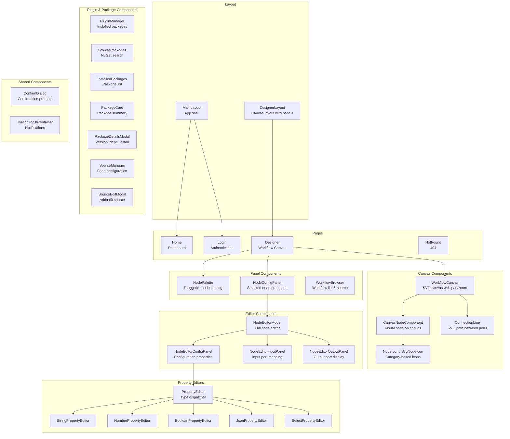
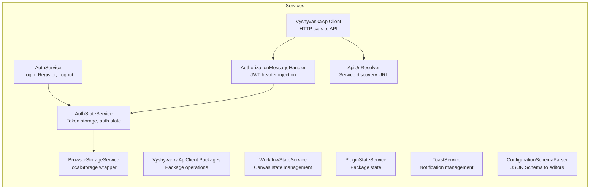
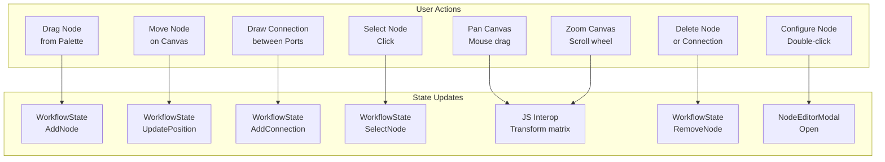

# Designer (Visual Workflow Editor)

## Overview

The Vyshyvanka Designer is a Blazor WebAssembly single-page application that provides a visual canvas for designing workflows. It communicates with the API exclusively over HTTP and has no direct dependency on the Engine or persistence layers.

## Application Structure

## Component Pattern

Every Blazor component follows a strict three-file pattern:

| File | Purpose |
|------|---------|
| `Component.razor` | Markup only. No `@code` blocks. No `<style>` blocks. |
| `Component.razor.cs` | Code-behind as a `partial` class. Uses `[Inject]` for DI. |
| `Component.razor.css` | Scoped CSS styles (optional). |

## Client Services

### Key Services

#### WorkflowStateService

Central state manager for the Designer canvas. Manages:

- Current workflow (nodes, connections, metadata)
- Selected node tracking
- Undo/redo history
- Node add, move, delete, and configure operations
- Connection create and delete operations
- Workflow serialization and deserialization
- Validation state

#### VyshyvankaApiClient

Typed HTTP client for all API communication:

- Workflow CRUD operations
- Execution triggering and history
- Node definition retrieval
- Package search, install, update, uninstall
- Package source management
- Authentication token injection via `AuthorizationMessageHandler`

#### AuthStateService

Manages authentication state in the browser:

- Stores JWT access and refresh tokens in `localStorage`
- Tracks current user information
- Provides authentication state to components
- Handles token refresh on expiry

#### ConfigurationSchemaParser

Parses JSON Schema from node definitions and maps property types to appropriate editor components:

| Schema Type | Editor |
|-------------|--------|
| `string` | StringPropertyEditor |
| `number` / `integer` | NumberPropertyEditor |
| `boolean` | BooleanPropertyEditor |
| `object` | JsonPropertyEditor |
| `string` with `enum` | SelectPropertyEditor |

## Canvas Interaction

The workflow canvas is an SVG-based interactive surface with JavaScript interop for performance-critical operations:

The `canvas-interop.js` file handles low-level mouse and touch events, coordinate transformations, and SVG rendering optimizations that would be too slow in Blazor's render cycle.

## Pages

### Home

Dashboard page showing workflow summaries and recent execution activity.

### Login

Authentication page. When the built-in provider is active, shows an email/password form. When Keycloak or Authentik is configured, redirects to the external identity provider's login page. The active provider is determined by calling `GET /api/auth/config` at startup. On successful login, stores tokens and redirects to the Designer.

### Designer

The main workspace containing:
- Workflow canvas (center)
- Node palette (left sidebar)
- Node configuration panel (right sidebar)
- Workflow browser (top bar)
- Plugin manager (accessible from toolbar)

### NotFound

404 page for unmatched routes.

## Client Models

The Designer maintains its own model types that mirror the API DTOs:

| Model File | Contents |
|-----------|----------|
| AuthModels | Login/register request and response types |
| WorkflowApiModels | Workflow, node, and connection DTOs |
| ExecutionApiModels | Execution response and summary types |
| DesignerModels | Canvas-specific state (positions, selections, zoom) |
| NodeEditorModels | Node editor form state |
| PackageApiModels | Package search, install, and source DTOs |
| PluginModels | Plugin state and metadata |
| ApiError | Error response type matching the API format |

These models are independent of the Core project's domain models, maintaining the architectural boundary where the Designer communicates only via HTTP.
