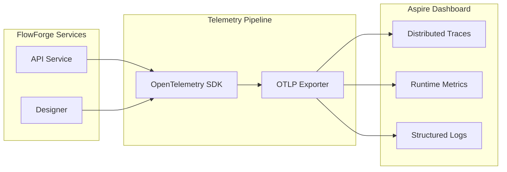
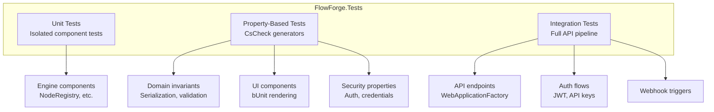

# Observability and Testing

## Observability

### OpenTelemetry Integration

FlowForge uses OpenTelemetry for distributed tracing, metrics, and logging, configured through the `FlowForge.ServiceDefaults` shared project.

### Instrumentation

| Instrumentation | What It Captures |
|----------------|-----------------|
| ASP.NET Core | HTTP request duration, status codes, route patterns |
| HTTP Client | Outbound HTTP call duration and status |
| Runtime | GC collections, thread pool, memory usage |

### Service Defaults

The `ServiceDefaults` project provides shared configuration applied to all services:

| Feature | Description |
|---------|------------|
| OpenTelemetry | Tracing, metrics, and logging with OTLP export |
| Health Checks | Liveness (`/alive`) and readiness (`/health`) endpoints |
| Service Discovery | Aspire-based service discovery for inter-service communication |
| HTTP Resilience | Retry policies and circuit breakers for outbound HTTP calls |

### Error Tracing

Every API error response includes a `traceId` field that correlates with the distributed trace, enabling end-to-end debugging from the client error to the server-side root cause.

## Testing Strategy

### Test Organization

### Test Types

| Type | Framework | Purpose | Location |
|------|-----------|---------|----------|
| Unit | xUnit | Isolated component behavior | `Tests/Unit/` |
| Property-Based | xUnit + CsCheck | Invariant verification with generated inputs | `Tests/Property/` |
| Integration | xUnit + WebApplicationFactory | Full HTTP pipeline testing | `Tests/Integration/` |

### Testing Tools

| Tool | Purpose |
|------|---------|
| xUnit | Test framework and runner |
| CsCheck | Property-based test generation |
| NSubstitute | Mocking interfaces for isolation |
| bUnit | Blazor component rendering and interaction testing |
| Microsoft.AspNetCore.Mvc.Testing | In-process API testing via `WebApplicationFactory` |
| EF Core InMemory | In-memory database for repository tests |

### Property-Based Test Coverage

Property-based tests verify invariants across randomly generated inputs:

| Area | Properties Verified |
|------|-------------------|
| Workflow Serialization | Round-trip serialization preserves all fields |
| Workflow Validation | Invalid workflows always produce errors; valid workflows pass |
| Connection Compatibility | Port type compatibility rules hold for all type combinations |
| Expression Evaluation | Expressions resolve correctly for all valid paths |
| Credential Security | Encrypted data never appears in API responses |
| Node Registry | Registration and lookup are consistent |
| Execution Order | Topological sort produces valid execution order for all DAGs |
| Parallel Execution | Concurrent execution produces deterministic results |
| UI State | Undo/redo operations are reversible |
| Configuration Persistence | Node configuration survives form/JSON mode round-trips |

### Integration Test Coverage

| Area | Tests |
|------|-------|
| Auth | Login, register, token refresh, invalid credentials |
| Authorization | Role-based policy enforcement for all endpoints |
| Workflows | CRUD operations, validation, version conflicts |
| Executions | Trigger, cancel, history queries |
| Webhooks | Trigger by ID, trigger by path, inactive workflow rejection |
| API Keys | Create, list, revoke, delete, authentication via header |
| Error Responses | Consistent error format for all exception types |
| Designer | API client, workflow state, canvas interactions, node palette |

### Test Infrastructure

| Component | Purpose |
|-----------|---------|
| `CustomWebApplicationFactory` | Configures in-memory database and test services |
| `FlowForgeApiFixture` | Shared fixture for API integration tests |
| `TestDataFactory` | Generates valid test entities (workflows, users, nodes) |
| `MockHttpMessageHandler` | Intercepts HTTP calls for Designer client tests |

### Test Naming Convention

All test methods follow the pattern: `When{Condition}Then{ExpectedResult}`

This makes test intent immediately clear from the method name without reading the implementation.
