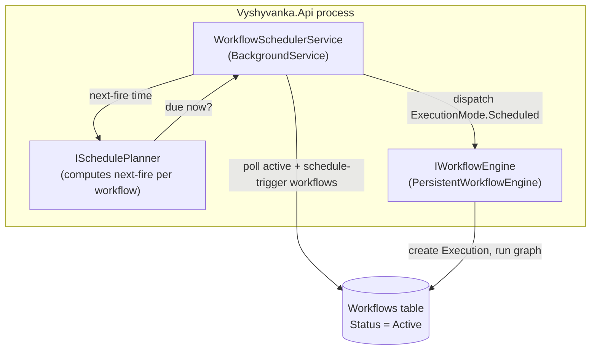

# SDD — Workflow Activation Model & Scheduler

Software Design Document for decoupling workflow **activation** from **executability**, and implementing the currently-missing **cron/interval scheduler**.

Status: **Proposed** · Scope: `Vyshyvanka.Core`, `Vyshyvanka.Engine`, `Vyshyvanka.Contracts`, `Vyshyvanka.Api`, `Vyshyvanka.Designer`

---

## 1. Problem Statement

Today a workflow has a single `bool IsActive` (default `false`) that governs **both**:

1. Whether automatic triggers are armed (webhook path listening; and — once built — cron scheduling), and
2. Whether the workflow can be executed **at all** (manual/API/designer runs are blocked when inactive).

Conflating these makes it impossible to develop and test a production workflow without arming its live triggers. The concrete concern: *a workflow that is active and carries a cron trigger would fire in the middle of development.*

There is a second, hidden problem the research surfaced: **there is no scheduler**. `ScheduleTriggerNode` is never invoked by anything. `GetNextExecutionTime` is a stub (`return fromTime.AddMinutes(1);` with a `// use a library like Cronos` comment). A solution-wide search for `IHostedService` / `BackgroundService` / `Quartz` / `Cronos` finds only that comment and a client-side Blazor UI poll. So cron triggers **never fire**, and the activation flag has no cron enforcement point because there is no cron dispatch to enforce it in.

This SDD addresses both: it introduces a proper activation **state model** and implements the missing **scheduler** so that `Active` genuinely means "runs automatically."

---

## 2. Goals & Non-Goals

### Goals

- Split "triggers armed" from "can be executed."
- **Inactive/Draft** workflows remain executable from the Designer and via direct API (subject to permissions + validation) but do **not** respond to automatic triggers.
- **Active** workflows respond to automatic triggers: webhook listening (already works) **and** cron/interval scheduling (new).
- Replace the bare `bool IsActive` with a `WorkflowStatus` state model that leaves room for future states.
- Implement a real cron scheduler backed by `Cronos`, dispatching executions with `ExecutionMode.Scheduled`.
- Preserve backward compatibility for existing persisted workflows via a data migration.

### Non-Goals

- Distributed/multi-instance scheduler coordination (leader election, distributed locks). Single-instance is assumed for v1; §9 notes the extension path.
- Per-user or per-team scheduling quotas.
- Catch-up / backfill of missed runs while the host was down (misfire policy is "skip", see §6.4).
- Changing the webhook activation path beyond renaming the gate from `IsActive` to `Status == Active`.

---

## 3. Current State (verified against code)

| Concern | Where enforced today | Behaviour |
|---|---|---|
| Domain flag | `Core/Models/Workflow.cs` → `bool IsActive` (default `false`) | Single boolean |
| Persistence | `Engine/Persistence/Entities/WorkflowEntity.cs` → `bool IsActive`, non-null column, **indexed** (`IX_Workflows_IsActive`) | Round-tripped in `WorkflowRepository` |
| Manual/API execution | `Api/Controllers/ExecutionController.cs` `TriggerExecution` → `if (!workflow.IsActive) → WORKFLOW_INACTIVE` | **Blocks** when inactive |
| Single-node / partial run | `ExecutionController.ExecuteSingleNode` + `TargetNodeId` branch | **Does NOT** check `IsActive` (permission only) |
| Webhook by-id | `Api/Controllers/WebhookController.cs` → `if (!workflow.IsActive) → WORKFLOW_INACTIVE` | Blocks |
| Webhook by-path | `WorkflowRepository.GetByWebhookPathAsync` → `.Where(w => w.IsActive && ...)` | Inactive is invisible |
| Sub-workflow | `Engine/Nodes/Actions/ExecuteWorkflowNode.cs` → fails if `!IsActive` | Blocks |
| Cron scheduling | **none** — no scheduler exists | Never fires |
| Contracts | `Contracts/Workflows/WorkflowContracts.cs` → `IsActive` on Create/Update/Response | Exposed |
| Designer | `Designer/Services/WorkflowEditService.cs` → `SetWorkflowActive` / `ToggleWorkflowActive` | Boolean toggle |
| Descriptive mode | `Core/Enums/ExecutionMode.cs` → `Manual/Trigger/Api/Scheduled` | Label only, nothing branches on it |

Validation (`Engine/Validation/WorkflowValidator.cs`) does **not** reference the activation flag — activation is a runtime gate, not a structural-validation concern. This SDD keeps it that way.

---

## 4. Target Design

### 4.1 State model

Introduce `WorkflowStatus` in `Vyshyvanka.Core/Enums/`:

```csharp
namespace Vyshyvanka.Core.Enums;

/// <summary>Lifecycle/activation state of a workflow.</summary>
public enum WorkflowStatus
{
    /// <summary>Editable, never armed. Runs only manually / via direct API. Default for new workflows.</summary>
    Draft,

    /// <summary>Armed for automatic triggers (webhook listening + cron/interval scheduling). Also runnable manually.</summary>
    Active,

    /// <summary>Triggers disarmed (cron unscheduled, webhook not listening) but still runnable manually / via API.</summary>
    Paused
}
```

Semantics:

| Status | Manual / API / Designer run | Webhook listening | Cron/interval scheduling |
|---|:---:|:---:|:---:|
| `Draft` | ✅ (validation + permission) | ❌ | ❌ |
| `Active` | ✅ | ✅ | ✅ |
| `Paused` | ✅ | ❌ | ❌ |

`Draft` vs `Paused` differ only in intent/UX: `Draft` = never been armed; `Paused` = was active, temporarily disarmed. Both are "triggers off, manual on." Keeping both gives the Designer a meaningful lifecycle (Draft → Active → Paused → Active) without extra states.

> Decision D1: three states, not a bool. A bool cannot express "was active, now paused" vs "never active" — a distinction users expect from n8n/Make. If the team prefers minimal surface, a two-state `Draft/Active` is a valid fallback (see §11 Alternatives).

### 4.2 The single executability rule

**Manual/API/Designer execution is always allowed** regardless of status (subject to permission + validation). Only automatic-trigger entry points check `Status == Active`.

Concretely, the `WORKFLOW_INACTIVE` gate is **removed** from `ExecutionController.TriggerExecution`. It is **replaced** by an `ExecutionMode`-aware guard so that requests claiming an automatic mode still require `Active`:

```csharp
// ExecutionController.TriggerExecution, replacing the current IsActive block
if (request.Mode is ExecutionMode.Trigger or ExecutionMode.Scheduled
    && workflow.Status != WorkflowStatus.Active)
{
    return BadRequest(new ApiError
    {
        Code = "WORKFLOW_NOT_ACTIVE",
        Message = "Automatic triggers are only served for active workflows"
    });
}
// Manual and Api modes: no status gate — permission + validation already checked.
```

> Decision D2: the manual API path stops gating on activation entirely; the scheduler and webhook receiver are the only callers that pass `Trigger`/`Scheduled` mode, so the guard above is what actually arms/disarms automatic behaviour at the execution boundary. This is defense-in-depth on top of the scheduler simply not enqueueing non-active workflows (§6).

### 4.3 Enforcement point matrix (target)

| Entry point | Gate (target) |
|---|---|
| `ExecutionController.TriggerExecution`, `Mode = Manual`/`Api` | none (permission + validation only) |
| `ExecutionController.TriggerExecution`, `Mode = Trigger`/`Scheduled` | `Status == Active` |
| `ExecutionController.ExecuteSingleNode` | unchanged (permission only) |
| `WebhookController` (by id + by path) | `Status == Active` |
| `WorkflowRepository.GetByWebhookPathAsync` | `.Where(w => w.Status == WorkflowStatus.Active && ...)` |
| `ExecuteWorkflowNode` (sub-workflow) | see D3 |
| Scheduler (new) | only enqueues `Status == Active` workflows with a schedule trigger |

> Decision D3: `ExecuteWorkflowNode` currently fails on `!IsActive`. A sub-workflow invoked by a parent is a *programmatic* call, closer to manual than to an automatic trigger. **Recommend loosening it to allow `Draft`/`Paused` sub-workflows** (block only an explicit `Archived` state if we ever add one), so a parent workflow can orchestrate un-armed children. Flagged for the reviewer — this is a behaviour change some may want to keep strict.

### 4.4 Scheduler architecture

A single hosted `BackgroundService` in `Vyshyvanka.Engine/Scheduling/` owns cron/interval dispatch.



Dispatch loop (tick every `SchedulerPollInterval`, default 30s):

1. Load `Status == Active` workflows whose node graph contains a `schedule-trigger` node. (Reuse the `IX_Workflows_Status` index; schedule-trigger presence is detected from `NodesJson`, mirroring the existing webhook-path `LIKE` query pattern.)
2. For each, compute `next-fire` from its `cronExpression` (via `Cronos.CronExpression`) or `interval`, relative to `lastFiredAt` (persisted, §5).
3. If `next-fire <= now` (within tolerance), dispatch an execution with `ExecutionMode.Scheduled`, populating the trigger context so `ScheduleTriggerNode.ShouldTriggerAsync` returns true:
   ```csharp
   context.Variables["triggerType"]   = "schedule";
   context.Variables["scheduledTime"] = nextFire;   // within the node's 60s tolerance
   ```
4. Persist `lastFiredAt = nextFire`; recompute `next-fire`.
5. Overlap policy: if the workflow's previous scheduled execution is still `Running`, **skip** this tick (no concurrent scheduled runs of the same workflow). Configurable later.

The scheduler calls the **same** `IWorkflowEngine.ExecuteAsync` the controllers use, so persistence, node-output storage, and cancellation all behave identically. It creates the same `ExecutionContext` shape the `ExecutionController` builds.

> Decision D4: poll-based, not a per-workflow timer. Polling every 30s is simple, survives config changes without timer bookkeeping, and matches the `ScheduleTriggerNode`'s existing 60s tolerance window. Per-workflow `PeriodicTimer` bookkeeping is deferred (§9).

### 4.5 Real cron parsing

Replace `ScheduleTriggerNode.GetNextExecutionTime` (currently a stub) with a `Cronos`-backed planner. Add `Cronos` to `Directory.Packages.props` and reference it from `Vyshyvanka.Engine`.

```csharp
// Engine/Scheduling/SchedulePlanner.cs
using Cronos;

public sealed class SchedulePlanner : ISchedulePlanner
{
    public DateTime? GetNextOccurrence(string? cronExpression, int? intervalSeconds, DateTime fromUtc, string timeZoneId = "UTC")
    {
        if (intervalSeconds is > 0)
        {
            return fromUtc.AddSeconds(intervalSeconds.Value);
        }

        if (string.IsNullOrWhiteSpace(cronExpression))
        {
            return null;
        }

        var expr = CronExpression.Parse(cronExpression, CronFormat.Standard); // 5-field
        var tz = TimeZoneInfo.FindSystemTimeZoneById(timeZoneId);
        return expr.GetNextOccurrence(fromUtc, tz);
    }
}
```

`ScheduleTriggerNode.GetNextExecutionTime` delegates to `ISchedulePlanner` (kept as a thin static shim for existing callers/tests, or removed if none — verify at implementation time).

---

## 5. Data Model & Migration

### 5.1 Entity changes

`WorkflowEntity`:

- Replace `public bool IsActive { get; set; }` with `public WorkflowStatus Status { get; set; }` (stored as `int`, EF default enum mapping).
- Add `public DateTime? LastScheduledFireAt { get; set; }` (nullable UTC) — the scheduler's cursor. Only set for scheduled workflows.

`Workflow` (Core model): replace `bool IsActive` with `WorkflowStatus Status`. (`LastScheduledFireAt` is engine/persistence-internal; it need not surface on the Core model or Contracts — keep it in the entity/repository layer.)

Index: replace `IX_Workflows_IsActive` with `IX_Workflows_Status` (the scheduler and webhook queries both filter on `Status == Active`).

### 5.2 EF migration

Add migration `WorkflowStatusAndSchedulerCursor`:

```
dotnet ef migrations add WorkflowStatusAndSchedulerCursor \
  --project src/Vyshyvanka.Engine --startup-project src/Vyshyvanka.Api \
  --output-dir Persistence/Migrations
```

Per the project's migration convention (steering `tech.md`): **strip `type:` parameters** from column definitions and **remove any `Npgsql:*` annotations / `using Npgsql...Metadata;`** from the generated `.cs` so the migration stays provider-agnostic (PostgreSQL + SQLite).

Data backfill (in the migration's `Up`, provider-agnostic): add `Status` column with default `0`, run an `UPDATE` mapping `IsActive=true → Active (1)` else `Draft (0)`, then drop `IsActive` and its index, then create `IX_Workflows_Status`.

`Down` reverses: add `IsActive`, backfill `IsActive = (Status == 1)`, drop `Status` + `LastScheduledFireAt`, restore `IX_Workflows_IsActive`.

> Note: mapping `Active → Active` and everything else (including a hypothetical future `Paused`) to `Draft` on downgrade is lossy but acceptable for a `Down`.

---

## 6. Behavioural Specification

### 6.1 Manual run from Designer / API
Allowed for any `Status`. The Designer's "Run" button always works; no more `WORKFLOW_INACTIVE` on a draft.

### 6.2 Webhook
Served only when `Status == Active`. By-path lookup filters on `Status == Active`; by-id re-checks. Response for non-active: `WORKFLOW_NOT_ACTIVE`.

### 6.3 Cron/interval
The scheduler enqueues an execution only for `Status == Active` workflows containing a `schedule-trigger` node, at the computed next-fire time, with `ExecutionMode.Scheduled`.

### 6.4 Misfire / catch-up
If the host was down across one or more fire times, on restart the scheduler computes the **next** occurrence from `now` (not from `lastFiredAt`), i.e. **skips** missed runs. No backfill in v1.

### 6.5 Activation transitions (Designer)
- Draft → Active: validate the workflow first (must pass `WorkflowValidator`); reject activation of an invalid workflow with `WORKFLOW_VALIDATION_FAILED`. This is the one place activation touches validation — arming an invalid workflow is nonsensical.
- Active → Paused / Paused → Active: no validation gate (already validated once); simply flips trigger arming.
- On any transition **away** from `Active`, leave `LastScheduledFireAt` as-is; on transition **to** `Active`, set `LastScheduledFireAt = now` so the first scheduled fire is computed forward from activation.

---

## 7. API & Contract Changes

`Contracts/Workflows/WorkflowContracts.cs`:

- `CreateWorkflowRequest` / `UpdateWorkflowRequest`: replace `bool IsActive` with `WorkflowStatus Status` (default `Draft`). (`WorkflowStatus` lives in `Core.Enums`, which Contracts already depends on — allowed per dependency rules.)
- `WorkflowResponse`: replace `bool IsActive` with `WorkflowStatus Status`.

New error codes (surfaced by the API): `WORKFLOW_NOT_ACTIVE` (replaces `WORKFLOW_INACTIVE`), `WORKFLOW_VALIDATION_FAILED` (on Draft→Active of an invalid workflow).

`WorkflowController` create/update mapping updates request `Status` → model `Status`. **Recommend** a dedicated `POST api/workflow/{id}/status { status }` endpoint so the activation-time validation (§6.5) lives in one place, rather than overloading the general update path.

---

## 8. Designer Changes

- `WorkflowEditService`: replace `SetWorkflowActive(bool)` / `ToggleWorkflowActive()` with `SetWorkflowStatus(WorkflowStatus)`.
- Replace the boolean toggle in the toolbar with a status control (Draft / Active / Paused) — a segmented control or dropdown, using existing `v-*` classes per the design-to-code steering.
- Show validation errors inline when Draft→Active fails.
- "Run" button is always enabled (no longer disabled on inactive).

(UI is per the design-system docs in `docs/design/`; exact control choice to be mocked before build per the frontend-design-workflow.)

---

## 9. Scheduler Robustness (single-instance v1, multi-instance path)

v1 assumes one API instance runs the scheduler. For multi-instance later:

- Add a leader-election / advisory-lock so only one instance dispatches (e.g. PostgreSQL advisory lock, or a `SchedulerLease` row with TTL). SQLite deployments are inherently single-instance.
- The `LastScheduledFireAt` cursor + a per-tick `UPDATE ... WHERE LastScheduledFireAt = <expected>` optimistic guard prevents double-fire even if two instances briefly race.

Deferred from v1; noted so the schema (`LastScheduledFireAt` as the concurrency cursor) is chosen with it in mind.

---

## 10. Testing Strategy

Per steering (`xUnit` + `CsCheck` + `NSubstitute`, naming `When{Condition}Then{Expected}`):

- **Unit — `SchedulePlanner`**: cron parsing (`0 9 * * 1-5`, `*/15 * * * *`), interval, timezone, invalid expression → null. Property test (CsCheck): next-occurrence is always `> fromUtc`.
- **Unit — status gate**: `TriggerExecution` with `Mode=Manual` on a `Draft` workflow → allowed; `Mode=Scheduled` on `Draft`/`Paused` → `WORKFLOW_NOT_ACTIVE`; `Active` → allowed.
- **Unit — scheduler dispatch**: fake `ISchedulePlanner` + substituted `IWorkflowEngine`; assert it enqueues only `Active` + schedule-trigger workflows, sets `ExecutionMode.Scheduled`, skips when a prior run is `Running`, and skips missed fires on restart.
- **Unit — activation transition**: Draft→Active on invalid workflow → `WORKFLOW_VALIDATION_FAILED`; on valid → `Active` and `LastScheduledFireAt` set.
- **Migration round-trip**: `IsActive=true → Active`, `false → Draft`; `Down` reverses.
- **Integration** (`WebApplicationFactory` + EF InMemory/SQLite): webhook by-path returns not-active for `Draft`; manual run of `Draft` returns 202.
- **Serialization** (CsCheck): `WorkflowStatus` round-trips through `System.Text.Json` (camelCase, source-gen context updated).

---

## 11. Alternatives Considered

- **Option A (minimal, no enum, no scheduler):** keep `bool IsActive`, just drop the manual-execution gate. Ships immediately, zero migration. Rejected *for this SDD* because it leaves the scheduler unbuilt (so "active" still doesn't mean "runs automatically") — but it is the correct **first PR** if the team wants to split delivery (see §12).
- **Two-state `Draft/Active` enum:** simpler than three states; loses the Paused/Draft distinction. Acceptable fallback if reviewers find `Paused` redundant.
- **Quartz.NET instead of a hand-rolled `BackgroundService`:** heavier dependency, its own job store and clustering. Overkill for a single-instance cron loop over a handful of workflows; `Cronos` (parsing only) + a `BackgroundService` is far lighter and matches the codebase style. Revisit if distributed scheduling with persistence-of-jobs becomes a hard requirement.

---

## 12. Delivery Plan (suggested PR split)

1. **PR-1 — Decouple (behaviour, no scheduler):** `WorkflowStatus` enum + entity/model/Contracts + migration + move the execution gate to be `ExecutionMode`-aware + webhook/repo query updates + Designer status control. Ships the core ask (develop an "active" workflow without a live cron firing) even before the scheduler exists — because with the mode-aware gate, no path fires a cron anyway.
2. **PR-2 — Scheduler:** `Cronos`, `ISchedulePlanner`, `WorkflowSchedulerService` (`BackgroundService`), DI registration in `ServiceCollectionExtensions`, real cron parsing, `LastScheduledFireAt` cursor, tests. Delivers end-to-end "Active = runs automatically."
3. **PR-3 (optional) — multi-instance hardening** per §9, only if/when a second instance is deployed.

---

## 13. Documentation Impact (general docs in `docs/`)

These general docs describe the current single-boolean model and must be updated when this SDD lands:

- `docs/03-domain-model.md` — enumerations section: add `WorkflowStatus`; workflow invariants mention activation.
- `docs/04-workflow-engine.md` — execution flow "Trigger Fires" now includes a scheduler dispatch source; add a Scheduling section.
- `docs/05-node-system.md` / `docs/nodes/schedule-trigger.md` — Schedule Trigger "Behavior" currently says "activates when the scheduler determines" but no scheduler exists; update once real.
- `docs/06-api-reference.md` — replace `isActive` request/response field with `status`; document new error codes and the status endpoint.
- `docs/09-designer.md` — replace the active toggle description with the status control.
- `docs/02-architecture.md` — note the new hosted `BackgroundService` scheduler in the layered/architecture overview.

---

## 14. Open Questions for Reviewer

1. **D1** — Three states (`Draft/Active/Paused`) or minimal two (`Draft/Active`)?
2. **D3** — Should `ExecuteWorkflowNode` (sub-workflow) allow `Draft`/`Paused` children, or stay strict (active-only)?
3. **§7** — Dedicated `POST api/workflow/{id}/status` endpoint, or carry `Status` through the existing update endpoint?
4. **§6.4** — Confirm "skip missed runs" misfire policy (no backfill) is acceptable for v1.
5. **§12** — Deliver as one PR or split into PR-1 (decouple) then PR-2 (scheduler)?
